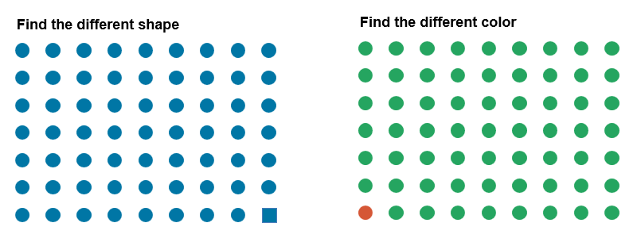
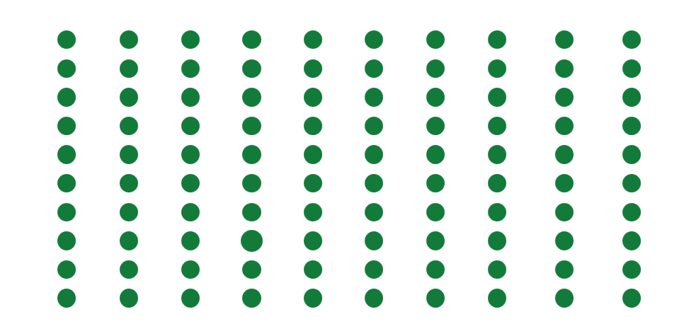
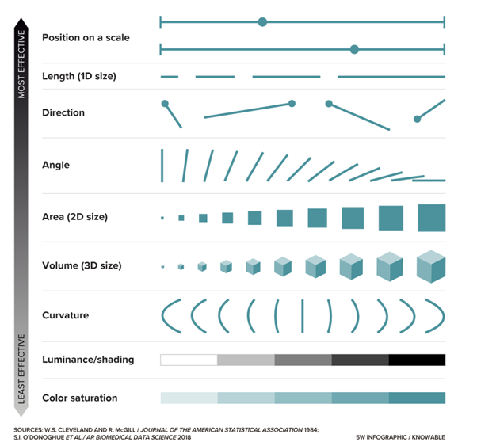
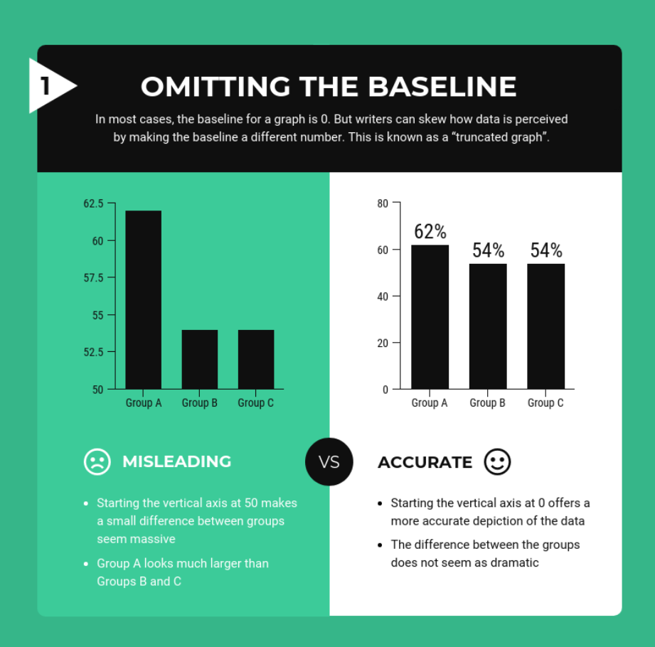
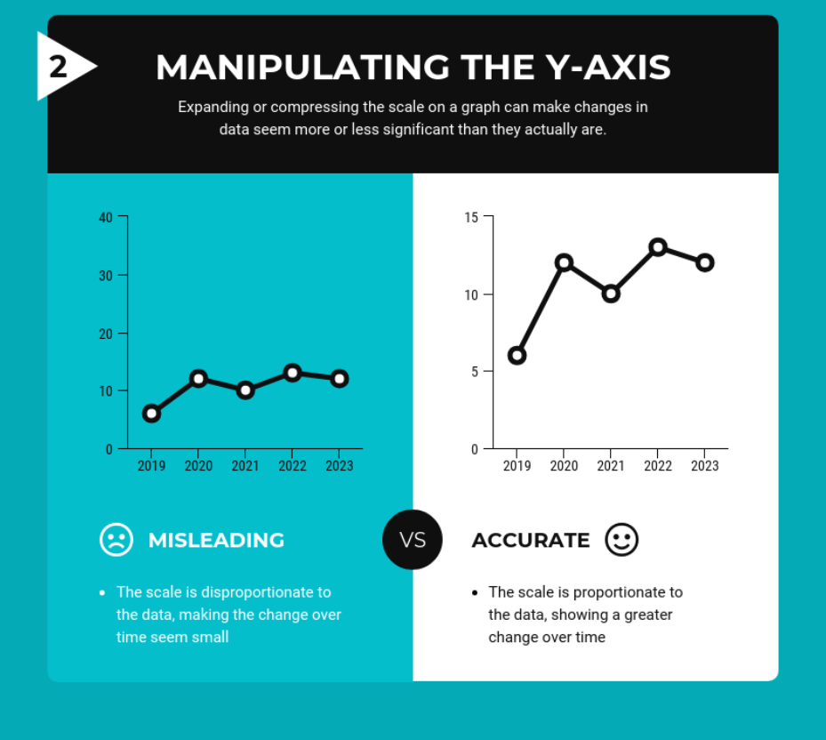
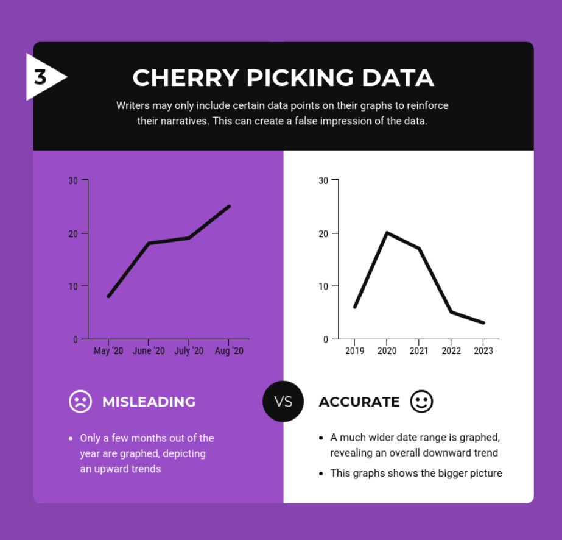
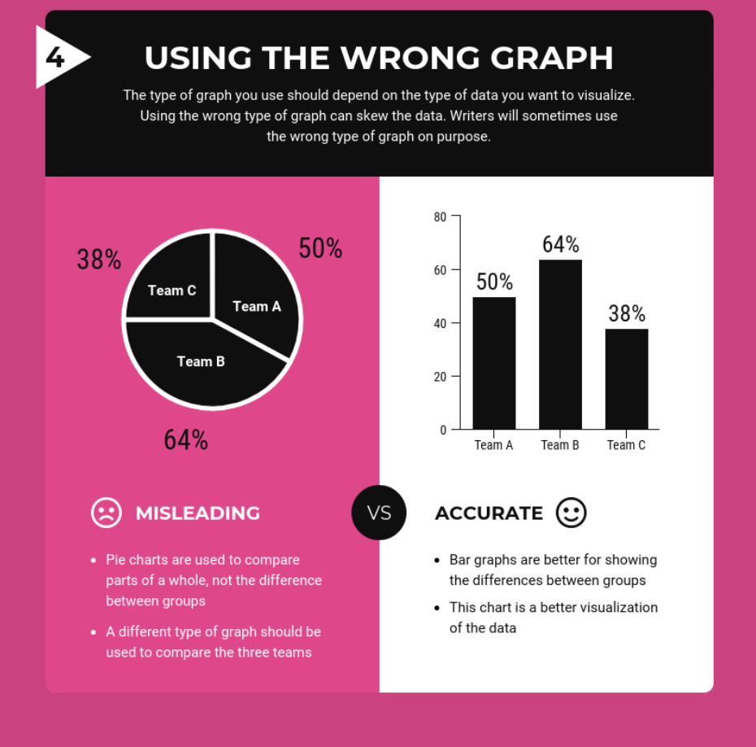
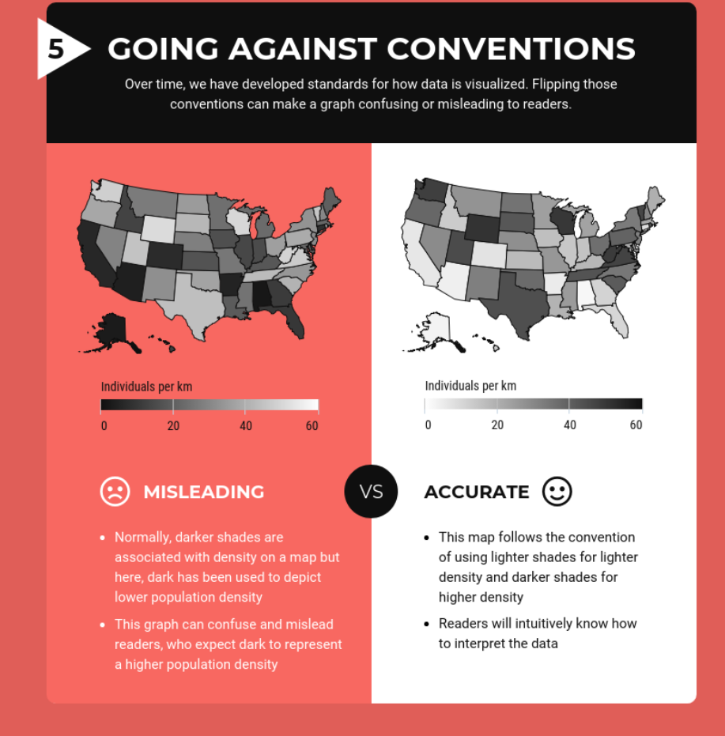
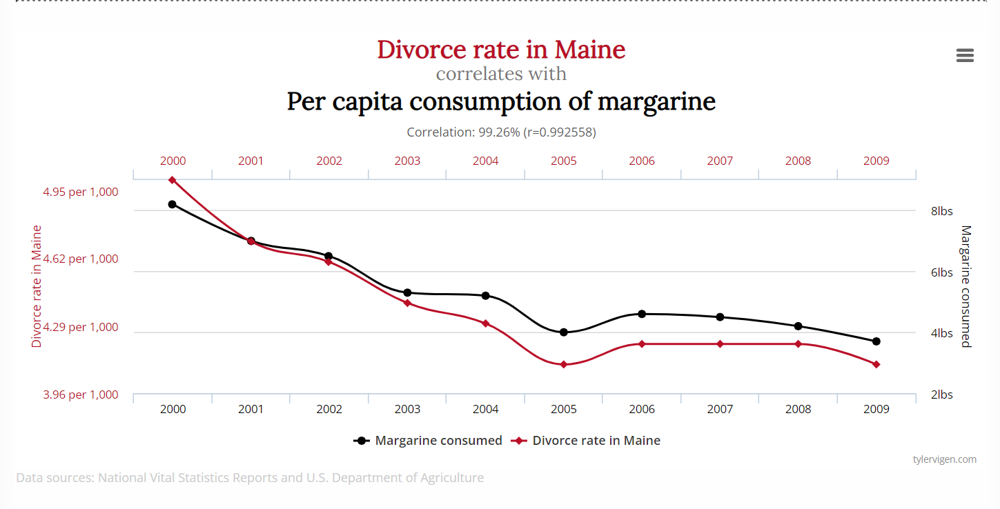

# Before We Start {background-color="#D9DBDB"}

## Today's Plan

| Time      | Part       | Content                                            |
|------------------------|------------------------|------------------------|
| 0:00–0:45 | **Part 1** | Visual encoding and graph crimes                   |
| 0:45–1:15 | **Part 2** | Choosing the right figure for the right audience   |
| 1:15–2:00 | **Part 3** | Annotating figures with models and writing legends |

::: fragment
Each part has a short primer followed by a practical exercise.

You will need R open with `palmerpenguins`, `tidyverse`, `ggdist`, `ggpubr`, and `emmeans` installed.
:::

# Part 1 — Visual Encoding and Graph Crimes {background-color="#D9DBDB"}

## How We See Data

The human visual system did not evolve to read graphs.

::: fragment
Some visual features are detected **before conscious attention engages**. A red dot among grey dots is spotted immediately. A larger circle registers instantly.
:::

::: fragment
This is **pre-attentive processing** (Healey and Enns, 2012).

For figure design, it means encoding an important group in a distinct colour or size directs attention automatically. Encoding the same information as a subtle difference in line style requires effortful, sequential search.
:::

## How Accurately Do We Read Encodings?

Cleveland and McGill (1984) asked: how accurately can people judge ratios encoded in different visual forms?

::: fragment
**Let us test this.**
:::

## 

```{r, echo=FALSE, out.width="85%"}
#| fig-align: "center"

```


## Find the different size object

```{r, echo=FALSE, out.width="85%"}
#| fig-align: "center"

```


::: notes
Run through the four slides. After each, ask for estimates by show of hands: closer to 30%, 50%, or 70%? Do not reveal the answer until all four are shown.
:::

## Visual Encoding

```{r, echo=FALSE, out.width="50%"}

```

## Encoding  

```{r}
library(tidyverse)
library(ggforce)
library(patchwork)

df_enc <- tibble(group = c("A", "B"), value = c(38, 62))

p1 <- ggplot(df_enc, aes(x = group, y = value, fill = group)) +
  geom_col(width = 0.5, colour = "black", linewidth = 0.3) +
  scale_fill_manual(values = c("#457B9D", "#E63946")) +
  scale_y_continuous(limits = c(0, 80), breaks = seq(0, 80, 20),
                     expand = expansion(mult = c(0, 0.02))) +
  labs(title = "Encoding 1: Position on a Common Scale",
       subtitle = "What percentage is the smaller value of the larger?",
       x = NULL, y = NULL) +
  theme_minimal(base_size = 14) +
  theme(legend.position = "none", panel.grid.major.x = element_blank(),
        panel.grid.minor = element_blank(),
        plot.title = element_text(face = "bold", size = 13),
        plot.subtitle = element_text(colour = "grey40", size = 10))

p2 <- ggplot(df_enc, aes(x = group, y = value, fill = group)) +
  geom_col(width = 0.5, colour = "black", linewidth = 0.3) +
  scale_fill_manual(values = c("#457B9D", "#E63946")) +
  scale_y_continuous(limits = c(0, 80), breaks = seq(0, 80, 20),
                     expand = expansion(mult = c(0, 0.02))) +
  facet_wrap(~ group, scales = "fixed") +
  labs(title = "Encoding 2: Position on Separate Scales",
       subtitle = "Same question. Same data.",
       x = NULL, y = NULL) +
  theme_minimal(base_size = 14) +
  theme(legend.position = "none", panel.grid.major = element_blank(),
        panel.grid.minor = element_blank(),
        strip.text = element_text(size = 11, face = "bold"),
        panel.spacing = unit(1, "cm"),
        plot.title = element_text(face = "bold", size = 13),
        plot.subtitle = element_text(colour = "grey40", size = 10))

p3 <- ggplot(df_enc, aes(x = "", y = value, fill = group)) +
  geom_col(width = 1, colour = "white", linewidth = 1.5) +
  coord_polar(theta = "y") +
  scale_fill_manual(values = c("#457B9D", "#E63946"), name = NULL) +
  labs(title = "Encoding 3: Angle",
       subtitle = "Same question. Same data.",
       x = NULL, y = NULL) +
  theme_void(base_size = 14) +
  theme(plot.title = element_text(face = "bold", size = 13, hjust = 0.5),
        plot.subtitle = element_text(colour = "grey40", size = 10, hjust = 0.5),
        legend.position = "bottom", legend.text = element_text(size = 11))

circle_df <- tibble(group = c("A", "B"), x = c(1.5, 3.5), y = c(2, 2),
                    radius = sqrt(c(38, 62) / pi))

p4 <- ggplot(circle_df) +
  geom_circle(aes(x0 = x, y0 = y, r = radius, fill = group),
              colour = "black", linewidth = 0.3) +
  scale_fill_manual(values = c("#457B9D", "#E63946"), name = NULL) +
  coord_fixed() +
  facet_wrap(~ group) +
  labs(title = "Encoding 4: Area",
       subtitle = "Same question. Same data.") +
  theme_void(base_size = 14) +
  theme(plot.title = element_text(face = "bold", size = 13, hjust = 0.5),
        plot.subtitle = element_text(colour = "grey40", size = 10, hjust = 0.5),
        legend.position = "bottom", legend.text = element_text(size = 11))

(p1 + p2) / (p3 + p4)

```


## Visual encoding is data-dependent


| Rank | Continuous data    | Categorical data   |
|------|--------------------|--------------------|
| 1    | Position           | Position           |
| 2    | Length             | **Colour (hue)**    |
| 3    | Angle              | Shape              |
| 4    | Area               | Colour (lightness) |
| 5    | Colour (lightness) | Area               |
| 6    | **Colour (hue)**       | Volume           |


::: fragment
**The practical rule:** assign your most important variable to the highest-ranked encoding available.

-  For continuous data, position is dominant. 

- For categorical data, colour hue is second only to position.
:::

## Applying the Hierarchy

::: {.column width="80%"}

```{r, echo = FALSE, message = FALSE, fig.width = 9, fig.height = 6}
library(palmerpenguins)

penguins |>
  drop_na(bill_length_mm, body_mass_g) |>
  ggplot(aes(x = body_mass_g, y = bill_length_mm,
             colour = species, shape = species)) +
  geom_point(size = 2.5, alpha = 0.7) +
  scale_colour_manual(values = c("darkorange", "purple", "cyan4")) +
  labs(x = "Body mass (g)", y = "Bill length (mm)",
       colour = "Species", shape = "Species") +
  theme_minimal(base_size = 14) +
  theme(legend.position = "bottom")
```

:::


::: {.column width="20%"}
-   Two continuous variables → **position** (rank 1)
-   Categorical grouping → **colour** (rank 2 for categorical) + **shape** (rank 3)
-   Redundant encoding: figure works in greyscale and for colour vision deficiency
:::

## Colour as a Tool

Colour is pre-attentive. That makes it powerful and dangerous.


Three palette types, each for a different data structure:

| Palette type | Data structure | Example |
|------------------------|------------------------|------------------------|
| **Categorical** | Discrete groups, no order | Species, treatment groups |
| **Sequential** | Continuous, one direction | Gene expression, density |
| **Diverging** | Continuous, meaningful midpoint | Log fold-change, temperature anomaly |

**Using the wrong palette for the data structure is one of the most common colour errors.** A sequential palette for categorical data implies an ordering that does not exist.


```{r}
okabe_ito <- c(
  "#E69F00",   # orange
  "#56B4E9",   # sky blue
  "#009E73",   # green
  "#F0E442",   # yellow
  "#0072B2",   # blue
  "#D55E00",   # vermillion
  "#CC79A7",   # pink
  "#000000"    # black
)

palette_data <- tibble::tibble(
  colour_name = c("Orange", "Sky blue", "Green", "Yellow",
                  "Blue", "Vermillion", "Pink", "Black"),
  hex         = okabe_ito,
  x           = seq_along(okabe_ito)
)

# --- Figure production ---
p <- ggplot(palette_data, aes(x = x, y = 1, fill = hex)) +
  geom_tile(colour = "white", linewidth = 1, height = 0.6) +
  geom_text(aes(y = 0.6, label = colour_name),
            vjust = 1, size = 3, colour = "grey20") +
  geom_text(aes(y = 0.5, label = hex),
            vjust = 1, size = 2.5, colour = "grey40", family = "mono") +
  scale_fill_identity() +
  scale_x_continuous(expand = expansion(mult = 0.05)) +
  scale_y_continuous(limits = c(0.35, 1.35)) +
  labs(
    title    = "Okabe-Ito Categorical Palette",
    subtitle = "Distinguishable with colour vision deficiency and in greyscale",
    x = NULL, y = NULL
  ) +
  theme_void()

p

```

## Colour as a Tool

Colour is pre-attentive. That makes it powerful and dangerous.


Three palette types, each for a different data structure:

| Palette type | Data structure | Example |
|------------------------|------------------------|------------------------|
| **Categorical** | Discrete groups, no order | Species, treatment groups |
| **Sequential** | Continuous, one direction | Gene expression, density |
| **Diverging** | Continuous, meaningful midpoint | Log fold-change, temperature anomaly |


**Using the wrong palette for the data structure is one of the most common colour errors.** A sequential palette for categorical data implies an ordering that does not exist.


```{r}
gradient_data <- tibble::tibble(x = seq(0, 1, length.out = 200), y = 1)

# --- Figure production ---
p <- ggplot(gradient_data, aes(x = x, y = y, fill = x)) +
  geom_tile(height = 0.5) +
  scale_fill_viridis_c(option = "viridis", guide = "none") +
  annotate("text", x = 0.01, y = 0.65, label = "Low",
           hjust = 0, size = 4, colour = "grey20") +
  annotate("text", x = 0.99, y = 0.65, label = "High",
           hjust = 1, size = 4, colour = "grey20") +
  scale_x_continuous(expand = expansion(0)) +
  scale_y_continuous(limits = c(0.5, 1.3)) +
  labs(
    title = "Viridis Sequential Palette",
    x = NULL, y = NULL
  ) +
  theme_void()
p

```

## Colour as a Tool

Colour is pre-attentive. That makes it powerful and dangerous.


Three palette types, each for a different data structure:

| Palette type | Data structure | Example |
|------------------------|------------------------|------------------------|
| **Categorical** | Discrete groups, no order | Species, treatment groups |
| **Sequential** | Continuous, one direction | Gene expression, density |
| **Diverging** | Continuous, meaningful midpoint | Log fold-change, temperature anomaly |


**Using the wrong palette for the data structure is one of the most common colour errors.** A sequential palette for categorical data implies an ordering that does not exist.


```{r}
radient_data <- tibble::tibble(x = seq(-1, 1, length.out = 200), y = 1)

# --- Figure production ---
p <- ggplot(gradient_data, aes(x = x, y = y, fill = x)) +
  geom_tile(height = 0.5) +
  scale_fill_distiller(palette = "PuOr", guide = "none") +
  annotate(
    "text",
    x = -0.98,
    y = 0.65,
    label = "Low",
    hjust = 0,
    size = 4,
    colour = "grey20"
  ) +
  annotate(
    "text",
    x = 0,
    y = 0.65,
    label = "Neutral",
    hjust = 0.5,
    size = 4,
    colour = "grey20"
  ) +
  annotate(
    "text",
    x = 0.98,
    y = 0.65,
    label = "High",
    hjust = 1,
    size = 4,
    colour = "grey20"
  ) +
  annotate(
    "segment",
    x = 0,
    xend = 0,
    y = 0.72,
    yend = 0.76,
    colour = "grey40",
    linewidth = 0.4
  ) +
  scale_x_continuous(expand = expansion(0)) +
  scale_y_continuous(limits = c(0.5, 1.3)) +
  labs(
    title = "PuOr Diverging Palette (colourblind-safe)",
    subtitle = "Appropriate for data with a meaningful central value",
    x = NULL,
    y = NULL
  ) +
  theme_void()

p


```

## Accessibility

\~8% of males have some form of colour vision deficiency (Sharpe et al., 1999).

::: incremental
-   Red-green is the most common. Red and green to distinguish groups will fail for a meaningful fraction of readers.
-   The **viridis** family provides perceptually uniform sequential palettes that work under colour vision deficiency and in greyscale (Garnier et al., 2021).
-   The **Okabe-Ito** palette provides eight categorically distinct colours that remain distinguishable under deuteranopia and protanopia (Okabe and Ito, 2008).
-   **Colour alone should never be the sole encoding.** Redundant encoding with shape or direct labelling ensures the figure works when colour fails.
:::

## Redundant encoding

```{r}
library(patchwork)
# --- Greyscale equivalents of species_colours ---
# Convert to luminance-equivalent greys
grey_colours <- c(
  "Adelie" = "grey55",
  "Chinstrap" = "grey75",
  "Gentoo" = "grey35"
)

species_colours <- c(
  "Adelie"    = "#E69F00",
  "Chinstrap" = "#56B4E9",
  "Gentoo"    = "#009E73"
)

species_shapes <- c(
  "Adelie"    = 16,   # filled circle
  "Chinstrap" = 17,   # filled triangle
  "Gentoo"    = 15    # filled square
)

# --- Panel (a): Full colour with redundant encoding ---
p_a <- ggplot(
  penguins,
  aes(x = bill_length_mm, y = body_mass_g, colour = species, shape = species)
) +
  geom_point(alpha = 0.7, size = 1.5) +
  scale_colour_manual(values = species_colours, name = "Species") +
  scale_shape_manual(values = species_shapes, name = "Species") +
  labs(
    x = "Bill length (mm)",
    y = "Body mass (g)",
    subtitle = "(a) Full colour with redundant shape encoding"
  )+
  theme_minimal()


# --- Panel (b): Greyscale simulation ---
p_b <- ggplot(
  penguins,
  aes(x = bill_length_mm, y = body_mass_g, colour = species, shape = species)
) +
  geom_point(alpha = 0.7, size = 1.5) +
  scale_colour_manual(values = grey_colours, name = "Species") +
  scale_shape_manual(values = species_shapes, name = "Species") +
  labs(
    x = "Bill length (mm)",
    y = "Body mass (g)",
    subtitle = "(b) Greyscale simulation"
  ) +
  theme_minimal()+
  
  theme(legend.position = "none")

# --- Assemble ---
p_combined <- (p_a +
  p_b)

p_combined

```

## Direct labelling

```{r}

ice_data <- lterdatasampler::ntl_icecover |>
  dplyr::filter(lakeid %in% c("Lake Mendota", "Lake Monona", "Lake Wingra")) |>
  dplyr::filter(!is.na(ice_off)) |>
  dplyr::mutate(
    ice_off_doy = as.integer(format(ice_off, "%j")),
    lakeid = factor(lakeid,
                    levels = c("Lake Mendota", "Lake Monona", "Lake Wingra"))
  )

# --- Offset Lake Monona for visual separation (illustrative figure) ---
ice_data_plot <- ice_data |>
  dplyr::mutate(
    ice_off_doy = dplyr::if_else(
      lakeid == "Lake Monona",
      ice_off_doy - 8L,
      ice_off_doy
    )
  )

# --- Labels at the rightmost year per lake ---
label_data <- ice_data_plot |>
  dplyr::group_by(lakeid) |>
  dplyr::filter(year == max(year)) |>
  dplyr::ungroup() |>
  dplyr::mutate(
    nudge_y = dplyr::case_when(
      lakeid == "Lake Mendota" ~ 4,
      lakeid == "Lake Monona" ~ -4,
      TRUE ~ 0
    )
  )

# Named colours for LTER ice lakes
lake_colours <- c(
  "Lake Mendota" = "#E69F00",
  "Lake Monona"  = "#56B4E9",
  "Lake Wingra"  = "#009E73"
)

lake_linetypes <- c(
  "Lake Mendota" = "solid",
  "Lake Monona"  = "dashed",
  "Lake Wingra"  = "dotted"
)

lake_mendota <- ice_data |>
  dplyr::filter(lakeid == "Lake Mendota")

# --- Figure production ---
p <- ggplot(
  ice_data_plot,
  aes(x = year, y = ice_off_doy, colour = lakeid, linetype = lakeid)
) +
  geom_line(linewidth = 0.6, alpha = 0.8) +
  geom_text(
    data = label_data,
    aes(label = lakeid, x = year + 2, y = ice_off_doy + nudge_y),
    hjust = 0,
    size = 3.2,
    fontface = "bold",
    show.legend = FALSE
  ) +
  scale_colour_manual(values = lake_colours) +
  scale_linetype_manual(values = lake_linetypes) +
  scale_x_continuous(expand = expansion(mult = c(0.02, 0.22))) +
  labs(
    x = "Year",
    y = "Ice-off date (day of year)"
  ) +
  theme_minimal()+
  theme(legend.position = "none")

p

```


## Data-to-ink ratios

```{r}
# --- Constructed data ---
constructed_data <- tibble::tibble(
  category = factor(paste("Group", 1:5), levels = paste("Group", 1:5)),
  value = c(42, 67, 38, 55, 71)
)

max_val <- max(constructed_data$value)

theme_bad_example <- theme_grey(base_size = 11) +
  theme(
    panel.background = element_rect(fill = "grey85", colour = NA),
    panel.grid.major = element_line(colour = "white", linewidth = 1.2),
    panel.grid.minor = element_line(colour = "white", linewidth = 0.6),
    plot.background  = element_rect(fill = "grey95", colour = NA),
    legend.background = element_rect(fill = "grey90", colour = "black",
                                     linewidth = 0.5)
  )

# --- Panel (a): Poor data-ink ratio ---
p_a <- ggplot(constructed_data, aes(x = category, y = value, fill = value)) +
  geom_col(colour = "black", linewidth = 0.8) +
  geom_text(aes(label = value), vjust = -0.3, size = 3.5) +
  scale_fill_gradient(low = "#E69F00", high = "#0072B2", guide = "none") +
  scale_y_continuous(limits = c(0, 85)) +
  labs(
    x = "Group",
    y = "Value",
    subtitle = "(a) Poor data-ink ratio"
  ) +
  theme_bad_example +
  theme(
    panel.border = element_rect(colour = "black", fill = NA, linewidth = 1.5),
    axis.line = element_line(linewidth = 1.2),
    plot.subtitle = element_text(size = 9, colour = "grey20", hjust = 0)
  )

# --- Panel (b): Good data-ink ratio ---
# Value label on the highest bar only
label_data <- dplyr::filter(constructed_data, value == max_val)

p_b <- ggplot(constructed_data, aes(x = category, y = value)) +
  geom_col(fill = "#0072B2") +
  geom_text(
    data = label_data,
    aes(label = value),
    vjust = -0.4,
    size = 3.5,
    colour = "grey20"
  ) +
  scale_x_discrete(labels = ~ gsub("Group ", "", .x)) +
  scale_y_continuous(
    limits = c(0, 85),
    expand = expansion(mult = c(0, 0.05))
  ) +
  labs(
    x = "Category",
    y = "Value",
    subtitle = "(b) Good data-ink ratio"
  ) +
  theme_classic()+
  theme(panel.grid.major.y = element_line(colour = "grey50"))

# --- Assemble ---
p_combined <- p_a +
  p_b +
  plot_layout(guides = "collect") +
  plot_annotation(tag_levels = "a") &
  theme(plot.tag = element_text(size = 12, face = "bold"))

p_combined

```

## Five common ways graphs can mislead you 📊


```{r, echo=FALSE, out.width="50%"}

```


##

```{r, echo=FALSE, out.width="60%"}

```


##

```{r, echo=FALSE, out.width="60%"}

```

##

```{r, echo=FALSE, out.width="60%"}

```

##

```{r, echo=FALSE, out.width="60%"}

```


## BONUS: Spurious correlation

```{r, echo=FALSE}
knitr::include_graphics("images/correlation_xkcd.png")
```

## BONUS: Spurious correlation

```{r, echo=FALSE, out.width="75%"}

```


## Exercise 1: Graph Crimes Tribunal

Each pair receives two figures.

For each figure:

::: incremental
1.  **Identify the crime** — what specifically is wrong?
2.  **Classify it** — distortion or omission?
3.  **Sentence it** — what concrete change would fix it?
:::

::: fragment
You have **five minutes**. Be specific.
:::

```{r}
countdown::countdown(
  minutes = 5L,
  color_border = "#00AEEF",
  color_text = "#00AEEF",
  color_running_text = "white",
  color_running_background = "#00AEEF",
  color_finished_text = "#00AEEF",
  color_finished_background = "white",
  top = 0,
  margin = ".5em",
  font_size = "2em"
)
```

::: notes
Direct students to the graph crimes webpage or distribute printed sheets. Each pair gets two different figures from the set of eight. Walk the room. After the timer, take reports from pairs — one minute per figure, adding the principle each crime violates.
:::


## Reporting Back

One minute per figure. Tell us:

-   What is this figure trying to show?

-   What is the crime?

    -   Whether it is distortion or omission

-   What the fix would be?


::: notes
After each report, name the principle: data-ink ratio, honest axis scaling, Cleveland and McGill hierarchy, accessible colour, redundant encoding. These were covered in the primer — now students are connecting principles to specific failures.
:::

# Part 2 — The Right Figure for the Right Audience {background-color="#D9DBDB"}

## Choosing the Right Figure for the Right Data {.scrollable}

Every figure begins with a question: what type of variables do I have, and what relationship am I trying to show?


```{r, include = FALSE}
library(tidyverse)
library(palmerpenguins)
library(ggdist)


# Shared minimal theme for all thumbnails
theme_thumb <- theme_void() +
  theme(
    legend.position = "none",
    plot.margin     = margin(4, 4, 4, 4)
  )

# FIG_01 — Raincloud: one continuous
p1 <- ggplot(penguins, aes(x = body_mass_g, y = "")) +
  stat_halfeye(
    adjust       = 0.5,
    justification = -0.2,
    .width       = 0,
    point_colour = NA,
    fill         = "#0072B2",
    alpha        = 0.8
  ) +
  geom_boxplot(
    width         = 0.1,
    outlier.shape = NA,
    fill          = "#0072B2",
    colour        = "grey20",
    linewidth     = 0.4
  ) +
  geom_jitter(
    height = 0.05,
    alpha  = 0.4,
    size   = 0.6,
    shape  = 21,
    colour = "#0072B2",
    fill   = "white"
  ) +
  theme_thumb

# FIG_02 — Scatter: two continuous
p2 <- penguins |>
  drop_na(bill_length_mm, flipper_length_mm) |>
  slice_sample(n = 50) |>
  ggplot(aes(x = bill_length_mm, y = flipper_length_mm)) +
  geom_point(alpha = 0.7, colour = "#0072B2", size = 6) +
  theme_thumb

# FIG_03 — Scatter: two continuous + discrete
p3 <- penguins |>
  drop_na(bill_length_mm, flipper_length_mm, species) |>
  slice_sample(n = 50) |>
  ggplot(
    aes(
      x      = bill_length_mm,
      y      = flipper_length_mm,
      colour = species,
      shape  = species
    )
  ) +
  geom_point(alpha = 0.8, size = 6) +
  scale_colour_manual(values = species_colours) +
  scale_shape_manual(values  = species_shapes) +
  theme_thumb
# FIG_04 — Bar chart: one discrete
p4 <- ggplot(penguins, aes(x = forcats::fct_infreq(species))) +
  geom_bar(fill = "#0072B2") +
  scale_y_continuous(
    limits = c(0, NA),
    expand = expansion(mult = c(0, 0.05))
  ) +
  theme_thumb

# FIG_05 — Raincloud: discrete + continuous
p5 <- ggplot(
  penguins,
  aes(x = body_mass_g, y = species, fill = species, colour = species)
) +
  stat_halfeye(
    adjust        = 0.5,
    justification = -0.2,
    .width        = 0,
    point_colour  = NA,
    alpha         = 0.8
  ) +
  geom_boxplot(
    width         = 0.12,
    outlier.shape = NA,
    alpha         = 0.5,
    linewidth     = 0.4,
    colour        = "grey20"
  ) +
  geom_jitter(
    height = 0.08,
    alpha  = 0.3,
    size   = 0.4
  ) +
  scale_fill_manual(values   = species_colours) +
  scale_colour_manual(values = species_colours) +
  theme_thumb

# FIG_06 — Heatmap: z-scored mtcars
mtcars_long <- mtcars |>
  tibble::rownames_to_column("car") |>
  dplyr::mutate(dplyr::across(where(is.numeric), scale)) |>
  tidyr::pivot_longer(
    cols      = where(is.numeric),
    names_to  = "variable",
    values_to = "z_score"
  )

p6 <- ggplot(mtcars_long, aes(x = variable, y = car, fill = z_score)) +
  geom_tile(colour = "white", linewidth = 0.2) +
  scale_fill_distiller(
    palette = "RdBu",
    limits  = c(-3, 3),
    oob     = scales::squish
  ) +
  theme_thumb

# FIG_07 — Heatmap: discrete + discrete + continuous fill
all_combos <- tidyr::expand_grid(
  species = levels(penguins$species),
  island  = levels(penguins$island)
)

mass_summary <- penguins |>
  dplyr::group_by(species, island) |>
  dplyr::summarise(mean_mass = mean(body_mass_g, na.rm = TRUE), .groups = "drop")

plot_data <- dplyr::left_join(all_combos, mass_summary,
                               by = c("species", "island"))

p7 <- ggplot(plot_data, aes(x = species, y = island, fill = mean_mass)) +
  geom_tile(colour = "white", linewidth = 0.5) +
  scale_fill_viridis_c(
    option   = "viridis",
    na.value = "grey80"
  ) +
  theme_thumb

# FIG_08 — Line chart: date + continuous
p8 <- ggplot(lake_mendota, aes(x = year, y = ice_off_doy)) +
  geom_line(colour = "#0072B2", linewidth = 0.5) +
  geom_smooth(
    method    = "lm",
    colour    = "grey40",
    fill      = "grey80",
    linewidth = 0.6,
    se        = FALSE
  ) +
  theme_thumb
```

```{r}
library(gt)

chart_table <- tibble(
  `Variable 1` = c(
    "Continuous", "Continuous", "Continuous",
    "Discrete",   "Discrete",   "Discrete",  "Date"
  ),
  `Variable 2` = c(
    "—",          "Continuous", "Continuous",
    "—",          "Continuous", "Discrete",
    "Continuous"
  ),
  `Variable 3` = c(
    "—", "—", "Discrete",
    "—", "—", "Continuous"
    , "-"
  ),
  `Chart type` = c(
    "Raincloud plot",
    "Scatter plot",
    "Scatter plot with coloured shapes",
    "Bar chart (counts)",
    "Raincloud plot or boxplot",
    "Heatmap",
    
    "Line chart"
  ),
  plot = list(p1, p2, p3, p4, p5, p6, p8)
)

chart_table |>
  gt() |>
  text_transform(
    locations = cells_body(columns = plot),
    fn = function(x) {
      map(
        chart_table$plot,
        gt::ggplot_image,
        height       = px(120),
        aspect_ratio = 1.6
      )
    }
  ) |>
  cols_label(
    `Variable 1` = "Variable 1",
    `Variable 2` = "Variable 2",
    `Variable 3` = "Variable 3",
    `Chart type` = "Chart type",
    plot         = "Example"
  ) |>
  cols_align(align = "center", columns = everything()) |>
  cols_align(align = "left",   columns = `Chart type`) |>
  cols_width(
    plot         ~ px(200),
    `Chart type` ~ px(220),
    everything() ~ px(110)
  ) |>
  tab_style(
    style     = cell_text(weight = "bold"),
    locations = cells_column_labels(everything())
  ) |>
  tab_style(
    style = cell_fill(color = "#f5f5f5"),
    locations = cells_body(rows = seq(1, nrow(chart_table), by = 2))
  ) |>
  tab_header(
    title    = "Choosing the right chart",
    subtitle = "Matched to variable types"
  ) |>
  opt_table_font(font = google_font("Source Sans Pro")) |>
  opt_stylize(style = 1, color = "blue") |>
  tab_options(
    table.width              = pct(100),
    heading.title.font.size  = px(18),
    heading.subtitle.font.size = px(14),
    column_labels.font.size  = px(13),
    table.font.size          = px(18),
    data_row.padding         = px(6)
  )

```

::: notes
Students should have read this table in the pre-reading. Spend no more than two minutes on it. The point is to establish the decision framework before the audience exercise.
:::

## Storytelling: Descriptive vs Explanatory

Every figure communicates at two levels: it presents data, and it makes an argument.

::: fragment
**Descriptive title:** "Body mass (g) distribution of three penguin species"

Neutral. States what the figure shows. Appropriate for journal figures and lab reports.
:::

::: fragment
**Explanatory title:** "Gentoo penguins are substantially heavier than Adelie and Chinstraps"

Directive. States what the figure means. Appropriate for talks, posters, and public engagement.
:::

::: fragment
The choice between them should always be deliberate and determined by context.
:::

## Audience Determines Design

::: incremental
-   **Journal/lab report:** descriptive legend, full statistical detail, raw data shown, self-contained figure legend beneath the figure
-   **Talk:** one finding per slide, generous fonts, explanatory title, minimal annotation
-   **Poster:** works at two scales — bold enough to attract from a distance, detailed enough to reward the reader who stops
-   **Public engagement:** familiar figure types, explicit message, no assumed technical knowledge
:::

::: fragment
What changes between contexts is not the standard but the design choices needed to meet it.
:::

## Storytelling Toolkit

| Technique | What it does | Where it is appropriate |
|------------------------|------------------------|------------------------|
| Explanatory title | States the conclusion | Talks, posters, public engagement |
| Highlighting | Focal group in colour, rest in grey | Talks, posters |
| Direct labelling | Labels on the data, not in a legend | All contexts where legible |
| Reference lines | Benchmarks (zero, threshold, event) | All contexts |
| Annotations | Text/arrows explaining features | Sparingly in journals, freely in talks |

::: fragment
For a journal submission: restraint. For a poster or talk: the full toolkit.
:::

## {.scrollable}

```{r}
# Shared thumbnail theme — enlarged
theme_thumb <- theme_void() +
  theme(
    legend.position = "none",
    plot.margin     = margin(6, 6, 6, 6),
    plot.title      = element_text(
      size   = 20,
      face   = "bold",
      hjust  = 0,
      margin = margin(b = 6)
    )
  )

# TECHNIQUE 1 — Explanatory title
t1 <- penguins |>
  drop_na(body_mass_g, species) |>
  slice_sample(n = 60) |>
  ggplot(aes(x = body_mass_g, y = species, fill = species, colour = species)) +
  stat_halfeye(
    adjust        = 0.5,
    justification = -0.2,
    .width        = 0,
    point_colour  = NA,
    alpha         = 0.8
  ) +
  geom_boxplot(
    width         = 0.15,
    outlier.shape = NA,
    alpha         = 0.5,
    linewidth     = 1.0,
    colour        = "grey20"
  ) +
  scale_fill_manual(values   = species_colours) +
  scale_colour_manual(values = species_colours) +
  theme_thumb

# TECHNIQUE 2 — Highlighting
t2 <- penguins |>
  drop_na(bill_length_mm, flipper_length_mm) |>
  slice_sample(n = 60) |>
  mutate(highlight = if_else(species == "Gentoo", "Gentoo", "Other")) |>
  ggplot(aes(
    x      = bill_length_mm,
    y      = flipper_length_mm,
    colour = highlight,
    size   = highlight,
    alpha  = highlight
  )) +
  geom_point() +
  scale_colour_manual(values = c("Gentoo" = "#0072B2", "Other" = "grey70")) +
  scale_size_manual(values   = c("Gentoo" = 5.0, "Other" = 3.0)) +
  scale_alpha_manual(values  = c("Gentoo" = 0.9, "Other" = 0.4)) +
  theme_thumb

# TECHNIQUE 3 — Direct labelling
label_data <- penguins |>
  drop_na(bill_length_mm, flipper_length_mm) |>
  group_by(species) |>
  summarise(
    x = median(bill_length_mm),
    y = median(flipper_length_mm),
    .groups = "drop"
  )

t3 <- penguins |>
  drop_na(bill_length_mm, flipper_length_mm) |>
  slice_sample(n = 60) |>
  ggplot(aes(
    x      = bill_length_mm,
    y      = flipper_length_mm,
    colour = species
  )) +
  geom_point(alpha = 0.5, size = 5) +
  geom_label(
    data        = label_data,
    aes(x = x, y = y, label = species, colour = species),
    size        = 10,
    fontface    = "bold",
    label.size  = 0,
    fill        = "white",
    inherit.aes = FALSE
  ) +
  scale_colour_manual(values = species_colours) +
  theme_thumb

# TECHNIQUE 4 — Reference lines
species_means <- penguins |>
  drop_na(body_mass_g) |>
  group_by(species) |>
  summarise(mean_mass = mean(body_mass_g), .groups = "drop")

overall_mean <- mean(penguins$body_mass_g, na.rm = TRUE)

t4 <- ggplot(species_means, aes(x = species, y = mean_mass, fill = species)) +
  geom_col(width = 0.6, alpha = 0.85) +
  geom_hline(
    yintercept = overall_mean,
    linetype   = "dashed",
    colour     = "grey20",
    linewidth  = 1.6
  ) +
  geom_text(
    aes(x = 2.6, y = overall_mean, label = "Overall mean"),
    vjust    = -0.6,
    hjust    = 1,
    size     = 16,
    colour   = "grey20",
    fontface = "bold"
  ) +
  scale_fill_manual(values = species_colours) +
  scale_y_continuous(expand = expansion(mult = c(0, 0.1))) +
  theme_thumb

# TECHNIQUE 5 — Annotation
t5 <- penguins |>
  drop_na(bill_length_mm, flipper_length_mm) |>
  slice_sample(n = 60) |>
  mutate(highlight = if_else(species == "Gentoo", "Gentoo", "Other")) |>
  ggplot(aes(
    x      = bill_length_mm,
    y      = flipper_length_mm,
    colour = highlight,
    alpha  = highlight
  )) +
  geom_point(size = 4) +
  scale_colour_manual(values = c("Gentoo" = "#0072B2", "Other" = "grey70")) +
  scale_alpha_manual(values  = c("Gentoo" = 0.9, "Other" = 0.3)) +
  annotate(
    "label",
    x          = 46,
    y          = 208,
    label      = "Gentoo",
    colour     = "#0072B2",
    fill       = "white",
    size       = 16,
    fontface   = "bold",
    label.size = 0
  ) +
  annotate(
    "curve",
    x         = 48,
    y         = 211,
    xend      = 50,
    yend      = 218,
    curvature = -0.3,
    arrow     = arrow(length = unit(0.02, "npc"), type = "closed"),
    colour    = "#0072B2",
    linewidth = 1.4
  ) +
  labs(title = "Annotation draws attention to a key feature") +
  theme_thumb

# --- gt table ---

technique_table <- tibble(
  Technique = c(
    "Explanatory title",
    "Highlighting",
    "Direct labelling",
    "Reference lines",
    "Annotations"
  ),
  `What it does` = c(
    "States the conclusion",
    "Focal group in colour, rest in grey",
    "Labels on the data, not in a legend",
    "Benchmarks (zero, threshold, event)",
    "Text or arrows explaining features"
  ),
  `Where appropriate` = c(
    "Talks, posters, public engagement",
    "Talks, posters",
    "All contexts where legible",
    "All contexts",
    "Sparingly in journals, freely in talks"
  ),
  plot = list(t1, t2, t3, t4, t5)
)

technique_table |>
  gt() |>
  text_transform(
    locations = cells_body(columns = plot),
    fn = function(x) {
      map(
        technique_table$plot,
        gt::ggplot_image,
        height       = px(200),
        aspect_ratio = 1.6
      )
    }
  ) |>
  cols_label(
    Technique           = "Technique",
    `What it does`      = "What it does",
    `Where appropriate` = "Where appropriate",
    plot                = "Example"
  ) |>
  cols_align(align = "left",   columns = c(Technique, `What it does`, `Where appropriate`)) |>
  cols_align(align = "center", columns = plot) |>
  cols_width(
    plot                ~ px(340),
    Technique           ~ px(160),
    `What it does`      ~ px(200),
    `Where appropriate` ~ px(200)
  ) |>
  tab_style(
    style     = cell_text(weight = "bold"),
    locations = cells_column_labels(everything())
  ) |>
  tab_style(
    style     = cell_text(weight = "bold"),
    locations = cells_body(columns = Technique)
  ) |>
  tab_style(
    style     = cell_fill(color = "#f5f5f5"),
    locations = cells_body(rows = seq(1, 5, by = 2))
  ) |>
  tab_header(
    title    = "Techniques for professional figures",
    subtitle = "Each technique is illustrated with a thumbnail example"
  ) |>
  opt_table_font(font = google_font("Source Sans Pro")) |>
  opt_stylize(style = 1, color = "blue") |>
  tab_options(
    table.width                = pct(100),
    heading.title.font.size    = px(18),
    heading.subtitle.font.size = px(14),
    column_labels.font.size    = px(13),
    table.font.size            = px(18),
    data_row.padding           = px(8)
  )

```

## Exercise 2: Same Data, Four Audiences

You all have the same finding:

**Gentoo penguins are substantially heavier than Adelie and Chinstrap penguins.**

```{r}

penguins |> 
  group_by(species) |> 
  summarise("Mass (g)" = round(mean(body_mass_g, na.rm = T),0),
            SD = round(sd(body_mass_g, na.rm = T),0),
            N = n()) |> 
  gt::gt()

```

::: fragment
Each group is assigned one context:

1.  **Journal figure** (specialist reader, desk reading)
2.  **Conference poster** (3 seconds to attract, 2 minutes to engage)
3.  **Seminar slide** (audience has no control over viewing time)
4.  **Museum infographic** (non-specialist, no assumed knowledge)
:::

## Your Task

On the paper provided, sketch your figure.

You must make explicit decisions about:

::: incremental
-   **Figure type** — raincloud, boxplot, bar chart, or something else?
-   **Title** — descriptive or explanatory?
-   **Legend vs direct labelling?**
-   **Annotation** — reference lines, highlights, brackets?
-   **Statistical detail** — significance indicators, CIs, sample sizes?
:::

```{r}
countdown::countdown(
  minutes = 8L,
  color_border = "#00AEEF",
  color_text = "#00AEEF",
  color_running_text = "white",
  color_running_background = "#00AEEF",
  color_finished_text = "#00AEEF",
  color_finished_background = "white",
  top = 0,
  margin = ".5em",
  font_size = "2em"
)
```

::: notes
Groups of 3–4. Assign contexts deliberately. Distribute A3 paper and markers. Walk the room. If a group draws the same figure regardless of context, ask: "Would a museum visitor understand a boxplot?" or "Would a journal reviewer accept an explanatory title?"
:::

## Gallery Walk and Discussion

Pin your sketches to the wall. Walk the room.

::: fragment
-   Where did the journal group and the museum group diverge most?
-   Did anyone use direct labelling? Did anyone use highlighting?
-   Which group simplified most? Did they lose anything important?
:::

```{r}
countdown::countdown(
  minutes = 5L,
  color_border = "#00AEEF",
  color_text = "#00AEEF",
  color_running_text = "white",
  color_running_background = "#00AEEF",
  color_finished_text = "#00AEEF",
  color_finished_background = "white",
  top = 0,
  margin = ".5em",
  font_size = "2em"
)
```

::: notes
Facilitate 3–4 minutes of discussion after the walk. The key insight: the data do not change, the audience determines the design. No single correct figure exists.
:::

# Part 3 — Models, Annotations, and Legends {background-color="#D9DBDB"}

## From Data to Figure to Legend

A publication-quality figure requires three things beyond the plot itself:

::: incremental
1.  **Correct axis scales** — variable name and unit, honest range, appropriate origin
2.  **Statistical annotations** — connecting the figure to the model that produced the result
3.  **A complete figure legend** — making the figure self-contained
:::

::: fragment
Open the script `workshop_part3.R` from the workshop materials.
:::

## Step 1: Build a Clean Raincloud Plot

```{r, eval = TRUE, echo = FALSE}
library(palmerpenguins)
library(tidyverse)
library(ggdist)
library(emmeans)

penguins |>
  drop_na(body_mass_g) |>
  ggplot(aes(x = species, y = body_mass_g, fill = species)) +
  stat_halfeye(adjust = 0.5, width = 0.6, .width = 0,
               justification = -0.2, point_colour = NA) +
  geom_boxplot(width = 0.15, outlier.shape = NA, alpha = 0.5) +
  geom_jitter(aes(shape = species), width = 0.1, alpha = 0.3, size = 1.2) +
  scale_fill_manual(values = c("darkorange", "purple", "cyan4")) +
  labs(x = "Species", y = "Body mass (g)") +
  theme_minimal(base_size = 14) +
  theme(legend.position = "none",
        panel.grid.major.x = element_blank())
```

::: fragment
**Axis checklist:**

-   Variable name **and** unit: "Body mass (g)" not "body_mass_g"
-   Axis starts where the data are, not forced to zero (this is not a bar chart)
-   Redundant encoding: colour **and** shape for species
:::

## Step 2: Fit a Model

```{r, eval = TRUE, echo = TRUE}
# Fit a one-way ANOVA
mass_model <- lm(body_mass_g ~ species,
                  data = penguins)
summary(mass_model)
```

::: fragment
```{r, eval = TRUE, echo = TRUE}
# Estimated marginal means and pairwise comparisons
emm <- emmeans(mass_model, specs = pairwise ~ "species")

emm_means <- emm$emmeans |> as_tibble()

emm_pairs <- emm$contrasts |> as_tibble()

```
:::

::: fragment
`emmeans` gives you the estimated marginal means and the pairwise comparisons with Tukey adjustment. These are the numbers your annotations will report.
:::

::: notes
Walk through the output. Point out: the EMMs, the pairwise differences, the adjusted p-values. Students need to understand what these numbers are before putting them on a figure.
:::

## Annotating: Three Approaches

| Method | What it shows | When to use |
|------------------------|------------------------|------------------------|
| **Letter groupings** | Shared letter = not significantly different | Many groups, compact display |
| **Asterisks** | Significance threshold (*, **,*** ) | Two or three comparisons |
| **Explicit p-values** | Actual adjusted p-value | When precision matters |

::: fragment
**All three require definition in the figure legend.** An asterisk without a legend entry is meaningless.
:::

::: fragment
**All three have limitations.** Letters conflate "not different" with "identical." Asterisks reduce continuous evidence to binary thresholds. Explicit p-values can clutter a busy figure.
:::

## Step 3: Add Annotations

```{r, eval = TRUE, echo = FALSE}
library(emmeans)

# --- Model and estimated marginal means ---


emm_df <- emm_means |>
    rename(
        mean_mass = emmean,
        lower.CL  = lower.CL,
        upper.CL  = upper.CL
    )

# --- Pairwise annotation data ---
annotation_df <- emm_pairs |>
    separate(contrast, into = c("group1", "group2"), sep = " - ") |>
    mutate(
        stars = case_when(
            p.value < 0.0001 ~ "****",
            p.value < 0.001  ~ "***",
            p.value < 0.01   ~ "**",
            p.value < 0.05   ~ "*",
            TRUE             ~ "ns"
        ),
        p_label = case_when(
            p.value < 0.0001 ~ "p < 0.0001",
            TRUE             ~ paste0("p = ", round(p.value, 3))
        )
    )

plot_annotations <- annotation_df |>
    filter(p.value < 0.05)

y_max <- max(penguins$body_mass_g, na.rm = TRUE)

plot_annotations <- plot_annotations |>
    mutate(y_position = y_max + 300 * row_number())

# Species order must be consistent across the plot and annotations
species_order <- levels(penguins$species)

# --- Figure ---
ggplot(
    emm_df,
    aes(x = species, y = mean_mass, colour = species)
) +
  
    geom_jitter(
        data   = drop_na(penguins, body_mass_g, species),
        aes(x  = species, y = body_mass_g, colour = species),
        width  = 0.15,
        alpha  = 0.4,
        size   = 1.5,
        inherit.aes = FALSE
    ) +
    geom_pointrange(
        aes(ymin = lower.CL, ymax = upper.CL),
        linewidth = 1.2,
        size      = 1.1,
        fatten    = 2,
        fill = "white",
        shape = 21
    )  +
    geom_segment(
        data = plot_annotations,
        aes(
            x    = group1,
            xend = group2,
            y    = y_position,
            yend = y_position
        ),
        inherit.aes = FALSE,
        linewidth   = 0.5,
        colour      = "grey30"
    ) +
    geom_text(
        data = plot_annotations,
        aes(
            x = (as.numeric(factor(group1, levels = species_order)) +
                     as.numeric(factor(group2, levels = species_order))) / 2,
            y     = y_position + 110,
            label = p_label
        ),
        inherit.aes = FALSE,
        size        = 4.5,
        colour      = "grey30"
    ) +
    scale_colour_manual(values = species_colours) +
    scale_y_continuous(expand = expansion(mult = c(0.05, 0.1))) +
    labs(x     = "",
        y     = "Body mass (g)"
    ) +
    theme_minimal() +
    theme(panel.grid.major.x = element_blank(),
        panel.grid.minor = element_blank(),
        axis.text  = element_text(size = 8),
        axis.title = element_text(size = 8),
        axis.line  = element_line(colour = "grey40", linewidth = 0.4),
        axis.ticks = element_line(colour = "grey40", linewidth = 0.3),
        legend.position = "none"
    )
```

::: notes
Show both label = "p.signif" (asterisks) and label = "p.format" (explicit p-values) so students see the difference. Discuss which is appropriate when. Note that stat_compare_means uses unadjusted t-tests by default — the emmeans Tukey-adjusted values are more appropriate for the legend.
:::

## ✋ Quick Question

```{r}
countdown::countdown(
  minutes = 1L,
  color_border = "#00AEEF",
  color_text = "#00AEEF",
  color_running_text = "white",
  color_running_background = "#00AEEF",
  color_finished_text = "#00AEEF",
  color_finished_background = "white",
  top = 0,
  margin = ".5em",
  font_size = "2em"
)
```

::: fragment
Why are only two of the three pairwise comparisons shown on this figure?

Turn to the person next to you. 60 seconds.
:::

::: notes
Answer: because Adelie and Chinstrap do not differ significantly, so the bracket would add visual clutter without communicating a meaningful result. This is the annotation restraint principle — not every comparison needs to appear on the figure. The non-significant comparison should still be reported in the legend or text.
:::

## Step 4: Writing a Complete Figure Legend

A figure legend has four elements, always in this order:

::: incremental
1.  **Descriptive sentence** — what the figure shows, stated neutrally
2.  **Methods and sample** — data source, sample sizes (total and per group), exclusions
3.  **Statistical model and result** — the test, its result, what the annotations represent
4.  **Definition of all visual components** — every mark on the figure must be defined
:::

## Good and Bad Legends

**Element 1: Descriptive sentence**

|  |  |
|------------------------------------|------------------------------------|
| ✅ | Body mass of three penguin species in the Palmer Archipelago, Antarctica. |
| ❌ | Gentoo penguins are heavier. *(This is a result, not a description.)* |
| ❌ | Penguin data. *(Too vague. Which penguins? Which variable?)* |

**Element 4: Visual components**

|  |  |
|------------------------------------|------------------------------------|
| ✅ | The box represents the interquartile range, with the median indicated by a horizontal line; whiskers extend to 1.5 × IQR. |
| ❌ | Shows a raincloud plot. *(Names the type but defines nothing.)* |

## Your Turn: Write the Legend

Write a complete figure legend for the annotated raincloud plot you have just produced.

Single paragraph. Past tense. All four elements.

```{r}
countdown::countdown(
  minutes = 5L,
  color_border = "#00AEEF",
  color_text = "#00AEEF",
  color_running_text = "white",
  color_running_background = "#00AEEF",
  color_finished_text = "#00AEEF",
  color_finished_background = "white",
  top = 0,
  margin = ".5em",
  font_size = "2em"
)
```

::: fragment
Swap with the person next to you and check:

-   Could you understand the figure from the legend alone?
-   Is the model stated with F-statistic and p-value?
-   Are the significance brackets defined (test, adjustment method)?
-   Are all three visual layers (density, boxplot, points) defined?
-   Are sample sizes stated per group?
:::

::: notes
Take two or three volunteer legends. Critique constructively. Common failures: omitting sample sizes, not stating the adjustment method for multiple comparisons, writing "error bars show standard error" when there are no error bars, not explaining why only two comparisons are shown. The example legend is in the script.
:::

## Example Legend

::: fragment
**Figure 1.** Body mass (g) of three penguin species (*Pygoscelis adeliae*, *P. chinstrap*, and *P. papua*) in the Palmer Archipelago, Antarctica. Data are from the Palmer Penguins dataset (Horst, Hill and Gorman, 2020); observations with missing body mass values were excluded, giving final sample sizes of 151 Adelie, 68 Chinstrap, and 123 Gentoo individuals. A one-way ANOVA indicated a significant effect of species on body mass (F(2, 339) = 343.6, p \< 0.001). Brackets show pairwise comparisons; with direct p-value labelling). Adelie and Chinstrap species did not differ significantly (Tukey HSD adjusted p = 0.69) and are not annotated. The shaded region shows a kernel density estimate of the distribution. The large point represents estimated mean values, with the 95%CI represented by a vertical line. Individual observations are displayed as jittered points.
:::

# Wrap-Up {background-color="#D9DBDB"}

## Three Questions for Every Figure

::: incremental
1.  **Does the visual impression match the data?** — honest axes, appropriate encoding, no distortion
2.  **Who is the audience and does the design serve them?** — complexity, annotation, and detail calibrated to the reader
3.  **Is the figure self-contained?** — labels, units, legend, annotations defined, and ideally the code that produced it
:::
