## About me

```{r}
#| include: false
#| message: false
#| warning: false

library(arm)
library(car)
library(DHARMa)
library(emmeans)
library(equatiomatic)
library(fitdistrplus)
library(gtsummary)
library(lmtest)
library(MASS)
library(MuMIn)
library(performance)
library(pscl)
library(sjPlot)
library(tidyverse)
library(here)

```


::: columns
::: {.column .right}

Associate Professor in Data Science and Genetics at the [University of East Anglia](https://www.uea.ac.uk/).

<br>

Academic background in Behavioural Ecology, Genetics, and Insect Pest Control.

<br>

Teach Genetics, Programming, and Statistics

:::

::: {.column}

{fig-align="center" fig-alt="UEA logo" width=50%}

:::
:::


# Introductions

##

::: {.columns}

::: {.column width="30%"}
{width=100%}
:::

::: {.column width="70%"}

### Outline of the course

- Advanced linear modelling
- Power analysis
- Data reproducibility
- R programming
- Machine Learning

:::

:::


## Expectations

- One workshop per week

- One lecture per week

- One assignment per week

- One 'capstone' project

## What to expect during this course

::: columns
::: {.column}

<br>

I hope you end up with more questions than answers!

:::

::: {.column .center-text}

<br>

{fig-align="center" fig-alt="Schitts Creek questions gif" width=60%}

<small>Source: <a href="https://giphy.com/gifs/schittscreek-64afibPa7ySzhFAf00">giphy.com</a></small>

:::
:::


# Reproducible Research {background-color="#D9DBDB"}

## What is Reproducibility?

## Introduction to Reproducible Research

{fig-align="center" fig-alt="Turing Way Community cc-by licence" width=50%}

- For Research to be reproducible both data and methods should be available.

- Applying the described methods to the data leads to the same results

## Methods

- In theory, method availability ≠ code

- But with complex data and analyses - are methods of data collection enough?

## Self-correcting Science?

- Science advances incrementally by identifying and rectifying errors over time

- Peer review: Critical evaluation of papers by experts maintain quality

- Independent studies either support or fail to replicate findings

## Self-correcting Science?

- Publication bias: preference for positive results

- Pressure to publish

- Poor study designs and statistical issues

- Lack of transparency


## Reproducibility trial: 

### 246 biologists get different results from same data sets

{fig-align="center" fig-alt=": Forest plots of meta-analytic estimated standardized effect sizes (Zr, blue triangles) and their 95% confidence intervals for each effect size included in the meta-analysis model. (A) Blue tit analyses: Points where Zr are less than 0 indicate analyses that found a negative relationship between sibling number and nestling growth. (B) Eucalyptus analyses: Points where Zr are less than 0indicate a negative relationship between grass cover and Eucalyptus seedling success" width=50%}

## Reproducibility Crisis 

- The reproducibility crisis emerged when numerous studies, especially in fields like psychology, medicine, and biology, failed to be replicated by other researchers. 

- High-profile replication attempts revealed that many published results could not be consistently reproduced, raising doubts about their validity.

## Crisis as an Opportunity

- Recognition that no study should be considered 'definitive'

- Empower lasting systemic change through increased transparency in research methods, data sharing and reporting

- Structural change in academic culture


## Open Science

{fig-align="center" fig-alt="Open Science" width=50%}

Open science is a global movement that aims to make scientific research and its outcomes freely accessible to everyone. By fostering practices like data sharing and preregistration, open science not only accelerates scientific progress but also strengthens trust in research findings.

## UKRN

::::{.columns}

:::{.column width="70%"}

- UK Reproducibility Network - funded by UK Research Council

- 46 member institutions (UEA is one)

- Establish open research practices across UK Research

- [https://www.ukrn.org/](https://www.ukrn.org/)

:::

:::{.column width="30%"}

{fig-align="center" fig-alt="UKRN" width=80%}

:::

::::

# Project management {background-color="#D9DBDB"}

## Tidy projects

```
/home/phil/Documents/paper
├── abstract.R
├── correlation.png
├── data.csv
├── data2.csv
├── fig1.png
├── figure 2 (copy).png
├── figure.png
├── figure1.png
├── figure10.png
├── partial data.csv
├── script.R
└── script_final.R

```

## Organised projects

- README

- Documented

- Easy to code with

- All files are inside the root folder

## R projects

{fig-align="center" fig-alt="R projects" width=50%}

## Slugs

- A string of characters defining a file

 What do you think are the contents of these files:

- data/raw/madrid_minimum-temperature.csv

- scripts/02_compute_mean-temperature.R

- analysis/01_madrid_minimum-temperature_descriptive-statistics.qmd

## Name files

 Come up with good names for these:

- a dataset of cats with columns for weight, length, tail length, fur colour(s), fur type and name.

- a script that downloads data from Spotify.

- a scripts that cleans up data.

- a scripts that fits a linear discriminant model and saves it to a file.

## R projects and clean slates

{fig-align="center" fig-alt="R projects" width=80%}

- Use projects

- Check your code runs on blank slates

## Quarto

::::{.columns}


:::{.column width="30%"}

- Automates the creation of a paper or report

- Saves time

- Reduces errors

:::

:::{.column width="70%"}

{fig-align="center" fig-alt="copy-paste" width=100%}

(https://www.nature.com/articles/d41586-022-00563-z)

:::

::::

## Git

{fig-align="center" fig-alt="copy-paste" width=70%}

## Git repository

{fig-align="center" fig-alt="copy-paste" width=70%}

## Git collab

{fig-align="center" fig-alt="copy-paste" width=70%}

## Forking

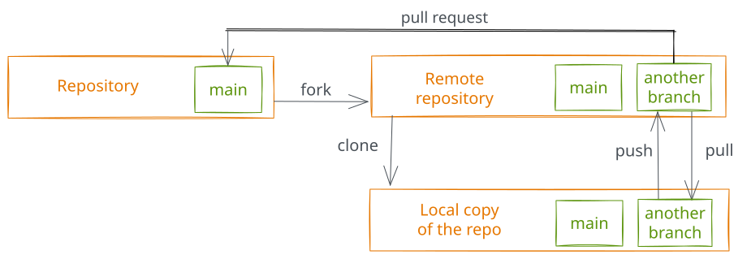{fig-align="center" fig-alt="copy-paste" width=70%}

## Renv

::::{.columns}

:::{.column width="80%"}

{fig-align="center" fig-alt="copy-paste" width=80%}

:::

:::{.column width="20%"}

{fig-align="center" fig-alt="copy-paste" width=80%}

:::

::::


## Benefits

{fig-align="center" fig-alt="" width=70%}


# Week Two: Descriptive Statistics  {background-color="#D9DBDB"}

## Building Statistical Models


::::{.columns}

:::{.column}

- What is a Statistical Model?

- A model is a simplified representation of real-world processes.

- It helps us describe, explain, and predict outcomes.

- A good fit makes accurate predictions; a poor fit can lead to misleading conclusions.

- To make reliable inferences, the model must accurately represent the data.

:::

:::{.column}

```{r, echo = FALSE}

knitr::include_graphics("images/bridge.png")
```

> “Later, we'll see how models help us test hypotheses using p-values to assess if the data fits our expectations.”

:::

::::

## Populations and Samples

Population:

- The entire group you want to study (e.g., all humans, all mice in a lab).

- Studying the entire population is often impractical due to time, cost, or logistics.

Sample:

- A subset of the population, selected to make inferences about the whole.

- Must be representative to ensure accurate conclusions.


## Descriptive Statistics

- Summarize data to highlight key features:

- Central Tendency: Where is the "center" of the data? (mean, median, mode)

- Spread: How variable are the data? (variance, standard deviation)

- Helps us understand the data before making inferences.

## Central tendency

The **central tendency** of a series of observations is a measure of the “middle value”


The three most commonly reported measures of central tendency are the sample **mean, median, and mode**.


| Mean        | Median      | Mode       |
| ----------- | ----------- |----------- |
| The average value     | The middle value      |The most frequent value      |
| Sum of the total divided by *n*   | The middle value (if *n* is odd). The average of the two central values (if *n* is even)      |The most frequent value      |
| Most common reported measure, affected by outliers | Less influenced by outliers, improves as *n* increases | Less common


## Mean

One of the simplest statistical models in biology is the **mean**

::::{.columns}

:::{.column}

| Lecturer     | Friends |
| ----------- | ----------- |
| Mark      | 5       |
| Tony   | 3     |
| Becky | 3    |
| Ellen   | 2      |
| Phil   | 1     |
| **Mean **  | **2.6**      |
| **Median **  | **3**      |
| **Mode **  | **3**      |


:::

:::{.column}


Calculating the mean:

$$ \bar{x} = \frac{\sum_{i=1}^{n} x_i}{n} $$
$$\frac{5 + 3 + 3 + 2 + 1}{5} = 2.6$$

Sum all the values and divide by n of values

:::

::::


## The mean

One of the simplest statistical models in biology is the **mean**

::::{.columns}

:::{.column}


| Lecturer     | Friends |
| ----------- | ----------- |
| Mark      | 5       |
| Tony   | 3     |
| Becky | 3    |
| Ellen   | 2      |
| Phil   | 1     |
| **Mean **  | **2.6**      |
| **Median **  | **3**      |
| **Mode **  | **3**      |


:::

:::{.column}

We already *know* this is a hypothetical value as you can't have 2.6 friends (I think?)

Now with any model we have to know how well it fits/ how accurate it is

:::

::::


## Symmetrical

If data is symmetrically distributed, the **mean and median** will be close, especially as *n* increases. 

This is also know as a **normal distribution**


```{r, echo = FALSE, out.width = "60%"}
# Load required packages
library(ggplot2)

# Set seed for reproducibility
set.seed(123)

# Generate random sample from a normal distribution
sample_size <- 1000
mu <- 0  # mean
sigma <- 1  # standard deviation
sample <- rnorm(sample_size, mean = mu, sd = sigma)

# Create a data frame with the sample data
df <- data.frame(x = sample)

# Create a histogram plot using ggplot2
ggplot(df, aes(x = x)) +
  geom_histogram(binwidth = 0.2, fill = "lightblue", color = "black") +
  labs(x = "Value", y = "Frequency", title = "Distribution Histogram") +
  theme_classic()


```


## Variance & Standard Deviation

Variance: 

The average of the squared differences from the mean.


$$s{^2}_{sample} = \frac{\sum(x - \bar{x})^2}{N -1}$$
Higher variance = more spread.

Standard Deviation (SD):

- The square root of variance.

- Easier to interpret because it’s in the same units as the data.

## Calculating variance

::::{.columns}

:::{.column}

```{r, echo = FALSE, out.width="100%", fig.alt = "Symmetrical sides"}
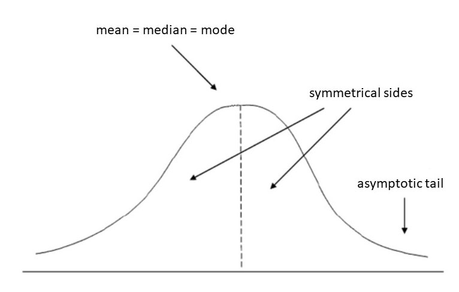
```

:::

:::{.column}


| Lecturer     | Friends | Residuals | Sq Resid |
| ----------- | ----------- |----------- |----------- |
| Mark      | 5       | 2.4 | 5.76 |
| Tony   | 3     | 0.4 | 0.16 |
| Becky | 3    | 0.4 | 0.16 |
| Ellen   | 2      | -0.6 | 0.36 |
| Phil   | 1     | -1.6 | 2.56 |
| **Mean **  | **2.6**      | | |


- Sum of Squared Residuals = 9

- N-1 = 4

- Variance = 9/4 = 2.25

:::

::::


## Standard Deviation

- Square root of **sample variance**

- A measure of dispersion of the sample

- Smaller SD = more values closer to mean, larger SD = greater data spread from mean

* *variance*:

$$
\sigma = \sqrt{\sum(x - \overline x)^2\over n - 1}
$$

## N-1? {.smaller}

```{r, echo = FALSE, out.width="30%", fig.alt = "Sampling"}
knitr::include_graphics("images/pop_sam.png")
```

For a *population* the variance $S_p^2$ is exactly the **mean** squared distance of the values from the population mean

$$
s{^2}_{pop} = \frac{\sum(x - \bar{x})^2}{N}
$$


But this is a *biased* estimate for the population variance 

- A biased sample variance will *underestimate* population variance

- n-1 (if you take a large enough sample size, will correct for this)

[More here](https://www.jamelsaadaoui.com/unbiased-estimator-for-population-variance-clearly-explained/#:~:text=The%20expected%20value%20of%20the%20sample%20variance%20is%20equal%20to,definition%20of%20an%20unbiased%20estimator.)


## Standard deviation - our example

Lecturer     | Friends | Diff | Squared diff |
  ------------ | ------- | --- | ------ |
  Mark         | 5       | 2.4  | 5.76    |
  Tony         | 3       | 0.4  | 0.16    |
  Becky        | 3       | 0.4  | 0.16    |
  Ellen        | 2       | -0.6  | 0.36    |
  Phil         | 1       | -1.6  | 2.56    |   
|  **Mean **  | **2.6**      |
| **variance** | **2.25** |
| **SD **  | **1.5**      |


## Standard Deviation

Small $s$ = data points are clustered near the mean

Large $s$ = data points are widely dispersed around the mean


```{r, echo = FALSE, message = FALSE, warning = FALSE, out.width = "60%"}

library(patchwork)

`SD = 1` <- rnorm(n = 1000, mean = 0, sd = 1)
`SD = 2` <- rnorm(n = 1000, mean = 0, sd = 2)
`SD = 3` <- rnorm(n = 1000, mean = 0, sd = 3)

tibble(`SD = 1`, `SD = 2`, `SD = 3`) %>% 
pivot_longer(cols = everything(), names_to = "Standard Deviation", values_to = "values") %>% 
  ggplot(aes(x = values, fill = `Standard Deviation`))+
  geom_histogram()+
  facet_wrap(~ `Standard Deviation`)+
  theme_classic()+
  theme(legend.position = "none")+
  labs(x = " ",
       y = "Frequency")


```


## Why the Normal Distribution matters

Shape: Symmetrical, bell-shaped curve

- Described by just two parameters: mean (μ) and standard deviation (σ).

- Rule of Thumb: For normally distributed data:

    ~68% within 1 SD

    ~95% within 2 SDs

    ~99.7% within 3 SDs

> Relevance: Many statistical tests assume data follows a normal distribution. This helps us calculate probabilities—like p-values—to test hypotheses.

## Why the Normal Distribution matters

If we assume a normal distribution (or close enough), we can calculate the probability of observing any given value using just the mean and standard deviation. 

$$
f(x) = \frac{1}{\sqrt{2\pi} \, \sigma}
       \exp\!\Biggl(-\frac{(x - \mu)^2}{2\,\sigma^2}\Biggr)
$$

This has applications in hypothesis testing and building confidence intervals

## Visualising a Distribution

::::{.columns}

:::{.column}

**Histograms** plot frequency/density of observations within bins

```{r, echo = FALSE, message = FALSE, out.width="80%"}
tibble(`SD = 1`, `SD = 2`, `SD = 3`) %>% 
pivot_longer(cols = everything(), names_to = "Standard Deviation", values_to = "values") %>% 
  filter(`Standard Deviation` == "SD = 2") %>% 
  ggplot(aes(x = values), fill = "grey")+
  geom_histogram()+
  theme_minimal()+
  theme(legend.position = "none")+
  labs(x = bquote(bar(x)),
       y = " ")
```

:::

:::{.column}

**Quantile-Quantile plots** plot quantiles of a dataset vs. quantiles of a *theoretical* (usually normal) distribution

```{r, echo = FALSE, warning = F, message  = F, out.width="80%"}

tibble(`SD = 1`,`SD = 2`, `SD = 3`) %>% 
pivot_longer(cols = everything(), names_to = "Standard Deviation", values_to = "values") %>% 
  filter(`Standard Deviation` == "SD = 2") %>% 
  ggplot(aes(sample = values))+
  geom_qq()+
  geom_qq_line()+
  theme(legend.position = "none")+
  labs(x = " ",
       y = " ")
```

:::

::::


## Z-Scores and the Standard Normal Distribution

Problem: Different datasets have different means and standard deviations.

Solution: Standardization allows comparisons by converting any normal distribution into a standard normal distribution (mean = 0, SD = 1).

$$
Z = \frac{X - \mu}{\sigma} 
$$

- Z: How many standard deviations a value is from the mean.

- X: Observed value.

- μ: Population mean.

- σ: Population standard deviation.

## Why do Z scores matter?

- The standard normal distribution allows us to calculate probabilities of observing extreme values.

- Example: If 𝑍 = 2, the observation is 2 standard deviations above the mean.

Using a Z-table, we can find the probability of getting a result at least this extreme.

This concept extends to p-values, which tell us how rare our data is under the null hypothesis.


# P-values

## What is a P-value?

:::{.incremental}

A p-value is the probability of obtaining results at least as extreme as the ones we observed, assuming the null hypothesis is true.


- It helps quantify how surprising or unusual our data is under the null hypothesis.


- A low p-value suggests that the observed data would be rare if the null hypothesis were true, which may lead us to question the null hypothesis

:::

#### Example

Imagine flipping a coin 100 times, expecting about 50 heads if it's fair (the null hypothesis). If you observe 90 heads, the p-value tells you how likely it is to get such an extreme result just by chance.

## Hypothesis formation

:::{.incremental}

- **Null hypothesis:** Assumes there is **no** difference between groups or no relationship between variables. It represents the "status quo" or baseline expectation.

> Example: A new drug has no effect compared to a placebo.


- **Alternative hypothesis:**  Assumes there **is** a difference or relationship.

> Example: The new drug does improve patient outcomes compared to the placebo.

:::

## Null Hypothesis Probability Distribution

```{r, echo = FALSE, out.width="50%"}

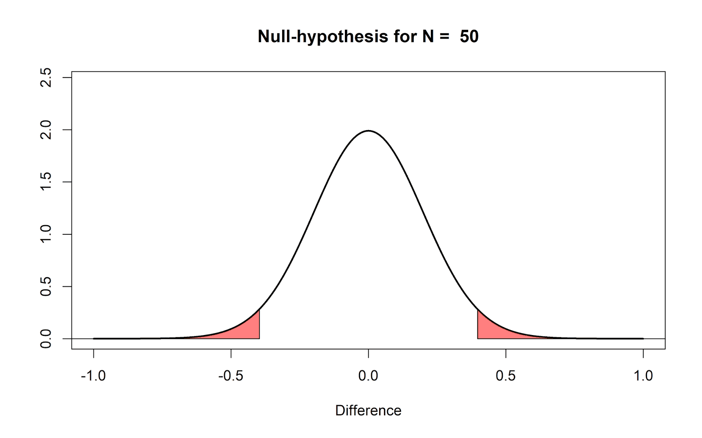

```


- The shaded areas in the tails represent extreme outcomes (typically the most unexpected 5% if using an $\alpha$ = 0.05).

- If your observed data falls within these tails, it’s considered statistically significant, suggesting it’s unlikely to occur by random chance under the null hypothesis.


## Impact of Sample Size on Distributions

```{r, echo = FALSE, out.width="50%"}

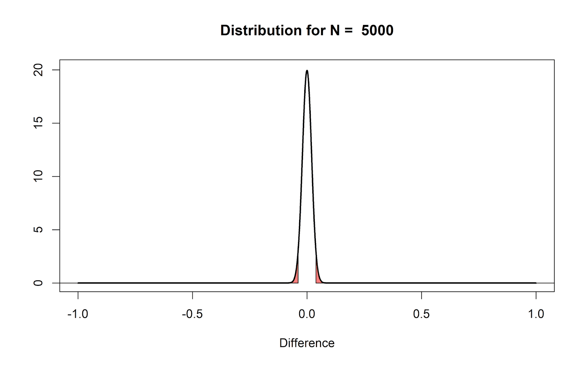

```

- Key Point: Larger sample sizes reduce variability, making it easier to detect small differences as statistically significant.

- However, statistical significance doesn't always mean practical importance—especially with large samples.


## Hypothesis testing

:::{.incremental}

- **Scenario:** Testing if diet A and diet B affect mice longevity.

- **Null Hypothesis (H₀):** No difference in longevity between diets.

- **Alternative Hypothesis (H₁):** There is a difference in longevity.


:::

```
lm(longevity ~ diet, data = mice)
```

Explanation: This linear model performs a t-test to assess if the mean lifespans differ significantly between diets.

```{r, echo = F}
data_sim <- function(mean1, mean2, sd){
set.seed(123)
mice_a <- rnorm(n = 12, mean = mean1, sd = sd)
mice_b <- rnorm(n = 12, mean = mean2, sd = sd)
mice <- data.frame(cbind(mice_a,mice_b)) %>% 
  pivot_longer(cols = everything(),
               names_to = "diet",
               values_to = "longevity")

model <- lm(longevity ~ diet, data = mice)

tidy_model <- model %>% 
  broom::tidy(., conf.int =T)

tidy_model
}

tidy_model <- data_sim(mean1 = 4, mean2 = 3, sd =1)

```


## Visualising the T Distribution

::::{.columns}

:::{.column}

- The t-distribution shows where your observed mean difference falls relative to what’s expected under the null hypothesis.

- Confidence Intervals (CI): The red area marks the 95% CI. If zero falls outside this range, it suggests statistical significance.

```{r, fig.show="hold", out.width="50%", echo = F}

tidy_model
```

:::

:::{.column}

```{r, fig.show="hold", out.width="50%", echo = F}
x <- seq(-5, 5, by = 0.1)
y1 <- dt(x, df = 22)

estimate <- tidy_model[[2,2]]
std.error <- tidy_model[[2,3]]

conf.low <- tidy_model[[2,6]]
conf.high <- tidy_model[[2,7]]

x1 <- (x*std.error)+estimate


plot(x1, y1, type = "l", col = "darkgrey", lty=1,
     xlab = "Mean difference", 
     ylab = "Density", 
     main = "T Distribution",
     ylim = c(0,0.4),
     xlim = c(min(x1), max(x1)))
polygon(c(x1[x1>=conf.high], max(x1), conf.high), c(y1[x1>=conf.high], 0, 0), col="red")


legend("topright", legend = "95% CI", lty = 1, col = "red")

#GGally::ggcoef_model(model)
```

:::

::::

## Writing About Statistical Results

“Diets can change the longevity of mice (*p* = 0.0016).”

:::{.incremental}

- “Mice on diet B lived significantly shorter lives than mice on diet A (*t*<sub>22</sub> = -3.6, *p* = 0.006).”


- "Mice on diet B had a reduced mean lifespan of 1.41 years[95% CI; -0.595:-2.22] from the mice on diet A (mean 4.19 years (95% CI, 3.62-4.77). While statistically significant (*t*<sub>22</sub> = -3.6, *p* = 0.006), this is a relatively small sample size, and further testing is recommended to confirm this effect."


- Which has the greatest level of useful detail?

:::


## Introduction to Standard Error

Standard error measures the accuracy of a sample mean as an estimate of the population mean.

$$
SE = {s\over \sqrt n}
$$


```{r, echo = FALSE, out.width="100%", fig.alt = "Data sampling"}

knitr::include_graphics("images/standard_error.png")

```


# Week Three: Inferential Statistics  {background-color="#D9DBDB"}


## Standard Error

### Standard deviation vs. standard error: 


::::{.columns}

:::{.column}

- Standard deviation measures variability **within** a sample


$s = \sqrt{\sum(x - \overline x)^2\over n - 1}$

:::


:::{.column}

- Standard error  is how much the sample mean (from a given sample) is likely to vary from the true population mean.

$SE(\overline{X}) = \frac{s}{\sqrt(N)}$

:::

::::


## Standard Error

- Standard Error of the Mean ($\overline{X}$) is the **Standard Deviation of the Sampling Distribution of the Mean.

- If you took many samples of size 𝑛from the same population, each sample would yield a different sample mean.

```{r, echo = FALSE, out.width="50%", fig.alt = ""}
knitr::include_graphics("images/sampling.png")
```

```{r, eval = F}

# install.packages("DiagrammeR")  # if not installed
library(DiagrammeR)

grViz("
digraph {
    node [shape=circle, style=filled, color=lightblue];

  A [label=' Population mean \n 5'];
  B [label='1'];
  C [label='3'];
  D [label='3'];
  E [label='4'];
  F [label='4'];
  G [label='4'];
  H [label='5'];
  I [label='5'];
  J [label='5'];
  K [label='5'];
  L [label='5'];
  M [label='7'];
  N [label='7'];
  O [label='7'];
 

  A -> B A -> C A -> D A -> E A -> F A -> G A -> H A-> I A-> J A -> K A -> L A-> M A -> N A->O;
}
")


```


## Standard Error

- All these sample means form their own distribution: the sampling distribution of the mean.

- The Standard Error measures the width (standard deviation) of this distribution of sample means.

- Larger 𝑛→ smaller SE → sample means cluster more tightly around the true mean.

```{r}
# -------------------------------------------
# Simulate sample means from an exponential population
# and show that they approximate a normal distribution
# as the number of samples (B) gets large.
# -------------------------------------------

# Set seed for reproducibility
set.seed(123)

# Parameters
n <- 30       # Sample size for each draw
B <- 10000    # Number of repeated samples
true_mean <- 5  # Mean of the exponential distribution (rate = 1/true_mean)

# Pre-allocate a vector to store the sample means
sample_means <- numeric(B)

# Loop: draw a sample of size n, compute mean, repeat B times
for(i in 1:B){
  # Draw n data points from an exponential distribution with mean = 5
  x <- rexp(n, rate = 1/true_mean)
  sample_means[i] <- mean(x)
}

# Plot the histogram of sample means
hist(sample_means, breaks = 40, freq = FALSE, 
     main = paste("Distribution of Sample Means"),
     xlab = "Sample Mean", col = "lightblue", border = "gray")

# Overlay a normal curve with the theoretical mean and std. dev. from CLT
# Theoretical mean of the sample mean = 5
# Theoretical std. dev. of the sample mean = (std. dev. of population) / sqrt(n)
# For Exp(mean=5), population std. dev. is also 5.

curve(dnorm(x, mean = true_mean, sd = 5 / sqrt(n)), 
      col = "red", lwd = 2, add = TRUE)

# Add a legend
legend("topright", legend = c("Sample Means", "Normal Approx"), 
       col = c("lightblue", "red"), lty = c(1,1), lwd = 2, bty = "n")


```


## Central Limit Theoreom (CLT)

- For large 𝑛the distribution of sample means becomes approximately normal, **no matter the original data’s shape** (assuming finite variance & independence).


- Lets us use normal-based methods (like confidence intervals and hypothesis tests) even if the original data are not normal—provided 𝑛 is large.


[Shiny App demonstrating CLT](https://pleft86.shinyapps.io/Sampling/)

## Small Samples

What is a sufficient 𝑛?

- When the data is very close to a normal distribution it might be very small c.10

- When the data is slightly skewed it might be 𝑛 = 30

- When the data follows an alternative distribution it could be very large


## Bootstrapping

- Bootstrapping: Resample from your data many times to estimate the distribution (and SE) of the Mean ($\overline{X}$) without assuming normality.

::::{.columns}

:::{.column}

```{r, echo = FALSE, out.width="70%", fig.alt = ""}
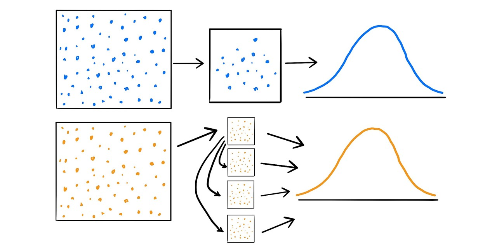
```

:::

:::{.column}

```{r, eval = F, echo = T}

# Perform bootstrapping
for(i in 1:1000) {
  # Resample with replacement
  resample <- sample(my_data, size = length(my_data), replace = TRUE)
  # Compute the statistic (mean here)
  boot_means[i] <- mean(resample)
}

```

:::

::::

## Parametric fits

If you *know* the data follows a specific distribution (e.g. Poisson, Binomial, etc) we can base our inference on these - *see Generalised Linear Models*

## Are two samples distributions from the same population?

- Even if two samples are both drawn from the same underlying population, they won’t have identical means.

- Question: When is that difference “big enough” to claim they come from different populations?

```{r, fig.width = 12}

plot_two_normals <- function(mean1 = 0, sd1 = 1, mean2 = 0.5, sd2 = 1) {
  x <- seq(-5, 5, by = 0.1)
  y1 <- dnorm(x, mean = mean1, sd = sd1)
  y2 <- dnorm(x, mean = mean2, sd = sd2)
  plot(x, y1, type = "l", col = "red", xlab = "X", ylab = "Density", main = "Two Normal Distributions")
  lines(x, y2, col = "blue", lty = "dashed")
  legend("topright", c("Population 1", "Population 2"), lty = c("solid", "dashed"), col = c("red", "blue"))
}

plot_two_normals()

```

## Standard Error vs. Standard Error of the Difference

::::{.columns}

:::{.column}


### Standard Error

Measures the spread (uncertainty) of one sample mean around its population mean.

### Standard Error of the Difference (SED)

$Mean~difference = \overline x_1 - \overline x_2$

$SED = \sqrt{s_1^2\over n_1}+{s_2^2\over n_2}$

Standard Error of the difference is calculated from two $s$ so will always be larger than a single population estimate


:::

:::{.column}

```{r, fig.width = 7}
plot_mean_diff <- function(mean1 = 0, sd1 = 1, mean2 = 0.5, sd2 = 1, sample_size = 20) {
    library(graphics)
    sd <- sqrt(sd1^2/sample_size + sd2^2/sample_size)
    x <- seq(-5, 5, by = 0.1)
    mean_diff <- rnorm(10000, mean = mean2 - mean1, sd = sd)
    y <- dnorm(x, mean = mean2 - mean1, sd = sd)
    plot(x, y, type = "l", col = "black", xlab = "Difference in Means", ylab = "Density", main = "Mean Difference Distribution")
    abline(v = 0, col = "red", lty = 2)
    xmin <- mean2 - mean1 - 1.96 * sd
    xmax <- mean2 - mean1 + 1.96 * sd
    ymin <- 0
    ymax <- max(y)
    rect(xmin, ymin, xmax, ymax, col = "grey", density = 20, angle = 45)
    legend("topright", legend = "95% \n Confidence Interval", fill = "grey")
}


plot_mean_diff(mean1 = 0, sd1 = 1, mean2 = 0.5, sd2 = 1, sample_size = 20)

```

:::

::::

## Two-sample t-tests

- Null Hypothesis : The two samples do not differ in their population means

- Alternative Hypothesis : The two samples come from populations with different means

**Even with identical populations, sample means differ. The t-test checks if that difference is too large to be due to chance.**

```{r, echo = FALSE, out.width="50%", fig.alt = ""}
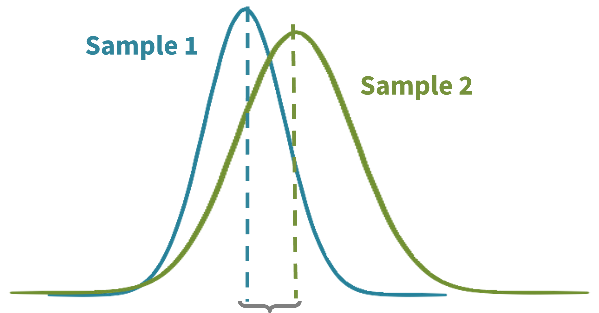
```


## Different enough?

How different is “different enough”?

When can we determine that two sample means are different **enough**? To have come from *different* populations?

::::{.columns}

:::{.column}

```{r, echo = FALSE, out.width="80%", fig.alt = ""}

```

:::

:::{.column}

```{r, echo = FALSE, out.width="80%", fig.alt = ""}
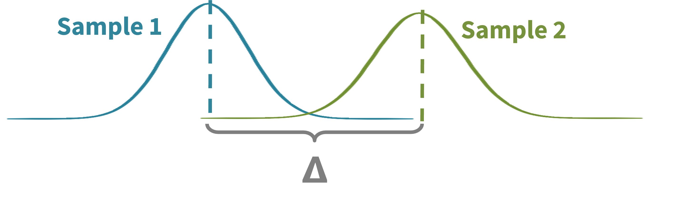
```

:::

::::


## Two-sample t-test

* Compare the means of two samples

* Null hypothesis: there is no difference between the population means

* t-statistic: based on difference in sample **means, sd & n**

* For a given sample size and t-value, how unlikely is to have two random samples *at least* this different IF both samples are drawn from identical/same populations. 


## T-test in Action

**Example:** A botanist is studying the mass of pollen transported by individual bees from two different hives (Hive A and Hive B). 

- Hive A: 62 bees, (mean pollen mass = 31.4 mg, variance = 225.0 mg^2) 

- Hive B: 67 bees, (mean pollen mass = 36.7 mg, variance = 186.0 mg^2) 


**Is there a significant difference in pollen mass transported per bee for the two hives studied?**


Variance $s^2$ = Sum of squared residuals/ n

Standard deviation (s) = $\sqrt Variance$


## Standard error of the difference

 **Calculate the difference in means, and the standard error of the difference in means**

::::{.columns}

:::{.column}

Mean Difference = 36.7 - 31.4

Mean Difference = 5.3

:::

:::{.column}


$$
SED = \sqrt{s^2_1\over n_1} + {s^2_2\over n_2}
$$


$$
SED = \sqrt{225\over 62} + {186\over 67}
$$


$$
SED = \sqrt{3.63} + {2.78}
$$


$$
SED = 2.53
$$


:::

::::


## Standard error of the difference

::::{.columns}

:::{.column}

Mean difference = 5.3


**Calculate 95% confidence intervals**

Assuming a normal distribution this would be 1.96 * SED = 4.96


Assuming a *t* distribution = ( $\alpha$ = 0.975, *df* = 129-2, *SED* = 2.53 ) = 5.008


95% CI range = 5.3 [± 5.008] = 0.292 - 10.308 

:::

:::{.column}

$$
SED = 2.53
$$

```{r, echo = FALSE, out.width="80%", fig.alt = "T distributions"}
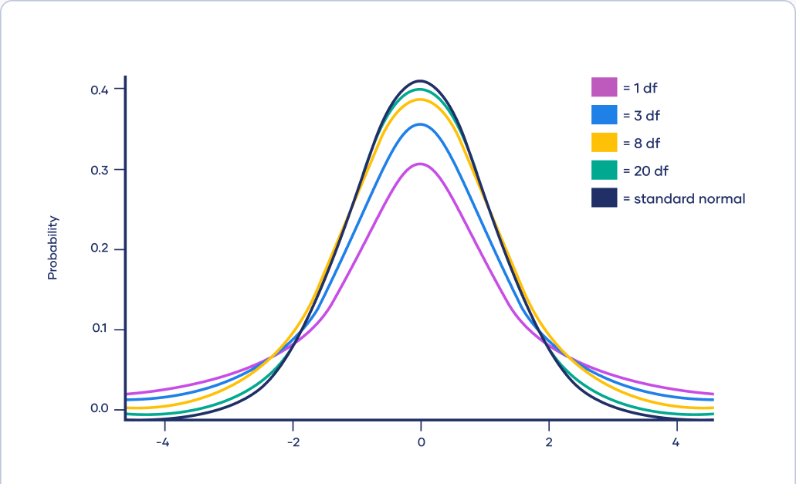
```

:::

::::


## Confidence intervals

**Calculate 95% confidence intervals**

95% CI range = 5.3 [± 5.008] = 0.292 - 10.308 

* **Describe the estimated mean difference**

**The mass of pollen transported per bee in Hive B is on average 5.3mg more than Hive A [0.29 - 10.3] (mean [± 95% CI])**

##

**The mass of pollen transported per bee in Hive B is on average 5.3mg more than Hive A [0.29 - 10.3] (mean [± 95% CI])**

:::{.fragment}

**The 95% CI calculated from the *t* distribution doesn’t include 0 → likely a real difference between the two hive populations.**
:::

:::{.fragment}

**"At P ≤ 0.05 bees from Hive B transport at least 0.29mg of pollen more per bee than Hive A"**

:::

## t-test in R

```{r, echo = T, eval = FALSE}

hive_data %>% 
  t_test(pollen_mass ~ hive,
         var.equal = T)

```

```

	Two Sample t-test

data:  hive_a and hive_b

t = 2.09, df = 127, p-value = 0.01152

alternative hypothesis: true difference in means is not equal to 0

95 percent confidence interval:
0.294166 10.30808

```

> We can also produce t-tests (and many other tests besides with the lm() function in R)

## Common misundertandings\n about P values

**A p-value is NOT:**

- The probability that the null hypothesis is true.

- The probability your results occurred "by chance."

- Proof of a meaningful or large effect.

**What it IS:**

- A measure of how surprising your data is under the assumption the null hypothesis is true.


[Common misconceptions about P-values](https://daniellakens.blogspot.com/2017/12/understanding-common-misconceptions.html?m=1)

[Evidence of P-hacking](https://www.ncbi.nlm.nih.gov/pmc/articles/PMC4359000/#:~:text=Evidence%20for%20p%2Dhacking%20from,test%20function%20in%20R)


## A non-significant p-value DOES NOT mean the null hypothesis is true

::::{.columns}

:::{.column}

In reality, we can’t know for sure if a true mean difference exists.

For illustration: Assume we could know the true mean difference.

The figure shows:

    Grey line: Expected data if the null hypothesis is true.

    Black line: Expected data if the alternative hypothesis is true.

A p-value shows how surprising the data are if the null is true.

A low p-value is evidence against the null, not proof of the alternative.

:::

:::{.column}

```{r, echo = FALSE, out.width="60%"}

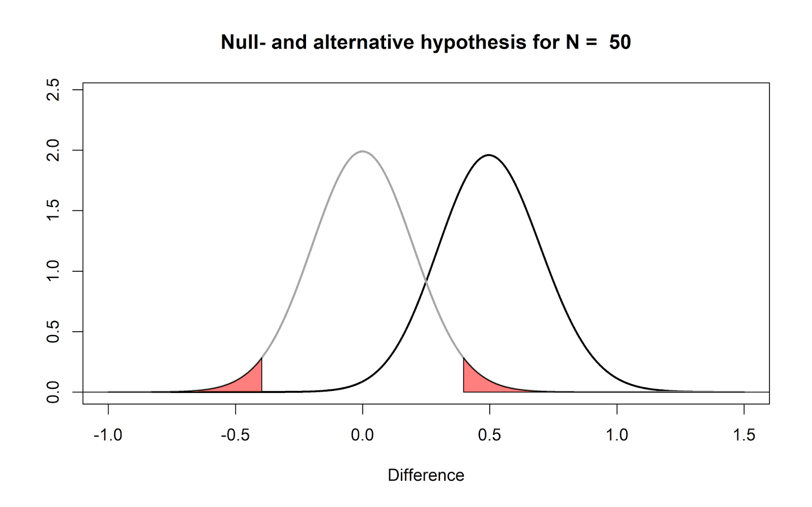

```

:::

::::


## Why a significant p-value does not mean the null hypothesis is false


What we can conclude, based on our data, is that we have observed an extreme outcome, that should be considered surprising. But such an outcome is not *impossible* when the null-hypothesis is true.

```{r, echo = FALSE, out.width="60%"}

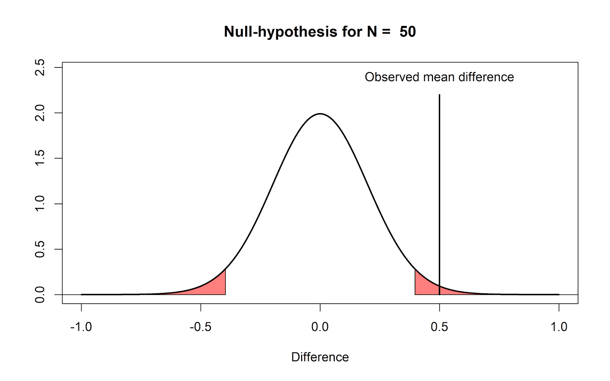

```


## Why a significant p-value is not the same as an important effect

::::{.columns}

:::{.column}

If we plot the null model for a very large sample size, we can see that even very small mean differences will be considered 'surprising'. 

However, just because data is surprising, does not mean we need to care about it. It is mainly the verbal label ‘significant’ that causes confusion here – it is perhaps less confusing to think of a ‘significant’ effect as a ‘surprising’ effect.

:::

:::{.column}

```{r, echo = FALSE, out.width="90%"}

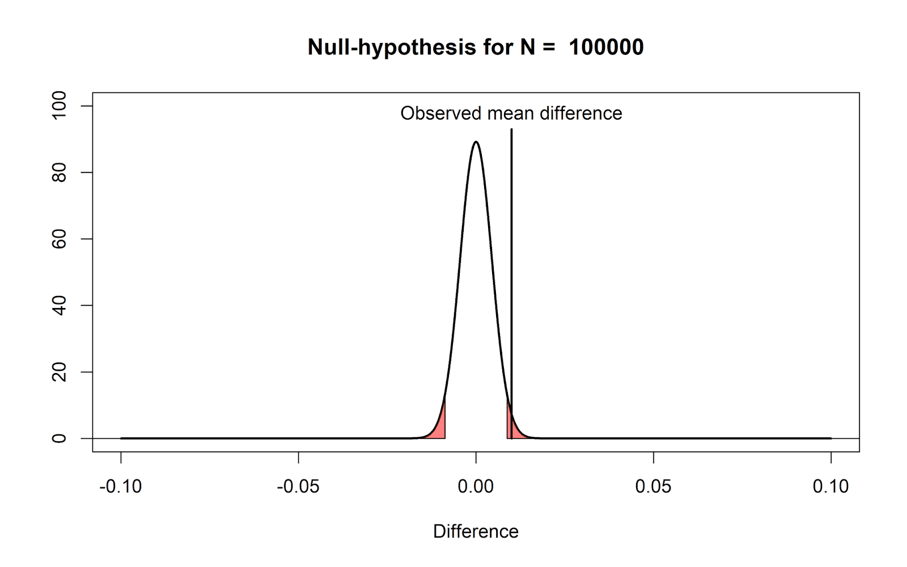

```

:::

::::

# Linear models {background-color="#D9DBDB"}

## Linear models cover multiple data types


::::{.columns}

:::{.column}

Difference tests: t-test, ANOVA, ANCOVA

```{r, echo = FALSE, out.width="100%", fig.alt = "Difference model"}
knitr::include_graphics("images/linear_model_difference.png")

```


:::

:::{.column}

Association tests: Regressions

```{r, echo = FALSE, out.width="100%", fig.alt = "Regression model"}
knitr::include_graphics("images/linear_model_regression.png")
```

:::

::::


## Basic linear models

```{r, echo = FALSE, out.width="60%", fig.alt = "Basic linear models aim to describe a linear relationship between a response (outcome) variable and a predictor (input) variable, usually by the method of ordinary least squares"}

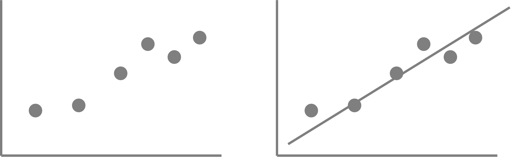

```

Basic linear models aim to describe a linear relationship between a:

:::{.incremental}

- response (dependent) variable and predictor(s) (independent) variable. 

- usually by the method of ordinary least squares.

:::

---

## Linear Regression Equation

$Y = \beta0 + \beta_1x1 + \epsilon$

::::{.columns}

:::{.column}

### Where:

$y$ is the predicted value of the response variable


$\beta0$ is the intercept (value of y when x = 0)


$\beta_1x1$ is the slope of the regression line


$\epsilon$ is the error term

:::

:::{.column}


```{r, echo = FALSE, out.width="100%", fig.alt = "regression"}

knitr::include_graphics("images/reg.png")

```

:::

::::

## Example

```{r, include = FALSE}

dros_clean <- readRDS(here("data","fruitfly.rds"))

```


::::{.columns}

:::{.column}

Difference tests: t-test, ANOVA, ANCOVA

```{r, echo = FALSE, out.width="100%", fig.alt = "Difference model"}
dros_diff <- lm(longevity ~ type, data = dros_clean)
summary(dros_diff)
```


:::

:::{.column}

Association tests: Regressions

```{r, echo = FALSE, out.width="100%", fig.alt = "Regression model"}
dros_diff <- lm(longevity ~ thorax, data = dros_clean)
summary(dros_diff)
```

:::

::::


## Combining variables and omitted variable bias

Now we have *two* (or more) reasonable predictors of longevity:

::::{.columns}

:::{.column}

```{r}
dros_model <- lm(longevity ~ thorax + type + sleep, data = dros_clean)
summary(dros_model)
```
:::

:::{.column}

$Y = \beta0 + \beta_1x1 +\beta_2x2 + \beta_3x3 + \epsilon$

```{r, echo = FALSE}
dros_model <- lm(longevity ~ thorax + type + sleep, data = dros_clean)
emmeans::emmeans(dros_model,
                 specs = ~ thorax + type,
                 at =list(thorax = seq(.64, .94, by = .02))) %>% 
  as_tibble() %>% 
  ggplot(aes(x = thorax,
             y = emmean,
             colour = type))+
  geom_line(aes(group = type))+
  geom_point(data = dros_clean,
             aes(x = thorax, y = longevity),
          alpha = .4)+
  theme_bw()+
  labs(x = "Thorax size (mm)",
       y = "Longevity (days)")
```

:::

::::


## Line of best fit

```{r, echo = FALSE, out.width="70%", fig.alt = "Line fitting"}

knitr::include_graphics("images/fit-linear.png")

```


## Ordinary Least Squares

The line of best fit minimises the sum of the **squared distance** that *each* sample point is from the value predicted by the model

This is called the method of 


### Ordinary Least Squares

## Residuals


The difference between the ACTUAL value of the observation $y_i$ and the value that the model predicts $\hat{y_i}$ at that $x$ value are the residuals (residual error).


```{r, echo = FALSE, out.width="50%", fig.alt = "residuals"}

knitr::include_graphics("images/ols.png")

```

The regression model fitted by **O**rdinary **L**east **S**quares (OLS) will produce the equation for the line that **MINIMIZES** the sum of squares of the residuals


## Sum of Squares Errors

::::{.columns}

:::{.column}

```{r, echo = FALSE, out.width="40%", fig.alt = "sum of squares error"}

knitr::include_graphics("images/ols-2.png")

```

:::

:::{.column}

This produces the line with the *smallest* total area size for the squares. 

$$
SSE = \underset{i=1}{n \atop{\sum}}(y_i - \hat{y_i})^2
$$


SUM OF RESIDUAL ERROR = $(2)+(-1)+(4)+(-3)+(-2)=0$


SUM OF SQUARES OF RESIDUAL ERROR = $(2^2)+(-1^2)+(4^2)+(-3^2)+(-2^2)=34$

:::

::::


## Coefficient of determination


$\LARGE{R^2}$ : The proportion of variation in the dependent variable that can be predicted from the independent variable


$$
\LARGE{R^2=1-{Sum~of~Squared~Distances~between~y_i~and~\hat{y_i}\over{Sum~of~Squared~Distances~between~y_i~and~\overline{y}}} }
$$


$$
\LARGE{R^2=1-{SSE\over{SST}}}
$$


## Assumptions of the Linear Model

:::{.incremental}

-  *Errors* should be normally distributed

- Homoscedasticity of the errors

- Independent observations

- A Linear relationship

:::

## Model fit checks

```{r, echo = T, out.width="100%"}
performance::check_model(dros_model, 
                         detrend = F) 
```


## Linearity

```{r, echo = T, out.width="100%"}
performance::check_model(dros_model,
                         check = "linearity") 
```


## Normality

```{r}
#| eval: true
#| echo: true
#| layout-ncol: 2
#| fig-height: 7
#| message: false

performance::check_model(dros_model,
                         check = "normality")

performance::check_normality(dros_model)
```

## Heteroscedasticity

```{r}
#| eval: true
#| echo: true
#| layout-ncol: 2
#| fig-height: 7
#| message: false

performance::check_model(dros_model,
                         check = "homogeneity")

performance::check_heteroscedasticity(dros_model)
```

## Outliers

```{r}
#| eval: true
#| echo: true
#| layout-ncol: 2
#| fig-height: 7
#| message: false

performance::check_model(dros_model,
                         check = "outliers")

performance::check_outliers(dros_model)
```

# Questions? {background-color="#D9DBDB"}

## Interpreting Models

```{r, echo = FALSE, out.width="60%", fig.alt = "R model summary provides, the formula of the regression, the estimate of the intercept and standard error, estimated differences and uncertainity for each slope, the degrees of freedom for the whole model, F value and R squared"}
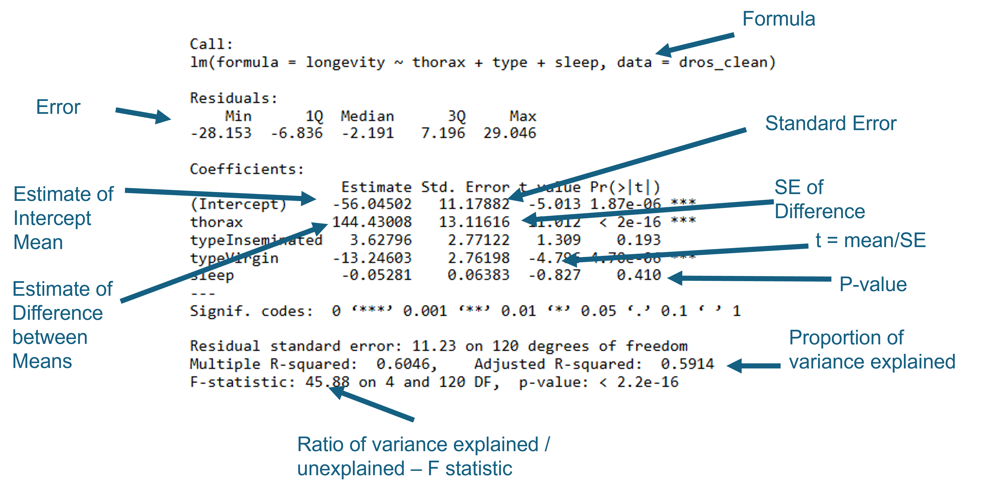
```


## Reporting  {.smaller}

::::{.columns}

:::{.column width="40%"}

```{r}

broom::tidy(dros_model, conf.int = T)

```

:::

:::{.column width="60%"}

:::{.incremental}

- The effect of thorax is statistically significant and positive (beta = 144.43, 95% CI [118.46, 170.40], t(120) = 11.01, p < .001; Std. beta = 0.64, 95% CI
[0.52, 0.75])

  - The effect of type [Inseminated] is statistically non-significant and positive (beta = 3.63, 95% CI [-1.86, 9.11], t(120) = 1.31, p = 0.193; Std. beta = 0.21,
95% CI [-0.11, 0.52])

  - The effect of type [Virgin] is statistically significant and negative (beta = -13.25, 95% CI [-18.71, -7.78], t(120) = -4.80, p < .001; Std. beta = -0.75, 95%
CI [-1.07, -0.44])

 - The effect of sleep is statistically non-significant and negative (beta = -0.05, 95% CI [-0.18, 0.07], t(120) = -0.83, p = 0.410; Std. beta = -0.05, 95% CI
[-0.16, 0.07])

:::

:::

::::

# ANOVA {background-color="#D9DBDB"}


## Model summary

In this example of a simple linear model, we run the equivalent to a Student's t-test.

```{r, echo = FALSE, out.width="60%", fig.alt = "R model summary provides, the formula of the regression, the estimate of the intercept and standard error, estimated differences and uncertainity for each slope, the degrees of freedom for the whole model, F value and R squared"}
summary(dros_model)
```

**Q. What happens when we have more than two groups in our predictor variable? Why shouldn't we just do lots of t-tests?**


## ANalysis Of VAriance (ANOVA)

ANOVAs use information about variances, but the main goal of analysis is comparison of MEANS (don’t let the name mix you up - more on this later).


:::{.fragment}

**ANOVA is an omnibus test** – it tests for significant differences between any means in the study

:::

:::{.fragment}


**ANOVA is just a special case of the linear model**

:::


## ANOVA Hypotheses:

**Null Hypothesis (H0):** All means are equal (in other words, all groups are from populations with the same mean)

:::{.fragment}

**Alternative Hypothesis (HA):** At least two group means are NOT equal (that means that just two could be different, or they could ALL be different)

:::


## ANOVA Example 


::::{.columns}

:::{.column}

We have collected data for soil uranium concentrations at three locations on Los Alamos National Lab property: Site A, Site B, and Site C. The data structure is shown here: 

A one-way ANOVA can be used to assess whether there is a statistically significant difference in uranium concentration in soil at three locations

:::

:::{.column}

```{r, echo = FALSE, out.width="120%", fig.alt = "A tidy dataframe illustrating one continuous dependent variable and and one factor predictor variable (with three levels)"}
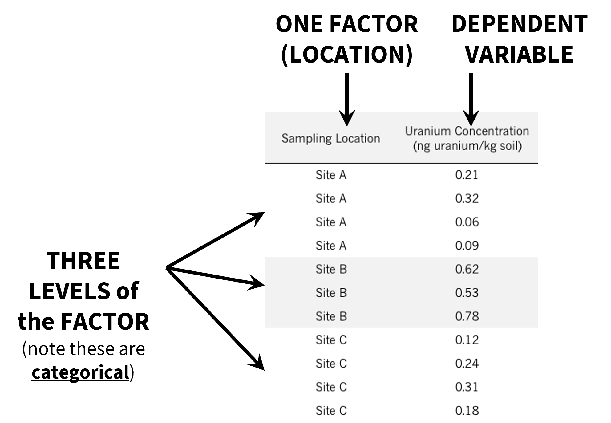
```

:::

::::


## One-way ANOVA (single factor)

What does this one-way/single-factor refer to? 

There is a **single factor** (*variable*), with at least 3 **levels**, where we are trying to compare means across the different levels of that factor.

ANOVA does this *indirectly* by looking at total *between* and *within* group variances as a ratio (F).

```{r, echo = FALSE, out.width="70%", fig.alt = ""}
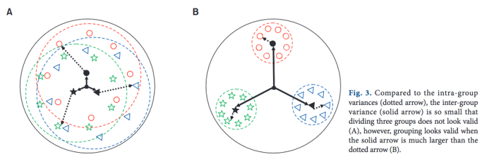
```

## Sums of Squares

::::{.columns}

:::{.column}


```{r, echo = FALSE, out.width="100%", fig.alt = "OLS fits a line to produce the smallest amount of SSE"}

knitr::include_graphics("images/Sum of squares.png")

```

:::

:::{.column}

**SST** The squared differences between the observed dependent variable $y_i$ and its overall mean $\overline{y}$.

**SSR** The sum of the differences between the predicted value $\hat{y_i}$ of the dependent variable and its overall mean $\overline{y}$.

**SSE** The error is the difference between the observed dependent value $y_i$  and the predicted value $\hat{y_i}$.

:::

::::


##

::::{.columns}

:::{.column width="30%"}

$$
SSE = \underset{i=1}{n \atop{\sum}}(y_i - \hat{y_i})^2
$$


$$
SSR = \underset{i=1}{n \atop{\sum}}(\hat{y_i} - \overline{y})^2
$$


$$
SST = \underset{i=1}{n \atop{\sum}}(y_i - \overline{y})^2
$$

where:

$y_i$ = Observed value

$\hat{y_i}$ = Value estimated by model

$\overline{y}$ = The Grand Mean


:::

:::{.column width="70%"}

```{r, echo = FALSE, out.width="90%", fig.alt = "A tidy dataframe illustrating one continuous dependent variable and and one factor predictor variable (with three levels)"}
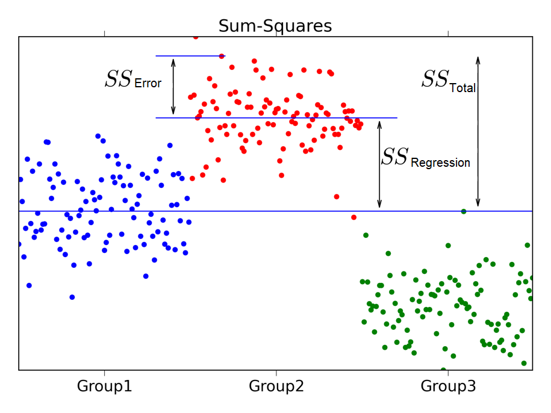
```


$SSE + SSR = SST$

:::

::::

---

## What does an ANOVA actually do?

::::{.columns}

:::{.column width="60%"}

$$
\large F = {SSR / (k-1)\over SSE / (N-k)} = {MSR\over MSE}
$$


$k$ = Total number of groups

$N$ = **numerator** degrees of freedom = Total number of observations across all groups

$N-k$ = **denominator** degrees of freedom

$MSR$ = Mean Squares Regression

$MSE$ = Mean Squares Error

This is a **ratio** of the between group variance and the the within group variance. 

:::

:::{.column width="40%"}


```{r, echo = FALSE, out.width="120%", fig.alt = ""}
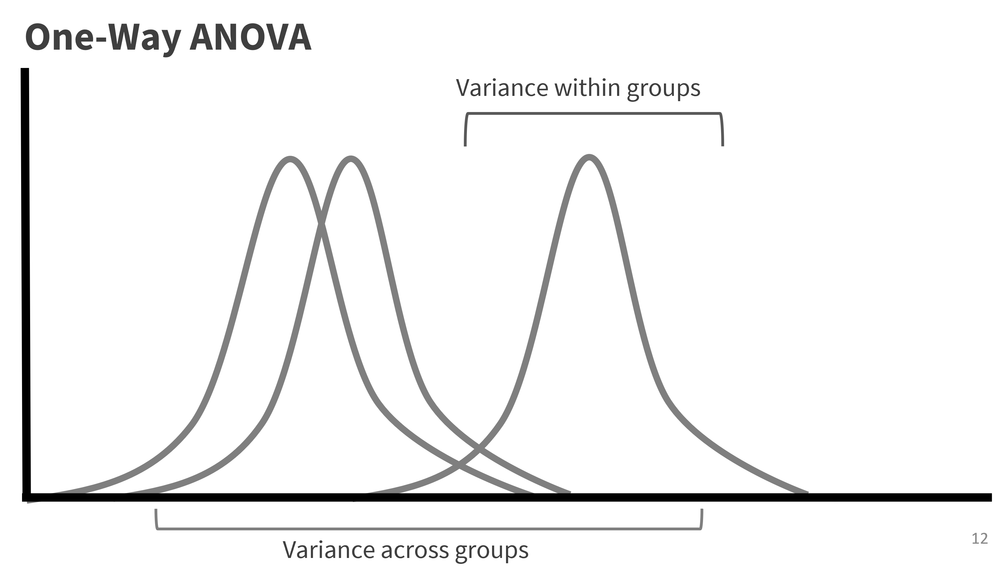
```

:::

::::


## F distribution

::::{.columns}

:::{.column}

The F-value or ratio of variances, over their respective degrees of freedom will have an F-distribution. 

This F distribution is used when we want to compare within and between group variances.

The curve of the distribution depends on the degrees of freedom, and it is always positively skewed

:::

:::{.column}

```{r, echo = F, fig.height = 10}
x <- seq(0.001, 5, by = 0.001)
y1 <- df(x, df1 = 1, df2 = 1)
y2 <- df(x, df1 = 2, df2 = 1)
y3 <- df(x, df1 = 5, df2 = 2)
y4 <- df(x, df1 = 10, df2 = 1)
y5 <- df(x, df1 = 100, df2 = 100)

plot(x, y1, type = "l", col = "red", lwd = 2,
     xlab = "x", 
     ylab = "Density", 
     main = "F Distributions",
     ylim = c(0,3),
     xlim = c(0.001, 4))
lines(x, y2, col = "blue", lwd = 2)
lines(x, y3, col = "green", lwd = 2)
lines(x, y4, col = "purple", lwd = 2)
lines(x, y5, col = "black", lwd = 2)
legend("topright", legend = c("df1 = 1, df2 = 1", "df1 = 2, df2 = 1", "df1 = 5, df2 = 2", "df1 = 10, df2 = 1", "df1 = 100, df2 = 100"), col = c("red", "blue", "green", "purple", "black"), lty = c(1, 1, 1, 1, 1))
```

:::

::::

## Significance testing

:::{.incremental}

- The **higher** the *F*-value the greater the *signal-to-noise* ratio. 


- For a given value of **numerator** and **denominator** degrees of freedom we can look up the probability of observing this ratio under a null hypothesis of identical variances.


- If F value is high enough then we might have enough evidence to conclude that samples are likely drawn from populations with *different* means.

:::

```{r, echo = FALSE, out.width="35%", fig.alt = ""}
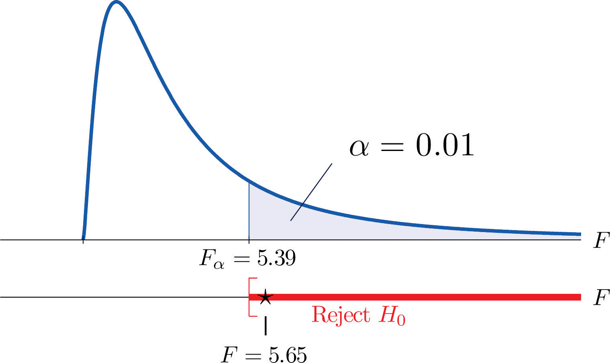
```


# Ask a question about: ANOVA


## ANOVA Example

::::{.columns}

:::{.column}

```{r, echo = T}

dros_model2 <-lm(longevity ~ thorax + sleep, data = dros_clean)

anova(dros_model2, dros_model)

```
:::


:::{.column}


```{r,  echo = T}
drop1(dros_model, test = "F")

```

:::

::::


# Post-hoc vs. Planned contrasts


## Correcting for multiple comparisons

:::{.incremental}

- The *F*-ratio tells us only whether the model fitted to the data (SSR) accounts for more variance than other factors (SSE). 

- So if the *F*-ratio is large enough to be statistically significant, then we only know that *one or more* differences between means are statistically significant.

- Further testing is needed! 

:::

## Planned contrasts

:::{.incremental}

- You focused on a *few* scientifically sensible comparisons, rather than every possible comparison

- You chose these *as part of the experimental design* before collecting data

- Could structure linear model to reflect this?

:::


## Post hoc

:::{.incremental}

- Typically unplanned comparisons, conducted only after a significant ANOVA result

- All combinations checked

- Needs correcting for inflated Type 1 error

:::

## Post hoc {.smaller}

| Method     | Equation | Notes|
| ----------- | ----------- |----------- |
| Bonferroni/Dunn-Sidak    | $p = {\alpha \over k}$      | Correct critical p for the number of independent tests
| Holm's    | $p_{1} < \alpha/(k–1+1) = \alpha/k$      | we start with the smallest p-value (i = 1) and determine whether there is a significant result (i.e. p1 < α/(k–1+1) = α/k. If so we move on to the second test. We continue in this manner until we get a non-significant result
| Tukey HSD  | $t_{crit} = q * \sqrt{MSE \over N}$  | Essential a t-test, correcting for multiple comparison, q-values can be looked up for test df and number of treatments


## Estimated means


```{r, echo = F}
library(emmeans)
```

```{r, echo = T}

means <- emmeans::emmeans(dros_model,
                          specs = ~ type)

means

```


## Estimated mean differences


```{r, echo = T}

means <- emmeans::emmeans(dros_model, 
                 specs = pairwise ~ type)

means

```


## Estimated CI of the difference

```{r, echo = T}


means <- emmeans::emmeans(dros_model, 
                 specs = pairwise ~ type)

confint(means)

```

## Predictions

```{r, eval = FALSE, echo = T}
dros_model <- lm(longevity ~ thorax + type + sleep, data = dros_clean)
emmeans::emmeans(dros_model,
                 specs = ~ thorax + type,
                 at =list(thorax = seq(.64, .94, by = .02))) %>% 
  as_tibble() 
```


```{r, echo = FALSE}
dros_model <- lm(longevity ~ thorax + type + sleep, data = dros_clean)
emmeans::emmeans(dros_model,
                 specs = ~ thorax + type,
                 at =list(thorax = seq(.64, .94, by = .02))) %>% 
  as_tibble() %>% 
  ggplot(aes(x = thorax,
             y = emmean,
             colour = type))+
  geom_line(aes(group = type))+
  geom_point(data = dros_clean,
             aes(x = thorax, y = longevity),
          alpha = .4)+
  theme_bw()+
  labs(x = "Thorax size (mm)",
       y = "Longevity (days)")

```


# Generalised Linear Models {background-color="#D9DBDB"}

## What are Generalised linear models?

:::{.incremental}

- The Generalised Linear Model (GLM) is an extension of the ordinary linear regression model that accommodates a broader range of response variable types and error distributions.

- Key components: 

- **Linear Predictor:** Combines predictor variables linearly.

- **Link Function:** Links the mean of the response variable to the linear predictor.

- **Error family:** Drawn from the **exponential family** it determines the shape of the response variable's distribution.

:::


## Linear Predictor

Linear models:

::: {.center-text}


$y_i = \beta0 + \beta_1x1 + \beta_2x2 + ... +\beta_nxn +\epsilon_i$

:::


::: {.fragment}

<br>

Then generalised linear models...

::: {.center-text}

$\eta_i = \beta_0 + \beta_1 x_{1i} + \beta_2 x_{2i} + \ldots + \beta_n x_{ni}$


:::

- $\eta_i$ the linear prediction for observation $i$

:::


## The link function


Let's start with linear models...

::: {.center-text}


$y_i = \beta0 + \beta_1x1 + \beta_2x2 + ... +\beta_nxn +\epsilon_i$

:::

::: {.fragment}

<br>

Then generalised linear models...

::: {.center-text}

$g(\mu_i) = \eta_i$


:::

:::

:::{.fragment}

- $\eta_i$ linear prediction for observation $i$

- $g$ the link function relating the linear predictor to the expected value (mean) of the response variable

- $\mu_i$ is the expected value of the response variable for observation $i$

Common link functions: identity, sqrt, log, logit

:::


## Error family

Let's start with linear models...

::: {.center-text}


$y_i = \beta0 + \beta_1x1 + \beta_2x2 + ... +\beta_nxn +\epsilon_i$


$\epsilon_i = \mathcal{N}(0, \sigma^2)$

:::


::: {.fragment}

Then generalised linear models...

::: {.center-text}

$\mu_i = f(\eta_i)$

$\epsilon_i \sim \mathcal{N}(0, \sigma^2)$

:::

:::

:::{.fragment}

 - $\epsilon_i$ is the error term for observation $i$

**Examples:** Gaussian (normal), binomial, Poisson, gamma, etc.

:::

## Generalised Linear Model

::::{.columns}

:::{.column}

**Linear Predictor** ($\eta$):

$\eta_i = \beta_0 + \beta_1 x_{1i} + \beta_2 x_{2i} + \ldots$

**Link Function** ($g$):

$g(\mu_i) = \eta_i$

**Probability Distribution**:

$\mu_i = f(\eta_i)$

$\epsilon_i \sim \mathcal{N}(0, \sigma^2)$

:::

:::{.column}

- $\eta_i$ linear prediction for observation $i$

- $g$ the link function relating the linear predictor to the expected value (mean) of the response variable

- $\mu_i$ is the expected value of the response variable for observation $i$

- $f$ the inverse of the link function, transforming the linear predictor back to the response variable's expected value

- $\epsilon_i$ is the error term for observation $i$

:::

::::

## Changing model structures

There are a range of model structures available. 

The choice of error family and link influence how well the model fits

| Exponential Error Family      | Link Function       |
|-------------------|---------------------|
| Gaussian          | Identity, sqrt, log, inverse            |
| Binomial          | Logit, probit, cloglog               |
| Poisson           | Log, identity, sqrt                 |
| Gamma             | Inverse, identity, log, sqrt             |
| Negative Binomial | Log, identity, sqrt|


## Choosing an error family

::::{.columns}

:::{.column width="40%"}

- What type of variable is the outcome?

- Fit models: check residuals and AICs

:::

:::{.column width="60%"}

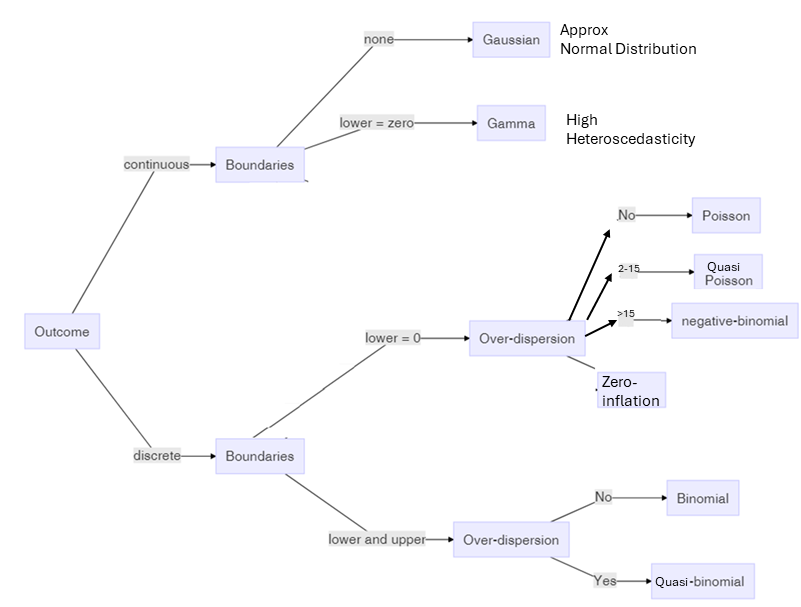{fig-align="center" fig-alt="physalia logo" width=150%}

:::

::::

# Likelihood {background-color="#D9DBDB"}


## Log-Likelihood

::::{.columns}

:::{.column}

- Likelihood measures the probability of observing the given data under a specific statistical model, as a function of the model's parameters.

- It represents how well the model explains the observed data.

- The log likelihood function in maximum likelihood estimations is usually computationally simpler as it is additive.

:::

:::{.column}

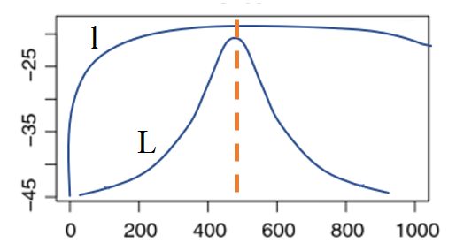{fig-align="center" fig-alt="The log-likelihood (l) maximum is the same as the likelihood (L) maximum." width=100%}

:::

::::

## Log-Likelihood

Likelihood Function:

$L(\theta | y) = f(y_1 | \theta) \times f(y_2 | \theta) \times \ldots \times f(y_n | \theta)$

:::{.fragment}
<br>
Log-Likelihood Function:

$\ell(\theta | y) = \log(f(y_1 | \theta)) + \log(f(y_2 | \theta)) + \ldots + \log(f(y_n | \theta))$

:::

:::{.fragment}
<br>
Although log-likelihood functions are mathematically easier than their multiplicative counterparts, they can be challenging to calculate by hand. They are usually calculated with software.

:::

## Maximum Likelihood Estimation

For a specified error family distribution and link function, the glm finds parameter values that have the highest likelihood score.

:::{.incremental}

- Which estimates are most probable for producing the observed data

- This is an iterative process, without a single defined equation

- For gaussian and identity link it will produce the same outcome as OLS.

:::

Log-Likelihood Function:
$$\ell(\theta | \mathbf{y}) = \sum_{i=1}^{n} \log(f(y_i | \theta))$$


## Maximum Likelihood


::::{.columns}

:::{.column}

```{r}
#| eval: true
#| echo: false
#| fig-height: 8
#| message: false
#| warning: false

# Simulated data
set.seed(42)

log_likelihood_visual <- function(mean = 6, sd = 1){

data <- rnorm(100, mean = mean, sd = sd)

# Define a grid of mu and sigma values
mu_range <- seq(mean-(sd*2), mean+(sd*2), length.out = 100)
sigma_range <- seq(sd-sd, sd+sd, length.out = 100)
sigma_range[sigma_range < 1] <- 1
grid <- expand.grid(mu = mu_range, sigma = sigma_range)

# Function to calculate log-likelihood for normal distribution
log_likelihood <- function(mu, sigma, data) {
  n <- length(data)
  -n/2 * log(2 * pi) - n * log(sigma) - 1/(2 * sigma^2) * sum((data - mu)^2)
}

# Calculate log-likelihood for each combination of mu and sigma
grid$log_likelihood <- mapply(log_likelihood, mu = grid$mu, sigma = grid$sigma, MoreArgs = list(data = data))

# Plot
ggplot(grid, aes(x = mu, y = sigma, z = log_likelihood)) +
  geom_contour_filled(aes(fill = after_stat(level)), bins = 20) + # Use geom_contour_filled for filled contour plots
  labs(title = "Log-Likelihood Contour Plot",
       x = expression(mu),
       y = expression(sigma),
       fill = "Log-Likelihood") +
  theme_minimal()
}

log_likelihood_visual()
```

:::

:::{.column}

- A contour plot visualizing the log-likelihood surface for a normal distribution fitted to simulated data. 

- The contour lines on the plot represent regions of equal log-likelihood values. Darker regions indicate lower log-likelihood values, while lighter regions indicate higher log-likelihood values

:::

::::


## Deviance

- The deviance is a key concept in Generalised linear models. 

- It measures the deviance of the fitted Generalised linear model with respect to a perfect/**saturated** model for the sample.

```{r}
#| eval: true
#| echo: false
#| fig-height: 6
#| message: false


# Simulate some data
set.seed(123)
n <- 100  # Sample size
x <- rnorm(n)  # Predictor variable
y <- 2 + 3*x + rnorm(n)  # Continuous response variable (linear relationship)

# Fit the null model (intercept only)
null_model <- lm(y ~ 1)

# Fit the saturated model (fully saturated model)
saturated_model <- lm(y ~ x)

# Fit the fitted model (linear predictor with x)
fitted_model <- lm(y ~ x)

# Create a dataframe to store observed points
observed_data <- data.frame(x = x, y = y)

# Generate fitted lines
fitted_lines <- data.frame(x = sort(x))
fitted_lines$Null <- predict(null_model, newdata = fitted_lines)
fitted_lines$Fitted <- predict(fitted_model, newdata = fitted_lines)

# Plot observed points and fitted lines
ggplot() +
    geom_point(data = observed_data, aes(x = x, y = y), color = "black") +
    geom_line(data = fitted_lines, aes(x = x, y = Null, color = "Null")) +
    geom_line(data = observed_data, aes(x = x, y = y, color = "Saturated")) +
    geom_line(data = fitted_lines, aes(x = x, y = Fitted, color = "Fitted")) +
    scale_color_manual(values = c("Null" = "red", "Saturated" = "blue", "Fitted" = "green"),
                       name = "Model") +
    labs(
        title = "Fitted Lines vs Observed Points",
        x = "x",
        y = "y"
    ) +
    theme_minimal(base_size = 14)


```


## Pseudo R-squared

::::{.columns}

:::{.column}

{fig-align="center" fig-alt="" width=100%}

:::

:::{.column}

Formula: 

$GLM~R^2 = 1 - \frac{D}{D_0}$

$linear\_model~R^2= 1 - \frac{SSE}{SST}$


- $D$ is the deviance of the fitted model.

- $D_0$ is the deviance of the null model (linear model with only an intercept).

The GLM $R^2$ **is not** the percentage of variance explained by the model, but rather a ratio indicating how close the fit is to being perfect.

:::

::::

## Pseudo R-squared in R

- We can fit the deviance-based pseudo $R^2$ with the `MuMIn` package

- `r.squaredLR()` is a function used to compute the likelihood ratio (LR) based R-squared for a given model

```{r}
#| eval: false
#| echo: true
#| message: false


library(MuMIn)

r.squaredLR(model)


```

## AIC

:::{.incremental}

- The Akaike Information Criterion (AIC)  balances the trade-off between model fit and complexity by penalizing models with more parameters.

- It aims to find the model that best explains the data while avoiding overfitting.

- AIC is calculated as follows: $\text{AIC} = 2k - 2\ln(\hat{L})$, 

- where: log-likelihood is the maximized value of the likelihood function for the fitted model. $k$ is the number of parameters in the model.

- In general a difference in AIC of <2 suggests equivalent goodness-of-fit

:::

## AIC

::::{.columns}

:::{.column}

**AIC can:**

- Compare non-nested models fitted to the same dataset and response variable

- Compare across different GLM families and link functions

:::

:::{.column}

**AIC cannot:**

- Compare models where the response variable is transformed

- Compare models where there are differences in the dataset

:::

::::

## Likelihood ratio test

The likelihood ratio test (LRT) “unifies” frequentist statistical tests. Brand-name tests like t-test, F-test, chi-squared-test, are specific cases (or even approximations) of the LRT.

- The likelihood ratio test (LRT) begins with a comparison of the likelihood scores of the two models:

$\text{LR} = -2(\ln L_1 - \ln L_2)$

:::{.fragment}

Where:

- $\ln L_1$ and $\ln L_2$ are the log-likelihoods of the two models being compared.

:::

## Likelihood ratio test

- This LRT statistic approximately follows a chi-square distribution. 

- To determine if the difference in likelihood scores among the two models is statistically significant, we next must consider the degrees of freedom. 

- In the LRT, degrees of freedom is equal to the number of additional parameters in the more complex model.

```{r}
#| echo: false
#| eval: true

janka <- read_csv(here::here("data", "janka.csv"))

fitted_model <- glm(hardness ~ dens, data = janka, family = Gamma(link = "sqrt"))
null_model <- glm(hardness ~ 1, data = janka, family = Gamma(link = "sqrt"))
fitted_likelihood <- logLik(glm(hardness ~ dens, data = janka, family = Gamma(link = "sqrt")))
null_likelihood <- logLik(glm(hardness ~ 1, data = janka, family = Gamma(link = "sqrt")))
```

```{r}
#| echo: true
#| eval: true


LR <- -2*(null_likelihood[1]-fitted_likelihood[1])

LR

```

## Likelihood ratio test

:::{.incremental}

- The likelihood ratio test `lrtest()` is typically calculated as twice the difference in deviance between the two models. (Can also be carried out with the `anova()` function)

- Scaling by -2 ensures the test statistic follows a chi-square distribution under certain conditions

- We can calculate the likelihood ratio test statistic, compare it to the chi-square distribution with the appropriate degrees of freedom, and determine whether the improvement in fit between the two models is statistically significant.

:::

```{r}

lrtest(null_model, fitted_model)

```

# GLMs for count data {background-color="#D9DBDB"}

## Poisson

:::: columns

::: {.column}

```{r}
#| eval: true
#| echo: false
#| fig-height: 8
#| message: false

# Define a range of lambda values (average rate of success)
lambda_values <- c(1, 4, 10, 20, 50)

# Generate the Poisson distribution data
poisson_data <- map_df(lambda_values, ~tibble(
  lambda = .x,
  events = 0:75, # Assuming a reasonable range for visualization
  probability = dpois(0:75, .x)
)) |> 
  mutate(lambda = factor(lambda, levels = lambda_values)) # For ordered plotting

# Plot
ggplot(poisson_data, aes(x = events, y = probability, color = lambda)) +
  geom_line(linewidth = 1.5) +
  scale_color_brewer(palette = "Dark2") +
  labs(title = "Change in Poisson Distribution with Different Lambda",
       x = "Number of Events",
       y = "Probability",
       color = "Lambda") +
  theme_minimal(base_size = 14)

```

::: 

::: {.column}

Count or rate data are ubiquitous in the life sciences (e.g number of parasites per microlitre of blood, number of species counted in a particular area). These type of data are **discrete** and **non-negative**.

A useful distribution to model abundance data is the **Poisson** distribution: 

a discrete distribution with a single parameter, λ (lambda), which defines both the mean and the variance of the distribution.

:::


::::

## GLM

::: {.incremental}

Recall the simple linear regression case (i.e a GLM with a Gaussian error structure and identity link). For the sake of clarity let's consider a single explanatory variable where $\mu$ is the mean for *Y*:

$\mu_i = \beta0 + \beta_1x1 + \beta_2x2 + ... +\beta_nxn$

$y_i \sim \mathcal{N}(\mu_i, \sigma^2)$

* The mean function is **unconstrained**, i.e the value of $\beta_0 + \beta_1X$ can range from $-\infty$ to $+\infty$. 

:::

## Poisson


* If we want to model count data we therefore want to **constrain** this mean to be positive only. 

:::{.incremental}

* Mathematically we can do this by taking the **logarithm** of the mean (the log is the default link for the Poisson distribution). 

* We then assume our count data variance to be Poisson distributed (a discrete, non-negative distribution), to obtain our Poisson regression model (to be consistent with the statistics literature we will rename $\mu$ to $\lambda$):

:::

## GLM Poisson

{fig-align="center" fig-alt="Poisson equation" width=80%}

## Poisson limitations

The **Poisson** distribution has the following characteristics:

::: {.incremental}

* **Discrete** variable (integer), defined on the range $0, 1, \dots, \infty$.

* A single ***rate*** parameter $\lambda$, where $\lambda > 0$.

* **Mean** = $\lambda$  

* **Variance** = $\lambda$

:::


## Poisson: Case study

:::: columns

::: {.column}

{fig-align="center" fig-alt="Stickleback" width=50%}
:::

:::{.column}

In this study the authors investigated the effect of the parasitic tapeworm *Schistocephalus solidus* infection on the susceptibility of infection from a second parasite, the trematode *Diplostomum pseudospathaceum*

> How does Treatment/Infection status affect trematode counts?

:::

::::

##

This model looks ok

```{r}
#| eval: false
#| echo: true
#| fig-height: 8
#| message: false

stick_lm <- lm(Diplo_intensity ~ Treatment, data = parasite)
```


```{r}
#| include: FALSE

parasite <- read_csv("../data_2/parasite_exp.csv")

```

```{r}
#| eval: true
#| echo: false
#| fig-height: 7
#| message: false

stick_lm <- lm(Diplo_intensity ~ Treatment, data = parasite)

emmeans::emmeans(stick_lm, specs = ~Treatment) %>% 
  as_tibble() %>% 
ggplot(aes(x=Treatment, y=emmean)) + 
  geom_pointrange(aes(ymin = lower.CL, ymax = upper.CL)) +
  geom_jitter(data = parasite, aes( x= Treatment, y = Diplo_intensity),
              alpha = .2, width = .2)+
  theme_minimal(base_size = 18)


```


## Diagnostics

Let us display the model diagnostics plots for this linear model.

```{r}
#| echo: false
#| layout-ncol: 2
#| fig-height: 8

plot(stick_lm, which=2)

plot(stick_lm, which=3)
```


* Curvature

* Funnelling effect


## Poisson model

We should therefore try a different model structure.

The response variable in this case is a classic **count data**: **discrete** and bounded below by zero (i.e we cannot have negative counts). We will therefore try a **Poisson model** using the canonical **log** link function for the mean:


* λ varies with x (mass) which means residual variance will also vary with 
x, which means that we just relaxed the homogeneity of variance assumption!

* Predicted values will now be integers instead of fractions

* The model will never predict negative values (Poisson is strictly positive)

$$
    \log{\lambda} = \beta_0 + \beta_1 T_i + \beta_1 T_j + \beta_1 T_k 
$$


## Fit the Poisson model

Fit the poisson model

```{r}
#| echo: true

stick_poisson <- glm(Diplo_intensity ~ Treatment, family = "poisson", data = parasite)

summary(stick_poisson)
```


## Poisson model fit 

::::{.columns}

:::{.column}

Linear Model

```{r}
#| echo: false
#| fig-height: 6

par(mfrow = c(1, 2), mar = c(4, 4, 2, 1))

plot(stick_lm, which=2)

plot(stick_lm, which=3)


```

:::

:::{.column}

Poisson Model

```{r}
#| echo: false
#| fig-height: 6

par(mfrow = c(1, 2), mar = c(4, 4, 2, 1))

plot(stick_poisson, which=2)

plot(stick_poisson, which=3)


```

:::

::::

## Effect of treatment

To perform a global test on the effect of treatment.

The likelihood ratio test allows us to determine the overall deviance explained by treatment

```{r}
#| eval: true
#| echo: true

# For a fixed  mean-variance model we use a Chisquare distribution
drop1(stick_poisson, test = "Chisq")

```


## Model summary

::::{.columns}

:::{.column}

```{r}
#| echo: true

summary(stick_poisson)

```

:::

:::{.column}

```{r}
#| eval: true
#| echo: false
#| fig-height: 5

emmeans::emmeans(stick_poisson, specs = ~Treatment,
                 type = "response") %>% 
  as_tibble() %>% 
ggplot(aes(x=Treatment, y=rate)) + 
  geom_pointrange(aes(ymin = asymp.LCL, ymax = asymp.UCL)) +
  geom_jitter(data = parasite, aes( x= Treatment, y = Diplo_intensity),
              alpha = .2, width = .2)+
  theme_minimal(base_size = 18)
```

:::

::::


## Poisson limitations

So for the Poisson regression case we assume that the mean and variance are the same.
Hence, as the mean *increases*, the variance *increases* also (**heteroscedascity**).
This may or may not be a sensible assumption so watch out! Just because a Poisson distribution *usually* fits well for count data, doesn't mean that a Gaussian distribution *can't* always work.

Recall the link function between the predictors and the mean and the rules of logarithms (if $\log{\lambda} = k$(value of predictors), then $\lambda = e^k$):


## Overdispersion

When the residual deviance is higher than the residual degrees of freedom, we say that the model is overdispersed. This situation is mathematically represented as:

$$
\phi = \frac{\text{Residual deviance}}{\text{Residual degrees of freedom}}
$$

Overdispersion occurs when the variance in the data is even higher than the mean, indicating that the Poisson distribution might not be the best choice. This can be due to many reasons, such as the presence of many zeros, many very high values, or missing covariates in the model.

## Overdispersion and what to do about it

| Causes of over-dispersion | What to do about it | 
|---------|:-----|
| Model mis-specification (missing covariates or interactions)    | Add more covariates or interaction terms   |
| Too many zeros ("zero inflation")    | Use a zero-inflated model  |
| Non-independence of observations       | Use a generalised mixed model with random effects to take non-independence into account    |
| Variance is larger than the mean      | Use a quasipoisson GLM if overdispersion = 2-15. Use a negative binomial GLM if > 15-20  |

: Overdispersion statistic values > 1


## Choosing a model

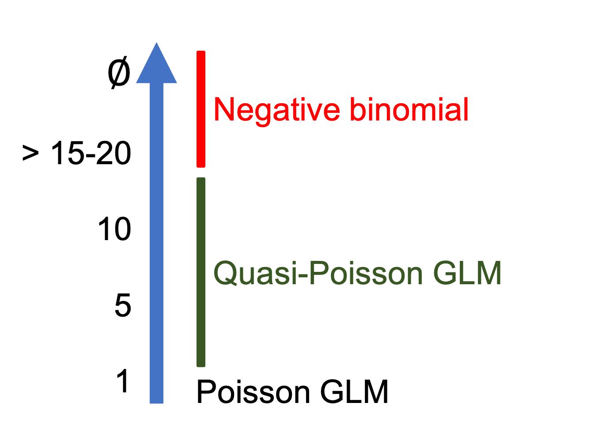{fig-align="center" fig-alt="Poisson/NegBin" width=50%}


## Overdispersion and what to do about it

It may be true that you are initially unsure whether overdispersion is coming from zero-inflation, larger variance than the mean or both. 

You can fit models with the same dependent and independent variables and different error structures and use AIC to help determine the best model for your data

## Overdispersion in the stickleback


$\phi = \frac{\text{Residual deviance}}{\text{Residual degrees of freedom}}$ = $\frac{697.25}{217} = 3.21$

```{r}
#| eval: true
#| echo: true

summary(stick_poisson)

performance::check_overdispersion(stick_poisson)

```

## Quasi-Poisson GLM 

The systematic part and the link function remain the same

$$
    \log{\lambda} = \beta_0 + \beta_1 x_i
$$

*phi*$\phi$ is a dispersion parameter, it will not affect estimates but will affect *significance*. Standard errors are multiplied by $\sqrt\phi$ 

$$
Y_i = Poisson(\phi \lambda_i)
$$


Where:

- $Yi$ is the response variable.
- $\phi$ is the dispersion parameter, which adjusts the variance of the distribution

Confidence intervals and p-values WILL change.


## Fit a quasipoisson model to the data

```{r}
#| eval: true
#| echo: true

stick_quasipoisson <- glm(Diplo_intensity ~ Treatment, family = quasipoisson, data = parasite)
```

* Look at the residual plots - how have they changed? 

* Look at the SE and p-values - how have they changed

* Calculate new 95% confidence intervals

## Compare models

```{r}
#| eval: true
#| echo: true
#| layout-ncol: 2

summary(stick_poisson)

summary(stick_quasipoisson)

```

## F distributions

The presence of overdispersion suggested the use of the F-test for nested models. We will test if the interaction term can be dropped from the model.

Though here for a term with only one degree of freedom $t^2$ = the F distribution with denominator degree of freedom

```{r}
#| eval: true
#| echo: true

drop1(stick_quasipoisson, test = "F")

```


# Resources

## Additional resources

* Discovering Statistics - Andy Field

* [Happy Git](https://happygitwithr.com/) 

* An Introduction to Generalized Linear Models - Dobson & Barnett

* An Introduction to Statistical Learning with Applications in R - James, Witten, Hastie & Tibshirani

* Mixed Effects Models and Extensions in Ecology with R - Zuur, et al.

* Ecological Statistics with contemporary theory and application

* The Big Book of R (https://www.bigbookofr.com/)

* [British Ecological Society Guides to Better Science](https://www.britishecologicalsociety.org/publications/better-science/)

*[(SORTEE)](https://www.sortee.org/reading/)


## Reading list {.smaller}

::::{.columns}

:::{.column}

[Writing statistical methods for ecologists](https://doi.org/10.1002/ecs2.4539)

[Reporting statistical methods and outcome of statistical analyses in research articles](https://link.springer.com/article/10.1007/s43440-020-00110-5)

[Design principles for data analysis](https://doi.org/10.1080/10618600.2022.2104290)

[Log-transformation and its implications for data analysis.](https://doi.org/10.3969%2Fj.issn.1002-0829.2014.02.009)

[Effect size, confidence interval and statistical significance: a practical guide for biologists](https://doi.org/10.1111/j.1469-185X.2007.00027.x)

[Same data, different analysts: variation in effect sizes due to analytical decisions in ecology and evolutionary biology](https://ecoevorxiv.org/repository/view/6000/)

[Misconceptions, Misuses, and Misinterpretations of P Values and Significance Testing](https://doi.org/10.2106/jbjs.16.01314)

:::

:::{.column}

[Ten common statistical mistakes to watch out for when writing or reviewing a manuscript.](https://elifesciences.org/articles/48175)

[Why most published research findings are false](https://journals.plos.org/plosmedicine/article?id=10.1371/journal.pmed.0020124)

[Step away from stepwise](https://doi.org/10.1186/s40537-018-0143-6)

[Model averaging and muddled multimodel inference](https://doi.org/10.1890/14-1639.1)

[Make scientific data FAIR](https://www.nature.com/articles/d41586-019-01720-7)

[A brief introduction to mixed effects modelling and multi-model inference in ecology](https://peerj.com/articles/4794/)

[The Practical Alternative to the p Value Is the Correctly Used p Value](https://doi.org/10.1177/1745691620958012)

:::

::::

## Reading list {.smaller}

::::{.columns}

:::{.column}

[Why Science Is Not Necessarily Self-Correcting](https://doi.org/10.1177/1745691612464056)

[The reproducibility debate is an opportunity, not a crisis](https://bmcresnotes.biomedcentral.com/articles/10.1186/s13104-022-05942-3)

:::

:::{.column}


:::

::::

## 

::: columns
::: {.column}

<br>

 [philip-leftwich](https://www.linkedin.com/in/philip-leftwich-117052155/)

 [\@ecoevo.social\@PhilipLeftwich](https://ecoevo.social/@PhilipLeftwich)

 [PhilipLeftwich](https://github.com/Philip-Leftwich)

 [philip.leftwich.github.io](https://philip.leftwich.github.io/)


:::
::: {.column}


:::
:::
