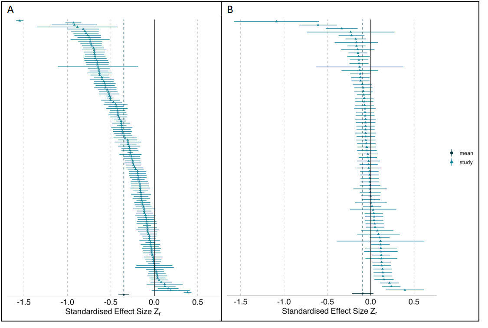
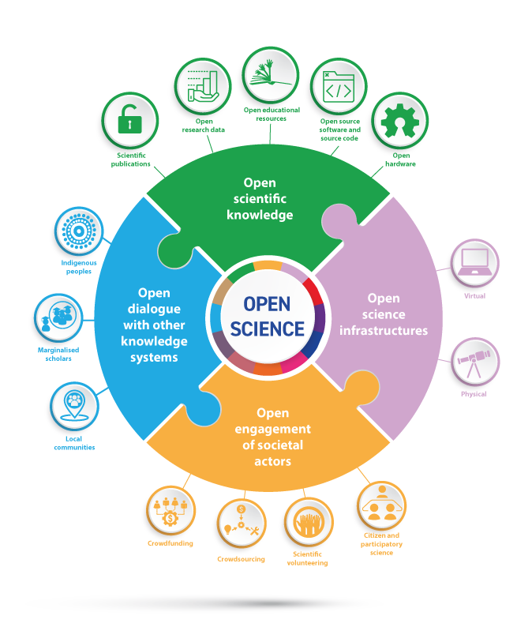
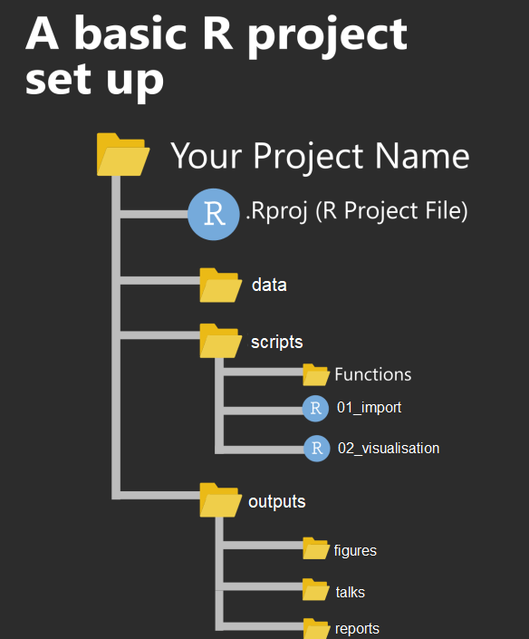
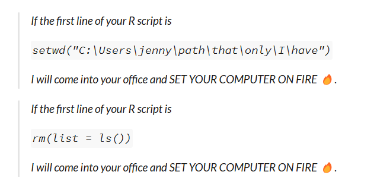
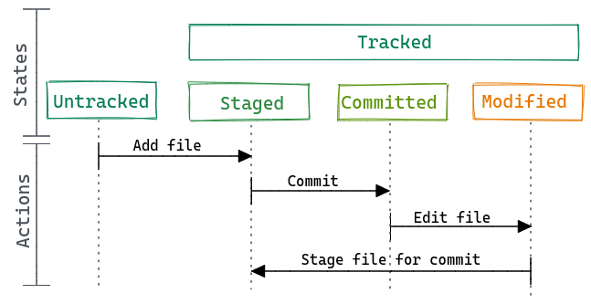
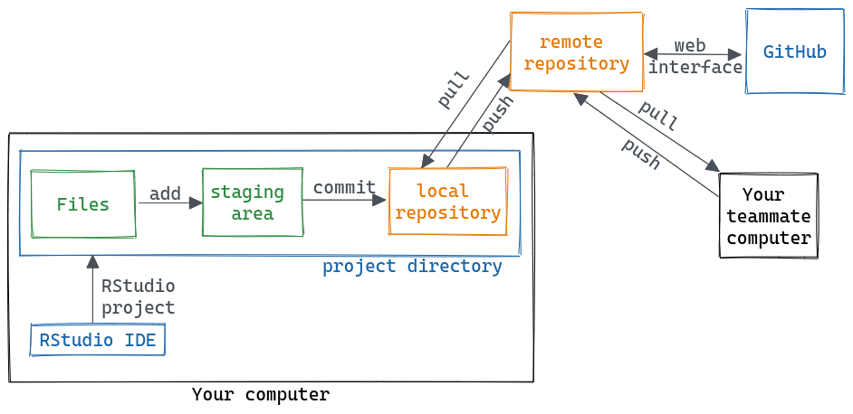
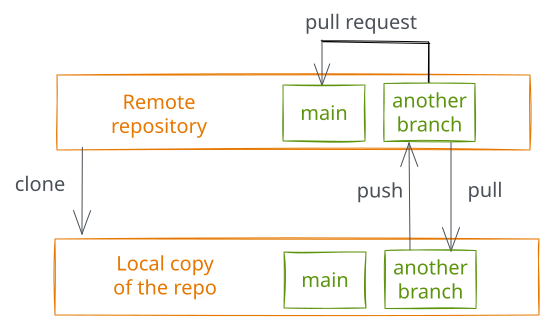
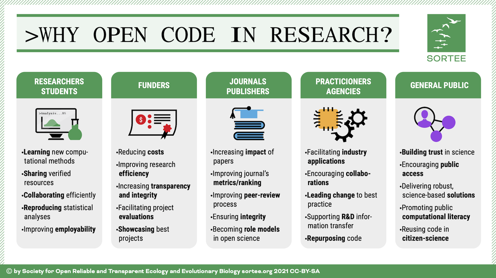

## About me

```{r}
#| include: false
#| message: false
#| warning: false
#| 
knitr::opts_chunk$set(warning = FALSE, message = FALSE, fig.retina = 3, fig.asp = 0.8, fig.width = 8, out.width = "60%")

library(arm)
library(car)
library(DHARMa)
library(emmeans)
library(equatiomatic)
library(fitdistrplus)
library(gtsummary)
library(lmtest)
library(MASS)
library(MuMIn)
library(performance)
library(pscl)
library(sjPlot)
library(tidyverse)
library(here)
library("ggpubr")
library(gt)
library(gtExtras)
library(palmerpenguins)
library(wesanderson)
library(rstatix)


```


::: columns
::: {.column .right}

Associate Professor in Data Science and Genetics at the [University of East Anglia](https://www.uea.ac.uk/).

<br>

Academic background in Behavioural Ecology, Genetics, and Insect Pest Control.

<br>

Teach Genetics, Programming, and Statistics

:::

::: {.column}

{fig-align="center" fig-alt="UEA logo" width=50%}

:::
:::


## Module Outline

::: {.columns}

::: {.column width="30%"}
{width=100%}
:::

::: {.column width="70%"}

### Outline of the course

- Advanced linear modelling
- Power analysis
- Data reproducibility
- R programming
- Machine Learning
- AI tool buiding

:::

:::

## Module Learning Outcomes

By the end of this module, you will be able to:

::: {.incremental}

1. Design and implement reproducible data analysis workflows

2. Apply advanced statistical techniques appropriately and critically

3. Evaluate the validity and limitations of analytical approaches

4. Use version control and documentation effectively

5. Communicate statistical analyses transparently

6. Critically assess published research for reproducibility

:::


## What Success Looks Like

### Your Capstone Project Will Demonstrate:

::: {.incremental}
- Complete transparency in data processing

- Reproducible analysis pipeline

- Critical evaluation of methods

- Clear documentation

- Version-controlled workflow

- Appropriate use of computational tools
:::

## Expectations and Structure

::: {.columns}
::: {.column width="50%"}

- **One workshop** per week

- **One lecture** per week

- **One assignment** per week

- **One 'capstone'** project (released for Easter break)

:::

::: {.column width="50%"}

### Time Commitment

- Contact hours: 3 hours/week

- Independent study: 2-4 hours/week


:::

:::

## Mutual Expectations

::: {.columns}
::: {.column width="50%"}

### You Can Expect From Me:

- Timely feedback (within 2 weeks)
- Clear assessment criteria
- Support during office hours
- Email responses within 48 hours (weekdays)
- Recognition that learning involves mistakes

:::

::: {.column width="50%"}

### I Expect From You:

- Active engagement in workshops
- Completion of weekly assignments
- Asking questions when unclear
- Academic integrity
- Respect for peers and collaborative learning
- Reflection on feedback

:::
:::

## Artificial Intelligence Use Policy

### Phased Approach to AI Integration

::: {.callout .callout-info}
We will build your foundational skills first, then progressively integrate AI tools
:::

**Weeks 1-4: Minimal AI Assistance**

- Focus on developing fundamental skills
- Understand core concepts independently
- Build problem-solving capabilities

## AI Use Policy (continued)

**Weeks 5-8: Guided AI Integration**

- Use AI for code debugging and explanation
- Critical evaluation of AI-generated solutions
- Understanding AI limitations

**Weeks 9-12: Advanced AI Collaboration**

- AI as a research assistant tool
- Ethical and transparent AI use
- All AI use must be documented and acknowledged

## AI Use: Ground Rules

::: {.callout .callout-warning}
**Critical Requirements**
:::

:::{.incremental}

- AI **cannot substitute** for understanding

- You **must explain** any code you submit

- **Document all** AI interactions in your workflow

- Critical thinking remains paramount

- Plagiarism policies **apply to AI-generated content**
:::

## Support Structures

::: {.columns}
::: {.column width="50%"}

### Formal Support

**Office Hours** (via Microsoft Bookings):

- Tuesday - Thurs
- 9-11 or 15.00-17.00
- 20-minute appointments
- [Bookings by appointment](https://outlook.office.com/bookwithme/user/ecce6ab39c454d88b403f999ee672ddc@uea.ac.uk?anonymous&ismsaljsauthenabled&ep=plink)

**Email**: p.leftwich@uea.ac.uk

- Include "5023B" in subject
- 48-hour response (weekdays)

:::

::: {.column width="50%"}

### Informal Support

**Study Groups**:

- Form groups with peers
- Share learning, not answers

**Online Resources**:

- Module Blackboard forum

**UEA Support**:

- Library Open Research team
- University Student Support

:::
:::


## What to Expect During This Module

::: {.columns}
::: {.column width="60%"}

<br>

<br>

I hope you end up with **more questions than answers**!

This is a sign of deep learning and critical thinking

:::

::: {.column width="40%"}

{fig-align="center" fig-alt="Schitts Creek questions gif" width=60%}

<small>Source: <a href="https://giphy.com/gifs/schittscreek-64afibPa7ySzhFAf00">giphy.com</a></small>

:::
:::


# Why Reproducibility Matters {background-color="#D9DBDB"}

## A Simple Question

Before we dive into the technical details, let's address the fundamental question:

::: {.callout}
**Why should you care about reproducible research?**
:::

. . .

The answer isn't just about better science—it's about:

- **Your career prospects**
- **Public trust in science**
- **Real-world consequences**
- **Ethical responsibility**


## What is Reproducibility?

{fig-align="center" fig-alt="Turing Way Community cc-by licence" width=50%}

- For Research to be reproducible both data and methods should be available.

- Applying the described methods to the data leads to the same results


## Why Reproducibility Matters: Real Consequences

### The Social Spiders Scandal (2024)

::: {.columns}
::: {.column width="60%"}

**Jonathan Pruitt: Behavioural Ecologist**

- Studied social spider colony behaviour
- **17 papers retracted**, dozens under investigation
- Fabricated data on spider behaviour
- Collaborators' careers damaged
- Years of research and PhD theses invalidated
- Field of social spider research set back decades

:::

::: {.column width="40%"}

::: {.callout .callout-warning}
**"I trusted the data was real"**

— Former collaborator
:::

**Lesson**: Even collaborators suffer when research isn't transparent

:::
:::

<small>Source: Woolston (2020) *Nature* 578: 199; Labbé (2024) *Science* 383: 6683</small>

## The Reinhart-Rogoff Excel Error (2010)

### When Spreadsheet Mistakes Shape Economic Policy

::: {.columns}
::: {.column width="60%"}

**The Error:**

- Influential paper on debt and economic growth
- **Excel coding error** excluded critical data rows
- Irreproducible results

**The Impact:**

- Used to justify **austerity policies** across Europe
- Affected **millions of people's lives**
- Only discovered when researchers requested raw data

:::

::: {.column width="40%"}

::: {.callout .callout-warning}
**The Lesson**

Even **honest mistakes** have enormous consequences when research isn't transparent
:::

**Key Point**: This wasn't fraud—it was a simple Excel error that could have been caught if the analysis was reproducible.

:::
:::

<small>Source: Herndon et al. (2014) *Cambridge Journal of Economics* 38(2): 257-279</small>

## Many Analysts, Many Answers

### 246 Biologists Analysed the Same Data

::: {.columns}
::: {.column width="50%"}

{fig-align="center" fig-alt="Forest plot showing widely varying effect sizes from different analysts" width="100%"}

:::

::: {.column width="50%"}

**The Study:**

- Same datasets provided to 246 research teams
- Same research questions
- Each team chose their own analytical approach

**The Results:**

- Wildly different conclusions
- Some found strong positive effects
- Others found strong negative effects
- Most found weak or no effects

:::
:::

::: {.callout .callout-warning}
**The Problem**: Analytical choices matter enormously—without transparency, we can't evaluate which approach is most appropriate
:::

<small>Source: Gould et al. (2023) *PLOS Biology*</small>

## Why This Matters to You: Career Impact

### The Professional Reality

::: {.columns}
::: {.column width="50%"}

**Without Reproducible Practices:**

- Difficulty publishing in top journals
- Lower citation rates
- Risk of post-publication scrutiny
- Potential retractions damaging reputation
- Limited collaboration opportunities
- Reduced funding success

:::

::: {.column width="50%"}

**With Reproducible Practices:**

- Open data papers cited **25% more**
- Open code increases citations by **36%**
- Improved job prospects
- Stronger research networks
- Protection against fraud accusations
- Enhanced research efficiency

:::
:::

::: {.callout .callout-success}
**You will be entering a field that increasingly demands transparency—these skills are becoming non-negotiable**
:::

<small>Sources: Piwowar et al. (2007) *PLoS ONE* 2(9): e308; McKiernan et al. (2016) *eLife* 5: e16800</small>

## Your Professional Obligation

### Why You Should Care Beyond Grades

::: {.columns}
::: {.column width="60%"}

**As Future Scientists, You Have Responsibility To:**

1. **The Public**: Research often publicly funded—taxpayers deserve reliable findings

2. **Your Discipline**: Poor practices damage field credibility

3. **Future Researchers**: Your work may be foundation for others

4. **Research Participants**: Human/animal subjects deserve ethical, rigorous research

5. **Yourself**: Protecting your reputation and career

:::

::: {.column width="40%"}

::: {.callout}
**"With great data comes great responsibility"**
:::

Ethics isn't just about avoiding misconduct—it's about actively pursuing excellence and transparency

:::
:::

# The Path Forward {background-color="#D9DBDB"}

## The Optimistic View: Culture is Changing

### Progress in the Last Decade

**New Practices Now Standard:**

- **Preregistration**: Now standard in many psychology journals
- **Registered Reports**: Offered by 300+ journals
- **Data Repositories**: Mandated by major funders (UKRI, NIH, Wellcome)
- **Code Sharing**: Expected by computational journals
- **Replication Studies**: Now valued, not stigmatised
- **Open Science Badges**: Journals rewarding transparency

## Organisations Driving Change

**Key Players:**

- Centre for Open Science
- UK Reproducibility Network (UKRN)
- UKRI Open Research policy
- European Commission Open Science initiatives

::: {.callout .callout-success}
**You are entering research at a transformative moment—equipped with these skills, you can be leaders rather than followers**
:::

## What is Reproducibility?

### The Turing Way Framework

{fig-align="center" fig-alt="Turing Way Community cc-by licence" width="50%"}

- For research to be reproducible, both **data and methods** must be available
- Applying the described methods to the data leads to the **same results**

<small>Source: The Turing Way Community (CC-BY licence)</small>

## Methods vs Code

### Why Code Matters

- In theory, method availability ≠ code
- But with complex data and analyses—are descriptions of methods enough?

::: {.fragment}
::: {.callout .callout-warning}
**"We analysed data using standard statistical methods in R"**

This is **not** reproducible
:::
:::

::: {.fragment}
::: {.callout .callout-success}
**"Complete analysis code available at: github.com/username/project"**

This **is** reproducible
:::
:::

## What Reproducibility Looks Like in Practice

### A Concrete Comparison

**Traditional Approach:**
```
Methods: "Data were analysed using standard statistical 
methods in R. Significance was set at p < 0.05."
```

. . .

**Reproducible Approach:**
```
Methods: "All analyses conducted in R version 4.3.1. 
Complete analysis code: github.com/username/project
Data deposited: Dryad doi:10.5061/xxxxx
Package versions: renv (renv.lock in repository)
Computational environment: Docker container (Dockerfile provided)
Analysis preregistered: OSF.io/xxxxx"
```

## The Difference Reproducibility Makes

::: {.columns}
::: {.column width="50%"}

**Traditional Research:**

- Methods descriptions vague
- Data hidden or lost
- Analysis steps unclear
- Impossible to verify
- Errors persist undetected

:::

::: {.column width="50%"}

**Reproducible Research:**

- Anyone can reproduce analyses
- Future-you can reproduce own work
- Errors identified and corrected
- Building on work becomes possible
- Transparency builds trust

:::
:::

## Open Science

{fig-align="center" fig-alt="UNESCO Open Science pillars" width="50%"}

Open science is a global movement making scientific research and its outcomes freely accessible to everyone. By fostering practices like data sharing and preregistration, open science accelerates scientific progress and strengthens trust in research.

## UKRN: UK Reproducibility Network

::: {.columns}
::: {.column width="70%"}

- Funded by UK Research Council
- **46 member institutions** (UEA is one)
- Establish open research practices across UK research
- [https://www.ukrn.org/](https://www.ukrn.org/)

**UEA UKRN Local Network:**

- Training and resources
- Community of practice
- Support for open research

:::

::: {.column width="30%"}
{fig-align="center" fig-alt="UKRN" width="80%"}
:::
:::

# Practical Tools {background-color="#D9DBDB"}

## Project Management

### The Foundation of Reproducibility

Before we talk about fancy tools, we need to establish **good habits**:

- Organised file structures
- Clear naming conventions
- Documentation from day one
- Version control mindset

## Messy Projects

### What Not to Do
```
/home/phil/Documents/paper
├── abstract.R
├── correlation.png
├── data.csv
├── data2.csv
├── fig1.png
├── figure 2 (copy).png
├── figure.png
├── figure1.png
├── figure10.png
├── partial data.csv
├── script.R
└── script_final.R
```

::: {.callout .callout-warning}
**Problem**: Which file is the actual final script? Which data file did you use? What does "figure 2 (copy).png" contain?
:::

## Organised Projects

### Principles of Good Organisation

- **README** file explaining project structure
- **Documented** code and decisions
- **Easy to navigate** with logical structure
- **All files inside the root folder**
- **No absolute paths** in code

## Good Project Structure

### Example Layout
```
project-name/
├── README.md
├── data/
│   ├── raw/
│   └── processed/
├── scripts/
│   ├── 01_data-cleaning.R
│   ├── 02_analysis.R
│   └── 03_visualisation.R
├── outputs/
│   ├── figures/
│   └── tables/
├── docs/
│   └── analysis-report.qmd
└── project-name.Rproj
```

## R Projects

:::{.column}
{fig-align="center" fig-alt="R projects" width="50%"}
:::

:::{.column}
**Benefits:**

- Automatic working directory management
- Encapsulated workspace
- Easy to share and collaborate
- Integrates with version control
:::

## File Naming: The Slug Principle

### What is a Slug?

A string of characters defining a file using:

- Lowercase letters
- Hyphens (not underscores or spaces)
- Descriptive, concise names
- Dates in ISO format (YYYY-MM-DD)

## Slug Examples

**Good file names tell you what's inside:**

- `data/raw/madrid_minimum-temperature.csv`
- `scripts/02_compute_mean-temperature.R`
- `analysis/01_madrid_minimum-temperature_descriptive-statistics.qmd`

. . .

**What do you think these contain?**

::: {.fragment}
- Clear temporal order (01, 02...)
- Descriptive content (minimum-temperature)
- Appropriate file type (.R, .csv, .qmd)
:::

## Exercise: Name These Files

Come up with good names for:

1. A dataset of cats with columns for weight, length, tail length, fur colour(s), fur type and name

2. A script that downloads data from Spotify

3. A script that cleans up data

4. A script that fits a linear discriminant model and saves it

::: {.fragment}
**Possible solutions:**

1. `data/raw/cats_morphology-and-characteristics.csv`
2. `scripts/01_spotify_data-download.R`
3. `scripts/02_data-cleaning.R`
4. `scripts/03_lda-model_fit-and-save.R`
:::

## R Projects and Clean Slates

{fig-align="center" fig-alt="Jenny Bryan on setwd()" width="70%"}

::: {.callout .callout-warning}
**Two Critical Rules:**

1. **Use R Projects** for every analysis
2. **Never save or restore .RData**—always start with a clean slate
:::

This ensures your code is fully reproducible from top to bottom.


## Version Control with Git

{fig-align="center" fig-alt="git workflow" width="60%"}

**What Git Does:**

- Tracks every change to your files
- Allows you to revert to previous versions
- Enables collaboration without conflicts
- Creates a complete history of your work

## Git Repository

{fig-align="center" fig-alt="git remote" width="60%"}

**Remote Repositories (GitHub/GitLab):**

- Backup your work in the cloud
- Share code with collaborators
- Make your research publicly accessible
- Enable others to build on your work

## Collaboration Without Conflicts

{fig-align="center" fig-alt="git collaboration" width="60%"}

**Direct Collaboration:**

- Multiple people working on same project
- Git manages conflicts automatically
- Each person has full history
- Changes can be reviewed before merging


## Benefits of Reproducible Research

{fig-align="center" fig-alt="benefits infographic" width="60%"}

<small>Source: Society for Open, Reliable, and Transparent Ecology and Evolutionary Biology (SORTEE)</small>

# Addressing Concerns {background-color="#D9DBDB"}

## Common Student Concerns

### "This seems like extra work"

::: {.columns}
::: {.column width="50%"}

**Initial investment:**

- ~20% more time upfront
- Learning curve for tools
- Setting up workflows

:::

::: {.column width="50%"}

**Long-term savings:**

- **50-70% time saved** overall
- No re-running lost analyses
- Easier collaboration
- Faster paper writing
- Reduced reviewer requests

:::
:::

::: {.callout .callout-success}
**Think of it as an investment that pays dividends throughout your career**
:::


## "What If I Make Mistakes?"

**Good news—reproducibility actually helps:**

::: {.columns}
::: {.column width="50%"}

**Benefits of Transparency:**

- Catches errors early
- Demonstrates integrity
- Creates learning opportunities
- Distinguishes honest mistakes from misconduct

:::

::: {.column width="50%"}

**Reality Check:**

- Mistakes in open science > hidden errors
- Transparency protects your reputation
- Errors are correctable
- Honesty builds trust

:::
:::

::: {.callout .callout-warning}
**The real mistake is claiming perfection or hiding errors**
:::

## Small Wins Count

### Reproducibility is a Spectrum

You don't need perfection on day one:

:::{.column}

**Level 1** (Everyone can start here):

- Document your workflow in a README file
- Use informative file names
- Keep raw data separate from processed data

**Level 2** (Build towards this):

- Use R scripts instead of clicking through menus
- Comment your code
- Use version control for major changes
:::

:::{.column}
**Level 3** (Module goal):

- Full version control with Git
- Automated analyses and containerisation
- Shared code and data repositories

::: {.callout .callout-success}
**Progress > Perfection**
:::

:::

# Your Starting Point {background-color="#D9DBDB"}

## Before We Begin: Quick Reflection

### Consider Your Current Practices

(Not assessed—just for self-awareness)

1. Could someone reproduce your last data analysis?
2. If your laptop died, how much work would you lose?
3. Can you remember what analysis you ran 6 months ago?
4. Would you trust your own year-old code?
5. Could you explain every step of your data processing?

. . .

::: {.callout}
**If you answered "no" or "unsure" to any of these—this module is designed for you**

We'll transform these concerns into strengths through systematic skill development
:::

## The Bottom Line

### What This Module Offers You

::: {.columns}
::: {.column width="50%"}

**Skills That Will Serve You:**

- Employability in data-driven sectors
- Research integrity and credibility
- Efficient, sustainable workflows
- Collaboration capabilities
- Critical thinking about methodology

:::

::: {.column width="50%"}

**Contribution to Science:**

- Join the open science movement
- Raise standards in your field
- Build trustworthy knowledge
- Enable future discoveries

:::
:::

::: {.callout .callout-info}
**This isn't just a module about statistics and coding—it's about becoming a researcher who makes science better**
:::

## Questions?

::: {.center-text}
**Remember**: There are no stupid questions—only opportunities to learn

:::


