# Introduction {background-color="#D9DBDB"}

```{r, include = FALSE}
library(tidyverse)

```

## Learning Objectives

By the end of this session, you will be able to:

1. Explain why power analysis matters for study design
2. Simulate data from a linear model with known parameters
3. Calculate power for a given sample size
4. Determine sample size needed for 80% power
5. Identify common pitfalls in power estimation

# Descriptive Statistics  {background-color="#D9DBDB"}

## Building Statistical Models


:::: {.columns}

::: {.column}

A model is a representation of what we think is going on in the real world. It can be a good fit, or a poor fit. 

- Descriptive statistics are the simplest models we use to summarise data.

- A well fitted model could be used to make *predictions* about what might happen in the real world. 


- If we want our inferences to be **accurate** the model must represent the data collected.


:::

::: {.column}

```{r, echo = FALSE}

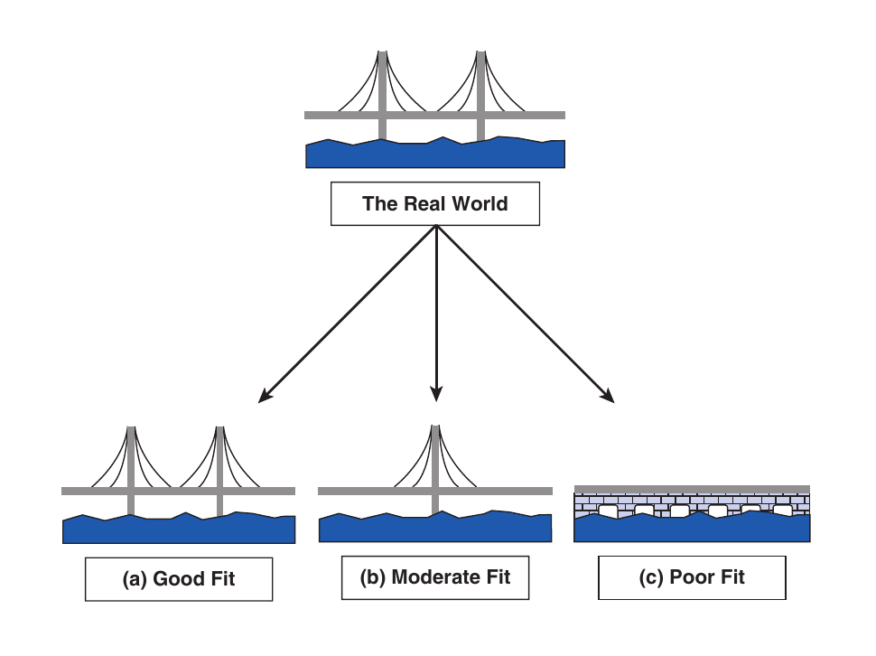
```

> All statistics are models, some are simpler than others 

:::

::::

## Populations

- The total “pool” you are trying to explore/describe

    - "e.g. all the trees in a forest" 

- Usually you’re not going to be able to study the entire population, because: time, money, access, resources, support, etc. 

- So instead, we can usually only work with a sample


## Sample

- Drawn **randomly** from the population...

- ...to collect observations for variable(s) of interest...

- ...to try to say something meaningful about the population.

- *A sample can misrepresent the population if it is biased.*

## Data Spread

If data is symmetrically distributed, the **mean and median** will be close, especially as *n* increases. 

This shape is characteristic of a **normal distribution**


```{r, echo = FALSE, out.width = "60%"}
# Load required packages
library(ggplot2)

# Set seed for reproducibility
set.seed(123)

# Generate random sample from a normal distribution
sample_size <- 1000
mu <- 0  # mean
sigma <- 1  # standard deviation
sample <- rnorm(sample_size, mean = mu, sd = sigma)

# Create a data frame with the sample data
df <- data.frame(x = sample)

# Create a histogram plot using ggplot2
ggplot(df, aes(x = x)) +
  geom_histogram(binwidth = 0.2, fill = "lightblue", color = "black") +
  labs(x = "Value", y = "Frequency", title = "Distribution Histogram") +
  theme_classic()


```


## Variance

Variance measures the average **squared distance** from the mean.


$$s{^2}_{sample} = \frac{\sum(x - \bar{x})^2}{N -1}$$

- Sample variance is a robust measure of data spread, but can be sensitive to outliers. 

- A higher variance means more spread.

## Calculating variance

Variance is the average squared distance from the mean; it tells us how spread out the data are

:::: {.columns}

::: {.column}

| Value | Distance from mean | Squared distance |
| ----- | ------------------ | ---------------- |
| 2     | −2                 | 4                |
| 4     | 0                  | 0                |
| 6     | +2                 | 4                |

Average squared distance:

$$
Variance = \frac{4+0+4}{3-1} = 4
$$

:::

::: {.column}

Why do we square and divide by *n-1*

- Square makes *all* distances positive

- *n-1* stops us underestimating spread when we use a sample

:::

::::


## N-1? {.smaller}

```{r, echo = FALSE, out.width="30%", fig.alt = "Sampling"}
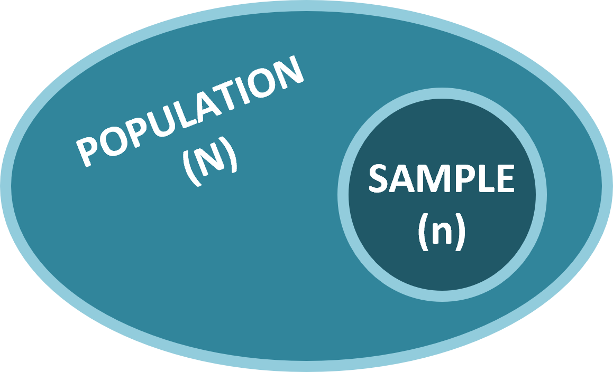
```

For a *population* the variance $S_p^2$ is exactly the **mean** squared distance of the values from the population mean

$$
s{^2}_{pop} = \frac{\sum(x - \bar{x})^2}{N}
$$


But this is a *biased* estimate for the population variance 

- A biased sample variance will *underestimate* population variance

- n-1 (if you take a large enough sample size, will correct for this)

[More here](https://www.jamelsaadaoui.com/unbiased-estimator-for-population-variance-clearly-explained/#:~:text=The%20expected%20value%20of%20the%20sample%20variance%20is%20equal%20to,definition%20of%20an%20unbiased%20estimator.)


## Standard Deviation

- Square root of **sample variance**

- A measure of dispersion of the sample

- Smaller SD = more values closer to mean, larger SD = greater data spread from mean

* *variance*:

$$
s^2 = \sqrt{\sum(x - \overline x)^2\over n - 1}
$$

## Why the Normal Distribution matters

Shape: Symmetrical, bell-shaped curve

:::: {.columns}

::: {.column}

- Rule of Thumb: For normally distributed data:

    ~68% within 1 SD

    ~95% within 2 SDs

    ~99.7% within 3 SDs

:::

:::{.column}


```{r, echo = FALSE, out.width="80%"}
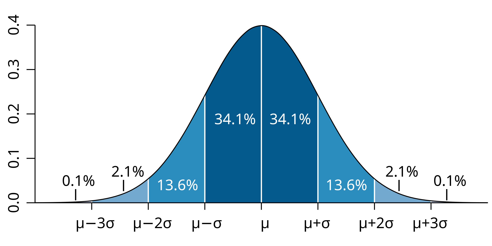
```

:::

::::


## Visualising a Distribution

:::: {.columns}

::: {.column}

**Histograms** show shape

```{r, include = FALSE}

`SD = 1` <- rnorm(n = 1000, mean = 0, sd = 1)
`SD = 2` <- rnorm(n = 1000, mean = 0, sd = 2)
`SD = 3` <- rnorm(n = 1000, mean = 0, sd = 3)

tibble(`SD = 1`, `SD = 2`, `SD = 3`) |>  
pivot_longer(cols = everything(), names_to = "Standard Deviation", values_to = "values") |>  
  ggplot(aes(x = values, fill = `Standard Deviation`))+
  geom_histogram()+
  facet_wrap(~ `Standard Deviation`)+
  theme_classic()+
  theme(legend.position = "none")+
  labs(x = " ",
       y = "Frequency")

```

```{r, echo = FALSE, message = FALSE, out.width="80%"}
tibble(`SD = 1`, `SD = 2`, `SD = 3`) |>  
pivot_longer(cols = everything(), names_to = "Standard Deviation", values_to = "values") |>  
  filter(`Standard Deviation` == "SD = 2") |>  
  ggplot(aes(x = values), fill = "grey")+
  geom_histogram()+
  theme_minimal()+
  theme(legend.position = "none")+
  labs(x = bquote(bar(x)),
       y = " ")
```

:::

::: {.column}

**Quantile-Quantile plots** plots against normality

```{r, echo = FALSE, warning = F, message  = F, out.width="80%"}

tibble(`SD = 1`,`SD = 2`, `SD = 3`) |>  
pivot_longer(cols = everything(), names_to = "Standard Deviation", values_to = "values") |>  
  filter(`Standard Deviation` == "SD = 2") |>  
  ggplot(aes(sample = values))+
  geom_qq()+
  geom_qq_line()+
  theme(legend.position = "none")+
  labs(x = " ",
       y = " ")
```

:::

::::

# Inferential Statistics  {background-color="#D9DBDB"}

## Inferential vs Descriptive

:::: {.columns}

::: {.column}

### Descriptive

- Summarises the data in a meaningful way

- Measures of central tendency & measures of variability

:::

::: {.column}

### Inferential

- Analyses a sample of data to infer about a larger population

- Includes hypothesis testing and building confidence intervals

:::

::::


## Standard deviation predicts data

Standard deviation describes how spread out individual observations are

```{r, fig.width = 12}
library(patchwork)

`SD = 1` <- rnorm(n = 1000, mean = 0, sd = 1)
`SD = 2` <- rnorm(n = 1000, mean = 0, sd = 2)
`SD = 3` <- rnorm(n = 1000, mean = 0, sd = 3)

tibble(`SD = 1`, `SD = 2`, `SD = 3`) |>  
pivot_longer(cols = everything(), names_to = "Standard Deviation", values_to = "values") |>  
  ggplot(aes(x = values, fill = `Standard Deviation`))+
  geom_histogram()+
  facet_wrap(~ `Standard Deviation`)+
  theme_classic()+
  theme(legend.position = "none")+
  labs(x = " ",
       y = "Frequency")

```

## Introduction to Standard Error

Standard error describes **uncertainty in the mean**, not spread of data

$$
SE = {s\over \sqrt n}
$$


```{r, echo = FALSE, out.width="100%", fig.alt = "Data sampling"}

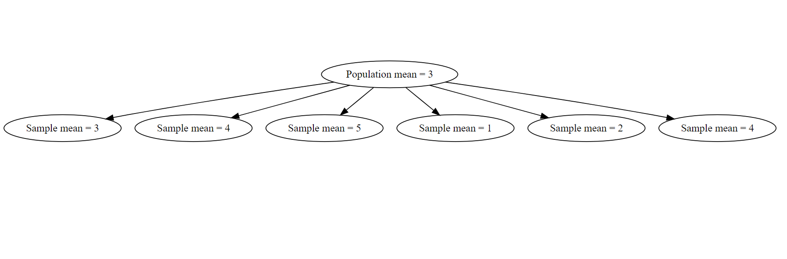

```

## Standard Error

### Standard deviation vs. standard error: 


:::: {.columns}

::: {.column}

- Standard deviation measures variability **within** a sample


$s = \sqrt{\sum(x - \overline x)^2\over n - 1}$

:::


::: {.column}

- Standard error  is how much the sample mean (from a given sample) is likely to vary from the true population mean.

$SE(\overline{X}) = \frac{s}{\sqrt(N)}$

:::

::::


## Standard Error

- Standard Error of the Mean ($\overline{X}$) is the **Standard Deviation of the Sampling Distribution of the Mean.

- If you took many samples from the same population, each sample would give a different mean.

```{r, echo = FALSE, out.width="50%", fig.alt = ""}
knitr::include_graphics("images/sampling.png")
```

## Confidence Intervals Explained

:::: {.columns}

::: {.column}

Can be constructed by YOU:

Do you want to know the range within which you will capture the mean...

::: {.incremental}

* 66% of the time = 1 * S.E.


* 95% = 1.96 * S.E. 


* 99% = 2.58 * S.E. 

:::

The Confidence level (C) is the inverse of the significance level.

$$
\alpha = 1 - C
$$

:::

::: {.column}

```{r, fig.height = 9}

# Load required libraries
library(ggplot2)

# Define mean and standard deviation
mean <- 0
sd <- 1

# Define the limits for the x-axis
x_limits <- c(-4, 4)

# Create a sequence of x values
x <- seq(x_limits[1], x_limits[2], length.out = 1000)

# Calculate the y values for the normal distribution
y <- dnorm(x, mean, sd)

# Create a data frame
data <- data.frame(x, y)

# Define the z-scores for SE, 95% CI, and 99% CI
se_limit <- c(-1, 1) * sd
ci_95_limit <- qnorm(c(0.025, 0.975), mean, sd)
ci_99_limit <- qnorm(c(0.005, 0.995), mean, sd)

# Plot the normal distribution
ggplot(data, aes(x = x, y = y)) +
  geom_line(linewidth = 1) +
  
  # Standard error shading
  geom_area(data = subset(data, x >= se_limit[1] & x <= se_limit[2]),
            aes(x = x, y = y), fill = "blue", alpha = 0.3) +
  
  # 95% CI shading
  geom_area(data = subset(data, x >= ci_95_limit[1] & x <= ci_95_limit[2]),
            aes(x = x, y = y), fill = "green", alpha = 0.2) +
  
  # 99% CI shading
  geom_area(data = subset(data, x >= ci_99_limit[1] & x <= ci_99_limit[2]),
            aes(x = x, y = y), fill = "red", alpha = 0.1) +
  
  # Add vertical lines for limits
  geom_vline(xintercept = se_limit, linetype = "dashed", color = "blue") +
  geom_vline(xintercept = ci_95_limit, linetype = "dashed", color = "green") +
  geom_vline(xintercept = ci_99_limit, linetype = "dashed", color = "red") +
  
  # Add text labels
  annotate("text", x = mean(se_limit), y = max(y) * 0.9, label = "SE", color = "blue", vjust = -1) +
  annotate("text", x = mean(ci_95_limit), y = max(y) * 0.8, label = "95% CI", color = "green", vjust = -1) +
  annotate("text", x = mean(ci_99_limit), y = max(y) * 0.7, label = "99% CI", color = "red", vjust = -1) +
  
  # Customize plot
  labs(title = "Normal Distribution with Standard Error and Confidence Intervals",
       x = "x", y = "Density") +
  theme_minimal(base_size = 18)


```

:::

::::

## 95% Confidence interval

"In 95% of experiments we would capture the true mean with our confidence interval range"

```{r, fig.height = 9}

set.seed(123)

true_mean <- 0
true_sd <- 1
n <- 30
n_sims <- 100

ci_data <- map_dfr(1:n_sims, ~{
  sample <- rnorm(n, mean = true_mean, sd = true_sd)
  m <- mean(sample)
  se <- sd(sample) / sqrt(n)
  tibble(
    mean = m,
    lower = m - qt(0.975, df = n - 1) * se,
    upper = m + qt(0.975, df = n - 1) * se
  )
}, .id = "sim")

ci_data <- ci_data |>
  mutate(contains_true = lower <= true_mean & upper >= true_mean)

ggplot(ci_data, aes(y = as.numeric(sim))) +
  geom_errorbarh(
    aes(xmin = lower, xmax = upper, colour = contains_true),
    height = 0
  ) +
  geom_vline(xintercept = true_mean, linetype = "dashed") +
  scale_colour_manual(values = c("TRUE" = "black", "FALSE" = "red")) +
  labs(
    x = "Mean value",
    y = "Sample",
    colour = "Contains true mean"
  ) +
  coord_flip()+
  theme(legend.position = "bottom")


```

## The T Distribution

- The t-distribution is a correction for small sample size and unknown population variance with an *approximately* normally distributed population

```{r, fig.width = 12}

x <- seq(-5, 5, by = 0.1)
y1 <- dt(x, df = 1)
y2 <- dt(x, df = 3)
y3 <- dt(x, df = 8)
y4 <- dt(x, df = 30)
y5 <- dnorm(x)
plot(x, y1, type = "l", col = "red", 
     xlab = "x", 
     ylab = "Density", 
     main = "T Distributions and Normal Distribution",
     ylim = c(0,0.4),
     xlim = c(-5, 5))
lines(x, y2, col = "blue")
lines(x, y3, col = "green")
lines(x, y4, col = "purple")
lines(x, y5, col = "black", lty = 2)
legend("topright", legend = c("df = 1", "df = 3", "df = 8", "df = 30", "Normal"), col = c("red", "blue", "green", "purple", "black"), lty = c(1, 1, 1, 1, 2))


```

## t vs normal distribution

the t-distribution is closely related to a normal distribution, but influenced by sample size *n* and has **fatter tails**

Calculate Confidence intervals based on *t-distribution*

${95\%~CI} = {\overline x \pm t*SE}$


```{r, out.width = "60%"}

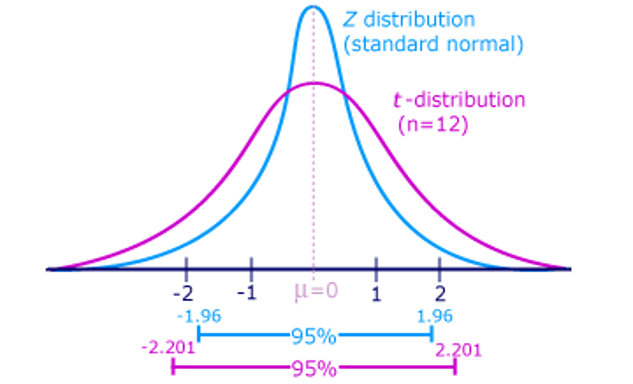

```

*Calculating t based on sample size WILL affect confidence intervals*


# Linear Models  {background-color="#D9DBDB"}

## Linear models for regression analysis


:::: {.columns}

::: {.column}

Difference tests: t-test, ANOVA, ANCOVA

```{r, echo = FALSE, out.width="100%", fig.alt = "Difference model"}
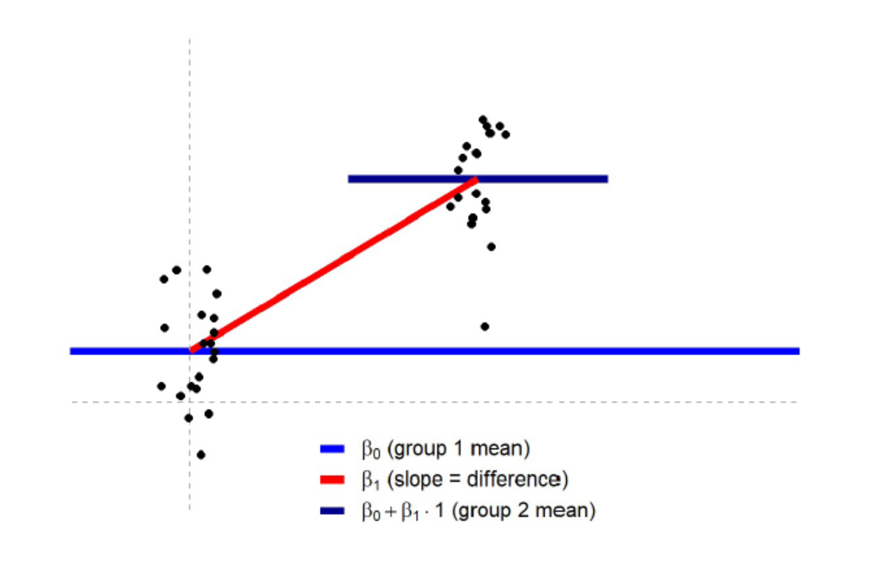

```


:::

::: {.column}

Association tests: Regressions

```{r, echo = FALSE, out.width="100%", fig.alt = "Regression model"}
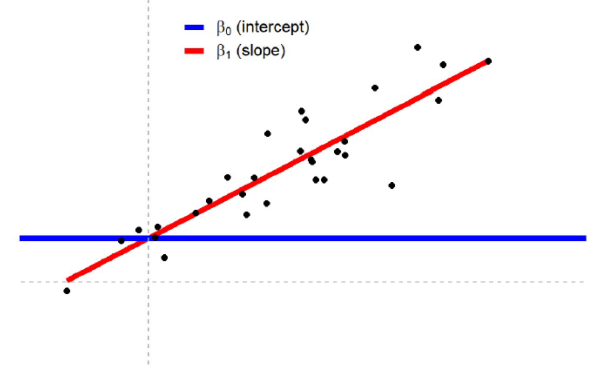
```

:::

::::


## Straight line equation

$$
\LARGE{y = a + bx}
$$

:::: {.columns}

::: {.column}

### Where:

$y$ is the predicted value of the response variable


$a$ is the intercept (value of y when x = 0)


$b$ is the slope of the regression line


$x$ is the value of the explanatory variable

:::

::: {.column}


```{r, echo = FALSE, out.width="100%", fig.alt = "regression"}

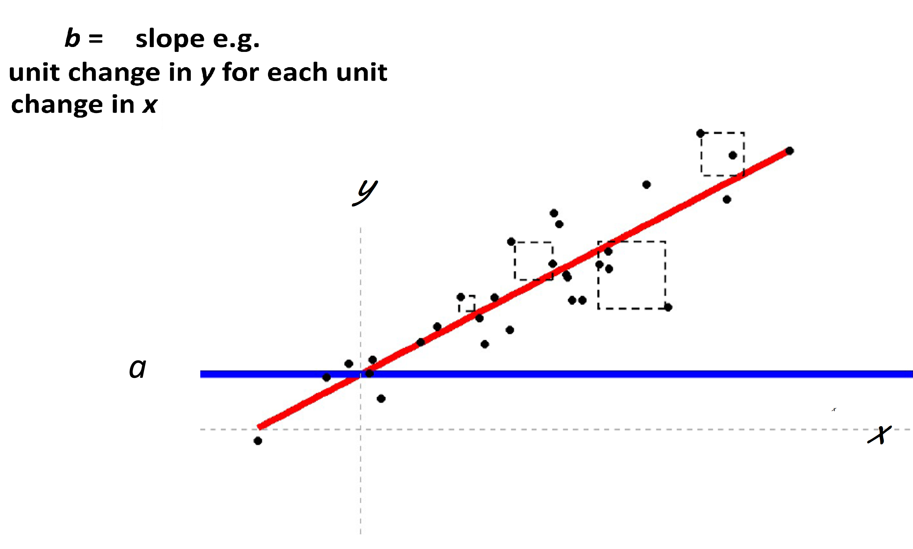

```

:::

::::


## Line of best fit

```{r, echo = FALSE, out.width="70%", fig.alt = "Line fitting"}

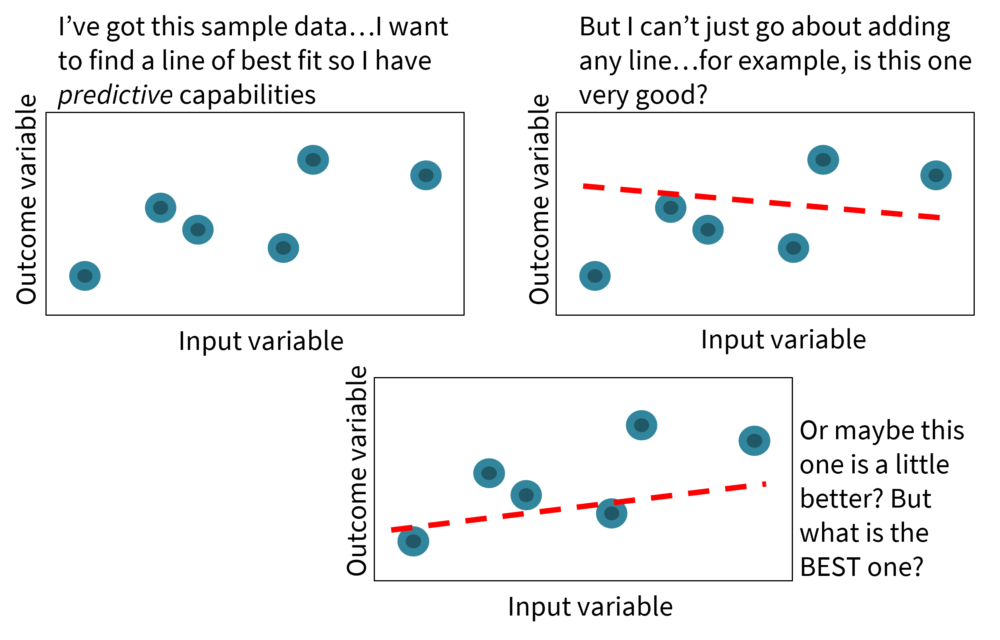

```


## Ordinary Least Squares

The line of best fit minimises the sum of the **squared distance** that *each* sample point is from the value predicted by the model

This is called the method of 


### Ordinary Least Squares


## Residuals


The difference between the ACTUAL value of the observation $y_i$ and the value that the model predicts $\hat{y_i}$ at that $x$ value are the residuals (residual error).


```{r, echo = FALSE, out.width="50%", fig.alt = "residuals"}

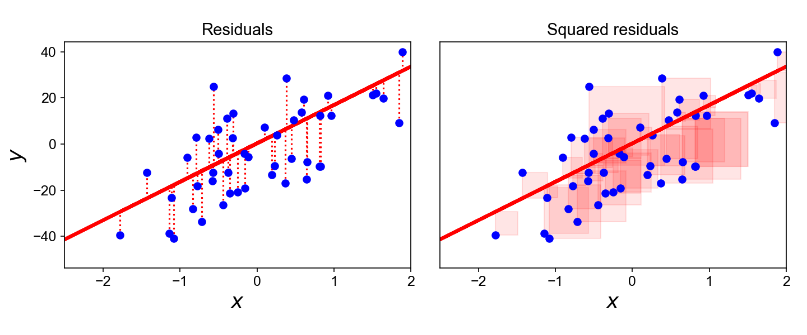

```

The regression model fitted by **O**rdinary **L**east **S**quares (OLS) will produce the equation for the line that **MINIMIZES** the sum of squares of the residuals


## Sum of Squares Errors

:::: {.columns}

::: {.column}

```{r, echo = FALSE, out.width="60%", fig.alt = "sum of squares error"}

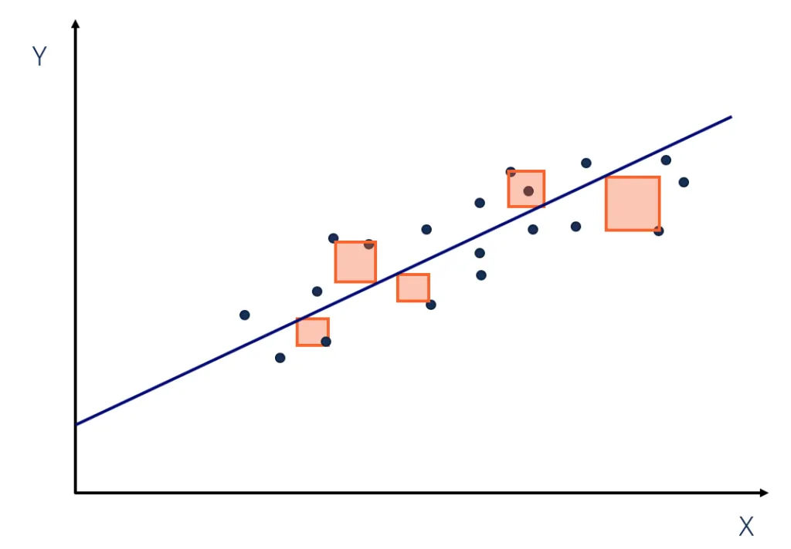

```

:::

::: {.column}

This produces the line with the *smallest* total area size for the squares. 

$$
SSE = \underset{i=1}{n \atop{\sum}}(y_i - \hat{y_i})^2
$$


SUM OF RESIDUAL ERROR = $(2)+(-1)+(4)+(-3)+(-2)=0$


SUM OF SQUARES OF RESIDUAL ERROR = $(2^2)+(-1^2)+(4^2)+(-3^2)+(-2^2)=34$

:::

::::


## Sums of Squares

:::: {.columns}

::: {.column}


```{r, echo = FALSE, out.width="100%", fig.alt = "OLS fits a line to produce the smallest amount of SSE"}

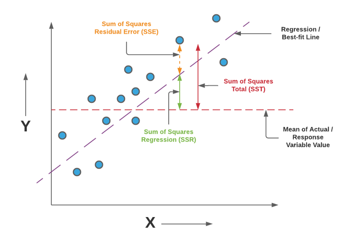

```

:::

::: {.column}

**SST** The squared differences between the observed dependent variable $y_i$ and its overall mean $\overline{y}$.

**SSR** The sum of the differences between the predicted value $\hat{y_i}$ of the dependent variable and its overall mean $\overline{y}$.

**SSE** The error is the difference between the observed dependent value $y_i$  and the predicted value $\hat{y_i}$.

:::

::::


## Linear model equation

$$
\LARGE{y_i = a + bx+\epsilon}
$$

:::: {.columns}

::: {.column}

```{r, echo = F}
darwin <- read_csv(here::here("data", "darwin.csv"))

```

```{r, echo = T}
darwin_ls1 <- lm(height ~ type, data = darwin) 
summary(darwin_ls1)
```

:::

::: {.column}


```{r, echo = F}
janka <- read_csv(here::here("data", "janka.csv"))

```

```{r, echo = T}
janka_ls1 <- lm(hardness ~ dens, data = janka) 
summary(janka_ls1)
```

:::

::::


## Coefficient of determination


$\LARGE{R^2}$ : The proportion of variation in the dependent variable that can be predicted from the independent variable


$$
\LARGE{R^2=1-{Sum~of~Squared~Distances~between~y_i~and~\hat{y_i}\over{Sum~of~Squared~Distances~between~y_i~and~\overline{y}}} }
$$


$$
\LARGE{R^2=1-{SSE\over{SST}}}
$$


## Compare these write-ups

- “There was a significant effect (*p* < 0.001).”

::: {.incremental}

- “There is a positive association between wood density and timber hardness (*t*<sub>34</sub> = 25.24, *p* = <0.001).”


:::


## A write-up


 **I** fitted a linear model (estimated using OLS) to predict **timber hardness from wood density**. The model explains a statistically significant and substantial proportion of variance (F<sub>1,34</sub>) = 636.98, p < .001, adj. R<sup>2</sup> = 0.95). The model shows that for each unit increase in wood density (kg/m^3) there is an **increase** of 57.51 (lbf) on the Janka wood hardness scale (Beta = 57.51, 95% CI [52.88, 62.14], t<sub>34</sub> = 25.24, p < .001). Model residuals were checked against the assumptions of a standard linear model.


# Assumptions  {background-color="#D9DBDB"}

## Assumptions of the Linear Model

::: {.incremental}

-  *Errors* should be normally distributed

- Homoscedasticity of the errors

- Independent observations

- A Linear relationship

:::

## Model fit checks

```{r, echo = T, out.width="100%"}
performance::check_model(janka_ls1, 
                         detrend = F) 
```


## Linearity

```{r, echo = T, out.width="100%"}
performance::check_model(janka_ls1,
                         check = "linearity") 
```

## Normality

```{r}
#| eval: true
#| echo: true
#| layout-ncol: 2
#| fig-height: 7
#| message: false

performance::check_model(janka_ls1,
                         check = "normality")

performance::check_normality(janka_ls1)
```

## Heteroscedasticity


```{r}
#| eval: true
#| echo: true
#| layout-ncol: 2
#| fig-height: 7
#| message: false

performance::check_model(janka_ls1,
                         check = "homogeneity")

performance::check_heteroscedasticity(janka_ls1)
```

## Outliers


```{r}
#| eval: true
#| echo: true
#| layout-ncol: 2
#| fig-height: 7
#| message: false

performance::check_model(janka_ls1,
                         check = "outliers")

performance::check_outliers(janka_ls1)
```
