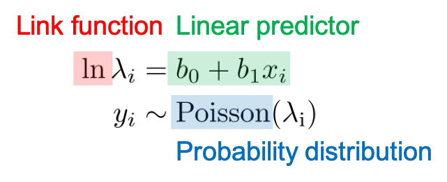

# Introduction {background-color="#D9DBDB"}

```{r, include = FALSE}
library(tidyverse)
library(here)
library(emmeans)
library(MASS)
```

## Learning Objectives

By the end of this session, you will be able to:

1. Explain why model assumptions are important

2. Fit appropriate models to rate/count data

3. Evaluate models for best fit

4. Deliver transparent and clear reporting


# Recap {background-color="#D9DBDB"}

## What have you learned so far?

<div style="margin-top: 3em;"></div>

- Tell me one thing you appreciate or understand more about coding, data exploration and version control

<div style="margin-top: 3em;"></div>

- Tell me one thing you don't quite understand or want to check?

# Fitting a Linear Model {background-color="#D9DBDB"}

## Cuckoo data

```{r, include = FALSE}
cuckoo <- read_csv(here("data_2", "cuckoo.csv"))
```

## Visualising Data

:::{.column}

- Mass: nestling mass of chick in grams

- Beg: begging calls per 6 secs

- Species: Warbler or Cuckoo
:::

:::{.column}

```{r}
ggplot(cuckoo, aes(x = Mass, y = Beg, colour = Species)) + 
  geom_point(size = 3, alpha = 0.6) +
  scale_colour_manual(values = c("darkorange", "steelblue")) +
  labs(x = "Nestling mass (g)", 
       y = "Begging calls per 6 seconds") +
  theme_minimal()

```
:::

## Linear Model

::: {style="height: 800px;"}

```{r}

cuckoo_lm <- lm(Beg ~ Mass * Species, data = cuckoo)

summary(cuckoo_lm)

```

:::


## Evaluation

```{r, echo = FALSE, fig-align: center, out.width = "80%"}

performance::check_model(
  cuckoo_lm,
  detrend = FALSE
)

```

# GLMs for count data {background-color="#D9DBDB"}

## Linear models


Let's start with linear models...

::: {.center-text}


$y_i = \beta0 + \beta_1x1 + \beta_2x2 + ... +\beta_nxn +\epsilon_i$


$\epsilon_i = \mathcal{N}(0, \sigma^2)$

:::

::: {.fragment}

$y_i$ = individual data point

$\epsilon_i$ = Error distribution (here standard Normal)

:::


## Generalised Linear models


Then generalised linear models...

::: {.fragment}

::: {.center-text}

$\mu_i = f(\beta0 + \beta_1x1 + \beta_2x2 + ... +\beta_nxn)$

$\epsilon_i \sim \mathcal{N}(0, \sigma^2)$

:::

:::


::: {.fragment}

 - $f$ is the link function to the mean
 
**Examples:** Log, sqrt, identity

 - $\epsilon_i$ is the error term for observation $i$

**Examples:** Gaussian (normal), binomial, Poisson, gamma, etc.

:::


## Poisson

:::: {.columns}

::: {.column}

```{r}
#| eval: true
#| echo: false
#| fig-height: 8
#| message: false

# Define a range of lambda values (average rate of success)
lambda_values <- c(1, 4, 10, 20, 50)

# Generate the Poisson distribution data
poisson_data <- map_df(lambda_values, ~tibble(
  lambda = .x,
  events = 0:75, # Assuming a reasonable range for visualization
  probability = dpois(0:75, .x)
)) |> 
  mutate(lambda = factor(lambda, levels = lambda_values)) # For ordered plotting

# Plot
ggplot(poisson_data, aes(x = events, y = probability, color = lambda)) +
  geom_line(linewidth = 1.5) +
  scale_color_brewer(palette = "Dark2") +
  labs(title = "Change in Poisson Distribution with Different Lambda",
       x = "Number of Events",
       y = "Probability",
       color = "Lambda") +
  theme_minimal(base_size = 14)

```

::: 

::: {.column}

Count or rate data are ubiquitous in the life sciences (e.g number of parasites per microlitre of blood, number of species counted in a particular area). These type of data are **discrete** and **non-negative**.

A useful distribution to model abundance data is the **Poisson** distribution: 

a discrete distribution with a single parameter, λ (lambda), which defines both the mean and the variance of the distribution.

:::

::::

## GLM

::: {.incremental}

Recall the simple linear regression case (i.e a GLM with a Gaussian error structure and identity link). For the sake of clarity let's consider a single explanatory variable where $\mu$ is the mean for *Y*:

:::{.center}

$\mu_i = \beta0 + \beta_1x1 + \beta_2x2 + ... +\beta_nxn$

$y_i \sim \mathcal{N}(\mu_i, \sigma^2)$

* The mean function is **unconstrained**, i.e the value of $\beta_0 + \beta_1X$ can range from $-\infty$ to $+\infty$. 

:::

:::

## Poisson


* If we want to model count data we therefore want to **constrain** this mean to be positive only. 

::: {.incremental}

* Mathematically we can do this by taking the **logarithm** of the mean (the log is the default link for the Poisson distribution). 

* We then assume our count data variance to be Poisson distributed (a discrete, non-negative distribution), to obtain our Poisson regression model (to be consistent with the statistics literature we will rename $\mu$ to $\lambda$):

:::

## GLM Poisson

{fig-align="center" fig-alt="Poisson equation" width=80%}

## Poisson distribution

The **Poisson** distribution has the following characteristics:

::: {.column}

::: {.incremental}

* **Discrete** variable (integer),

$$
        0, 1, \dots, \infty
$$


* **Mean** = $\lambda$  

* **Variance** = $\lambda$

:::

:::

::: {.column}

```{r}
library(tidyverse)

# Define lambdas and support
lambdas <- c(1, 3, 6, 10)
x_vals <- 0:25

# Create data
poisson_multi_df <- expand_grid(
  x = x_vals,
  lambda = lambdas
) %>%
  mutate(
    probability = dpois(x, lambda),
    lambda = factor(lambda)
  )

# Plot
ggplot(poisson_multi_df, aes(x = x, y = probability)) +
  geom_col(width = 0.7) +
  facet_wrap(~ lambda, ncol = 2, scales = "free_y") +
  labs(
    title = "Poisson Distributions for Different Values of λ",
    subtitle = "λ is both the rate and the mean of the distribution",
    x = "Count (x)",
    y = "P(X = x)"
  ) +
  theme_minimal()


```

:::

# Implementing a GLM {background-color="#D9DBDB"}

## Additive GLM

```{r, echo = TRUE}

cuckoo_glm_additive <- glm(Beg ~ Mass + Species, data = cuckoo,
                          family = poisson)

summary(cuckoo_glm_additive)

```

## Model predictions

::::{.columns}

:::{.column}

- This models the mean and 95% confidence intervals

> Uncertainty around true mean NOT prediction of sample distribution

- Modelled on the response/measured scale

```{r, echo = TRUE}
predictions_additive <- emmeans(cuckoo_glm_additive,
specs = ~ Mass + Species,
at = list(Mass = seq(0, 40, by = 0.5)),
type = "response") |>
as_tibble()

```

:::

:::{.column}

```{r, echo = FALSE, out.width = "120%"}

fig_main <- ggplot(predictions_additive,
aes(x = Mass, y = rate,
colour = Species, fill = Species)) +
geom_ribbon(aes(ymin = asymp.LCL, ymax = asymp.UCL),
            alpha = 0.15, colour = NA) +
# Mean estimate
geom_line(linewidth = 1.2) +
# Raw data
geom_point(data = cuckoo,
aes(y = Beg),
size = 2.5,
alpha = 0.6) +

scale_colour_manual(values = c("Cuckoo" = "darkorange", "Warbler" = "steelblue"),
labels = c("Cuckoo", "Reed warbler")

) +
scale_fill_manual(values = c("Cuckoo" = "darkorange", "Warbler" = "steelblue"),
labels = c("Cuckoo", "Reed warbler")

) +
scale_x_continuous(breaks = seq(0, 40, by = 10)) +
scale_y_continuous(breaks = seq(0, 100, by = 10)) +

  labs(
x = "Nestling mass (g)",
y = "Begging calls per 6 seconds",
colour = NULL,
fill = NULL
) +
theme_minimal(base_size = 12)


fig_main

```
:::

:::


## Model checks

```{r, echo = FALSE, out.width = "80%"}

performance::check_model(
  cuckoo_glm_additive,
  residual_type = "normal",
            detrend = FALSE)


```


## Interaction term

```{r, echo = TRUE}

cuckoo_glm_interaction <- glm(Beg ~ Mass + Species+
                                Mass:Species, 
                              data = cuckoo,
                          family = poisson)

summary(cuckoo_glm_interaction)

```

## Interaction predictions

::::{.columns}

:::{.column}

```{r, echo = TRUE}
predictions_interaction <- emmeans(cuckoo_glm_interaction,
specs = ~ Mass + Species,
at = list(Mass = seq(0, 40, by = 0.5)),
type = "response") |>
as_tibble()

```

:::

:::{.column}

```{r, echo = FALSE, out.width = "120%"}

fig_main <- ggplot(predictions_interaction,
aes(x = Mass, y = rate,
colour = Species, fill = Species)) +
geom_ribbon(aes(ymin = asymp.LCL, ymax = asymp.UCL),
            alpha = 0.15, colour = NA) +
# Mean estimate
geom_line(linewidth = 1.2) +
# Raw data
geom_point(data = cuckoo,
aes(y = Beg),
size = 2.5,
alpha = 0.6) +

scale_colour_manual(values = c("Cuckoo" = "darkorange", "Warbler" = "steelblue"),
labels = c("Cuckoo", "Reed warbler")

) +
scale_fill_manual(values = c("Cuckoo" = "darkorange", "Warbler" = "steelblue"),
labels = c("Cuckoo", "Reed warbler")

) +
scale_x_continuous(breaks = seq(0, 40, by = 10)) +
scale_y_continuous(breaks = seq(0, 100, by = 10)) +

  labs(
x = "Nestling mass (g)",
y = "Begging calls per 6 seconds",
colour = NULL,
fill = NULL
) +
theme_minimal(base_size = 12)


fig_main

```
:::

:::


## Model check

```{r, echo = FALSE, out.width = "80%"}

performance::check_model(
  cuckoo_glm_interaction,
  residual_type = "normal",
            detrend = FALSE)


```


# Overdispersion {background-color="#D9DBDB"}

## Overdispersion

When the residual deviance is higher than the residual degrees of freedom, we say that the model is overdispersed. This situation is mathematically represented as:

$$
\phi = \frac{\text{Residual deviance}}{\text{Residual degrees of freedom}}
$$

Overdispersion occurs when the variance in the data is even higher than the mean, indicating that the Poisson distribution might not be the best choice. This can be due to many reasons, such as the presence of many zeros, many very high values, or missing covariates in the model.

## Overdispersion and what to do about it

| Causes of over-dispersion | What to do about it | 
|---------|:-----|
| Model mis-specification (missing covariates or interactions)    | Add more covariates or interaction terms   |
| Too many zeros ("zero inflation")    | Use a zero-inflated model  |
| Non-independence of observations       | Use a generalised mixed model with random effects to take non-independence into account    |
| Variance is larger than the mean      | Use a quasipoisson GLM if overdispersion = 2-15. Use a negative binomial GLM if > 15-20  |

: Overdispersion statistic values > 1


## Overdispersion and what to do about it

::: {.incremental}

- It may be true that you are initially unsure whether overdispersion is coming from zero-inflation, larger variance than the mean or both. 

- You can fit models with the same dependent and independent variables and different error structures and use AIC to help determine the best model for your data

- Study the residual plots

:::

## AIC

::: {.incremental}

- The Akaike Information Criterion (AIC)  balances the trade-off between model fit and complexity by penalizing models with more parameters.

- It aims to find the model that best explains the data while avoiding overfitting.

- AIC is calculated as follows: $\text{AIC} = 2k - 2\ln(\hat{L})$, 

- where: log-likelihood is the maximized value of the likelihood function for the fitted model. $k$ is the number of parameters in the model.

- In general a difference in AIC of <2 suggests equivalent goodness-of-fit

:::

## AIC

:::: {.columns}

::: {.column}

**AIC can:**

- Compare non-nested models fitted to the same dataset and response variable

- Compare across different GLM families and link functions

:::

::: {.column}

**AIC cannot:**

- Compare models where the response variable is transformed

- Compare models where there are differences in the dataset

:::

::::

## Overdispersion in the model

- Rough check

$\phi = \frac{\text{Residual deviance}}{\text{Residual degrees of freedom}}$ = $\frac{436.05}{47} = 9.27$

```{r}
#| eval: true
#| echo: true

summary(cuckoo_glm_interaction)

performance::check_overdispersion(cuckoo_glm_interaction)

```

## Quasi-Poisson GLM 

The systematic part and the link function remain the same

$$
    \log{\lambda} = \beta_0 + \beta_1 x_i
$$

*phi*$\phi$ is a dispersion parameter, it will not affect estimates but will affect *significance*. Standard errors are multiplied by $\sqrt\phi$ 

$$
Y_i = Poisson(\phi \lambda_i)
$$


Where:

- $Yi$ is the response variable.
- $\phi$ is the dispersion parameter, which adjusts the variance of the distribution

Confidence intervals and p-values WILL change.


## Fit a quasipoisson model to the data

```{r}
#| eval: true
#| echo: true

cuckoo_glm_quasi <- glm(Beg ~ Mass + Species+
                                Mass:Species, 
                              data = cuckoo,
                          family = quasipoisson)
```

* Look at the residual plots - how have they changed? 

* Look at the SE and p-values - how have they changed

* Calculate new 95% confidence intervals

## Compare models

```{r}
#| eval: true
#| echo: true
#| layout-ncol: 2

summary(cuckoo_glm_interaction)

summary(cuckoo_glm_quasi)

```

## Interaction predictions

::::{.columns}

:::{.column}

```{r, echo = TRUE}
predictions_quasi <- emmeans(cuckoo_glm_quasi,
specs = ~ Mass + Species,
at = list(Mass = seq(0, 40, by = 0.5)),
type = "response") |>
as_tibble()

```

:::

:::{.column}

```{r, echo = FALSE, out.width = "120%"}

fig_main <- ggplot(predictions_quasi,
aes(x = Mass, y = rate,
colour = Species, fill = Species)) +
geom_ribbon(aes(ymin = asymp.LCL, ymax = asymp.UCL),
            alpha = 0.15, colour = NA) +
# Mean estimate
geom_line(linewidth = 1.2) +
# Raw data
geom_point(data = cuckoo,
aes(y = Beg),
size = 2.5,
alpha = 0.6) +

scale_colour_manual(values = c("Cuckoo" = "darkorange", "Warbler" = "steelblue"),
labels = c("Cuckoo", "Reed warbler")

) +
scale_fill_manual(values = c("Cuckoo" = "darkorange", "Warbler" = "steelblue"),
labels = c("Cuckoo", "Reed warbler")

) +
scale_x_continuous(breaks = seq(0, 40, by = 10)) +
scale_y_continuous(breaks = seq(0, 100, by = 10)) +

  labs(
x = "Nestling mass (g)",
y = "Begging calls per 6 seconds",
colour = NULL,
fill = NULL
) +
theme_minimal(base_size = 12)


fig_main

```
:::

:::


# Negative Binomial {background-color="#D9DBDB"}

## Negative Binomial

```{r}
#| eval: true
#| echo: false
#| fig-height: 8
#| fig-width: 10
#| message: false

##Negative Binomial Distribution (Varying Shape Parameter r)
#In the negative binomial distribution:
  
#  Shape Parameter (r): Represents the number of successes required before the experiment is stopped.
#Probability of Success (p): Represents the probability of success in each Bernoulli trial.
#As r increases:
  
#  The distribution becomes more skewed to the right.
#The average number of failures before success increases.
#The variance of the distribution also increases, indicating greater variability.

# Function to generate negative binomial distribution data

generate_nbinom_data <- function(r, p) {
  tibble(failures = 0:(10*r), 
         probability = dnbinom(0:(10*r), size = r, prob = p))
}

# Define range of shape parameter values (r)
r_values <- rep(c(2, 5, 10), times = 3)  # Number of successes

# Fixed probability of success
p_fixed <- rep(c(0.2, 0.4, 0.6), each = 3)  

# Generate negative binomial distribution data for different r values
nbinom_data <- map2_df(r_values, p_fixed, ~generate_nbinom_data(r = .x, p = .y) 
                      |>  mutate(r = as.factor(.x)) |>  mutate(p = as.factor(.y))) 

# Plot for negative binomial distribution
ggplot(nbinom_data, aes(x = failures, y = probability, color = r, group = interaction(r,p))) +
  geom_line() +
  scale_color_brewer(palette = "Dark2")+
  labs(title = "Negative Binomial Distribution with Varying Shape Parameter (r)",
       x = "Number of Failures",
       y = "Probability",
       color = "Number of Successes (r)") +
  theme_minimal(base_size = 14)+
  facet_wrap(~p)+
  gghighlight::gghighlight()

```

## Negative Binomial

Negative binomial GLMs are favored when overdispersion is high.

It has two parameters, $μ$ and $\theta$. $\theta$ controls for the dispersion parameter (smaller $\theta$ indicates higher dispersion). It corresponds to a combination of two distributions (Poisson and gamma).

It assumes that the $Y_i$ are Poisson distributed with the mean $μ_i$ assumed to follow a gamma distribution:

$$
E(Y_i) = μ_i \\
\text{Var}(Y_i) = μ_i + μ_i^2/k
$$


## Fitting a negative binomial in R

Negative binomial is not in the `glm()` function. We need the `MASS` package:

Suitable for strongly over-dispersed zero-bounded integer data.

```{r}
#| eval: false
#| echo: true
#| message: false

library(MASS)

model <- glm.nb(y ~ x1 + x2, link = "log", data = dataframe)

```

## Negbin

```{r, echo = TRUE}
# Neg bin
cuckoo_nb <- glm.nb(Beg ~ Mass + Species+
                                Mass:Species, 
                              data = cuckoo,
                    link = "log")
summary(cuckoo_nb)
```

## Compare models

```{r}
#| echo: false
#| fig-height: 7
#| warning: false


# Poisson
cuckoo_glm_interaction <- glm(Beg ~ Mass + Species+
                                Mass:Species, 
                              data = cuckoo,
                          family = poisson)

# Quasipoisson
cuckoo_glm_quasi <- glm(Beg ~ Mass + Species+
                                Mass:Species, 
                              data = cuckoo,
                          family = quasipoisson)

# Neg bin
cuckoo_nb <- glm.nb(Beg ~ Mass + Species+
                                Mass:Species, 
                              data = cuckoo,
                    link = "log")

```


## Compare models

```{r}
#| echo: true
#| fig-height: 7
#| warning: false


AIC(cuckoo_glm_interaction)
AIC(cuckoo_glm_quasi)
AIC(cuckoo_nb)


```

## Validating Negative Binomial models

```{r}
#| echo: true
#| fig-height: 7
#| layout-ncol: 2
#| warning: false

performance::check_model(cuckoo_nb,
                         residual_type = "normal",
            detrend = FALSE)

performance::check_zeroinflation(cuckoo_nb)

```


## Comparison of model predictions

```{r}


predictions_nb <- emmeans::emmeans(cuckoo_nb, 
                 specs = ~ Mass + Species,
at = list(Mass = seq(0, 40, by = 0.5)),
type = "response") |>
as_tibble() |> 
  rename("rate" = "response") |> 
  mutate(model = "NB")

predictions_interaction <- predictions_interaction |> 
  mutate(model = "Poisson")

predictions_quasi <- predictions_quasi |> 
  mutate(model = "Quasi")

predictions <- rbind(predictions_interaction, predictions_quasi, predictions_nb)


fig_main <- ggplot(predictions,
aes(x = Mass, y = rate,
    colour = Species,
    fill = Species)) +
geom_ribbon(aes(ymin = asymp.LCL, ymax = asymp.UCL,
    group = interaction(model,Species)),
            alpha = 0.15) +
# Mean estimate
geom_line(linewidth = 1.2,
          aes(
    group = interaction(model,Species))) +
# Raw data
geom_point(data = cuckoo,
aes(y = Beg,
    colour = Species),
size = 2.5,
alpha = 0.6) +
scale_x_continuous(breaks = seq(0, 40, by = 10)) +
scale_y_continuous(breaks = seq(0, 100, by = 10)) +
gghighlight::gghighlight()+ 
  labs(
x = "Nestling mass (g)",
y = "Begging calls per 6 seconds",
colour = NULL,
fill = NULL
) +
theme_minimal(base_size = 12)+
scale_colour_manual(values = c("Cuckoo" = "darkorange", "Warbler" = "steelblue"),
labels = c("Cuckoo", "Reed warbler")

) +
scale_fill_manual(values = c("Cuckoo" = "darkorange", "Warbler" = "steelblue"),
labels = c("Cuckoo", "Reed warbler")

)+
  facet_wrap(vars(model), ncol = 3)+
  coord_cartesian(ylim = c(0,100))


fig_main

```


# What next? {background-color="#D9DBDB"}

## Model limitations

- There are series of models that can deal with zero-inflation

- Pick the best model for your needs and understand limitations

- Recognise that terms may be *significant* or not depending on modelling decisions

- Be transparent about modelling decisions

## Write-ups

Begging call rates increased with nestling mass for both species. There was weak evidence that this relationship differed between species as our interaction term was significant under the Poisson GLM (Mass × Species interaction: z = -2.58, P = 0.009, n = 51). When accounting for overdispersion with quasi-Poisson this effect was not significant (Mass × Species interaction: t(47) = -.93, P = 0.357), but remains so under a Negative Binomial model (z = -2.913, P = 0.004). Given this uncertainty, we present both specifications here.

In our most conservate (QuasiPoisson model), across the observed mass range, each gram increase in mass was associated with a 8% increase in calling rate (rate ratio: 1.08 [95% CI: 1.07–1.09]). Reed warblers called at higher rates (1.04 [95% CI 0.9 - 1.2]) than cuckoos after accounting for body mass differences but this was not statistically significant (Species effect: t(47) = 0.54, P = 0.69).

## Tables

```{r, echo = T}

sjPlot::tab_model(cuckoo_glm_additive, cuckoo_glm_quasi, cuckoo_nb)


```
