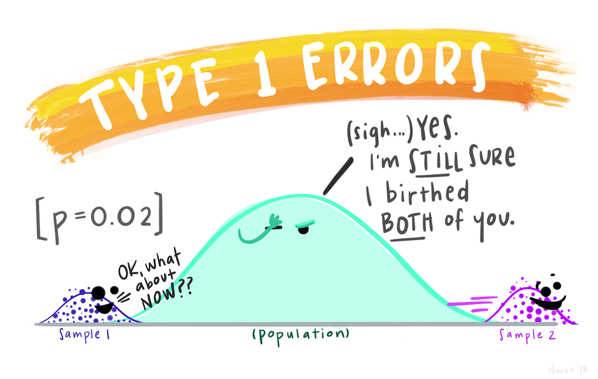
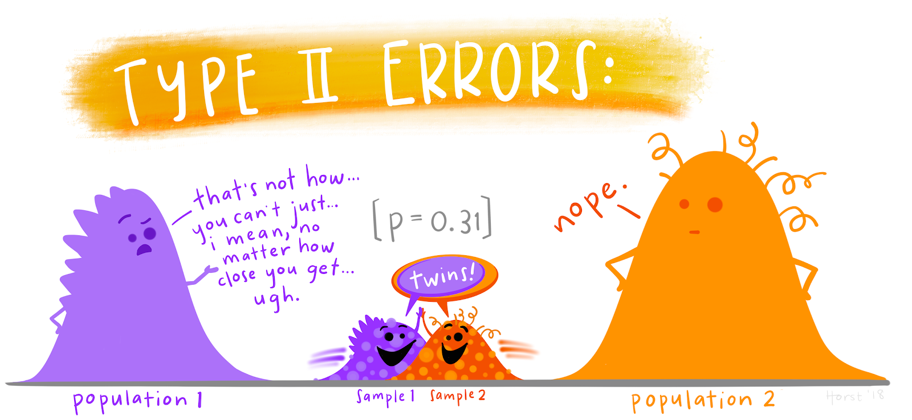

# Introduction {background-color="#D9DBDB"}

```{r, include = FALSE}
library(tidyverse)

```

## Learning Objectives

By the end of this session, you will be able to:

1. Explain why power analysis matters for study design
2. Simulate data from a linear model with known parameters
3. Calculate power for a given sample size
4. Determine sample size needed for 80% power
5. Identify common pitfalls in power estimation

# Why Power Analysis Matters {background-color="#D9DBDB"}

## The Core Problem

**Scenario**: You test whether a new diet reduces body mass in laboratory mice.

- 20 mice (10 per treatment)
- Result: p = 0.12

**What do you conclude?**


## P-values and test statistics

## What Determines a P-Value?


**A p-value is determined by THREE components:**

1. **Sample size (n)**
2. **Effect size (signal)**
3. **Variance (noise)**

:::{.callout-note}
## Key Insight
The same biological effect can be "significant" or "non-significant" depending on n and variance.
:::

**Formula for t-statistic:**

$$
t = \frac{\text{Effect size}}{\text{SE}} = \frac{\bar{x}_1 - \bar{x}_2}{\sqrt{\frac{s^2_1}{n_1} + \frac{s^2_2}{n_2}}}
$$

Where: $s^2$ = variance, $n$ = sample per group

## Error rates

::: {layout-nrows=2}
{width=30%}

{width=30%}
:::


## What Power Actually Means

**Statistical Power**: The probability of detecting a real effect if one exists.

::: {.callout}
**If your experiment has 80% power:**

"If I repeated this experiment 100 times (assuming the true effect exists), I would detect a significant result (p < 0.05) in approximately **80** of those experiments."
:::

. . .

**Key Insight**: Power tells you how reliable your study design is at detecting effects you care about.

## Real Consequences of Low Power

### 1. False Negatives (Type II Errors)

Real treatment effects go undetected. You might **abandon a promising intervention** because your study couldn't detect its effects.

### 2. Unstable Effect Sizes

Low-powered studies that DO find significance often **dramatically overestimate effect sizes**.

::: {.callout .callout-warning}
**"Winner's Curse"**: Significant results from underpowered studies tend to be flukes with inflated effects
:::

## Real Consequences (continued)


### 4. Higher False Discovery Rates

When power is low, a **higher proportion** of "significant" findings are actually false positives.

## The Power Analysis Question

::: {.callout}
**Before collecting data, power analysis answers:**

"What sample size do I need so that, if I repeated this experiment many times, I would reject the null hypothesis in **at least 80%** of experiments?"
:::

. . .

**Note**: 80% is a conventional threshold, but the actual required power depends on:

- Your field's standards
- Cost of data collection
- Consequences of Type I vs Type II errors


## Simulation

[Shiny simulation app](https://philip-leftwich-hypothesis-testing-simulation.share.connect.posit.cloud/)

# Traditional vs Simulation Approaches {background-color="#D9DBDB"}

## The Traditional Approach

For **simple designs** (t-tests, one-way ANOVA), power can be calculated using formulas:

:::{.column}

```{r}
#| echo: true
#| eval: false

# Using pwr package for two-sample t-test
library(pwr)
pwr.t.test(
  d = 0.5,           # Cohen's d effect size
  sig.level = 0.05,  # alpha
  power = 0.8,       # desired power
  type = "two.sample"
)
```

:::

:::{.column}

```{r}
#| echo: false
#| eval: true

# Using pwr package for two-sample t-test
library(pwr)
pwr.t.test(
  d = 0.5,           # Cohen's d effect size
  sig.level = 0.05,  # alpha
  power = 0.8,       # desired power
  type = "two.sample"
)
```

:::


## When Traditional Methods Break Down

Traditional formulas **don't work** for:

- Non-standardised effect sizes
- Multiple predictors
- Interactions
- Mixed models with random effects
- Generalised linear models (count data, binomial data)


::: {.callout .callout-success}
**Solution**: Simulation-based power analysis works for **ANY** model you can fit
:::

## The Simulation Logic

Simulation-based power analysis follows five steps:

1. **Specify your model**: Write the equation with concrete parameter values
2. **Simulate data**: Generate fake datasets based on that equation
3. **Analyse each dataset**: Fit your intended model to each simulated dataset
4. **Count successes**: How many times did you detect the effect (p < 0.05)?
5. **Calculate power**: Power = (# significant results) / (# simulations)

. . .

::: {.callout}
**Key Insight**: We control the "truth" in simulations, so we KNOW an effect exists. Power tells us how often we'd detect it.
:::

# Worked Example {background-color="#D9DBDB"}

## The Research Question

**Does a treatment reduce body mass in a study population?**

We also know that sex affects body mass, so we'll account for that.

**Design:**

- Two treatments: A (control) and B (treatment)
- Two sexes: Male and Female
- Outcome: Body mass (continuous, grammes)
- Balanced design: Equal numbers in each group

## Step 1: Specify the Data-Generating Model

We assume body mass follows this linear model:

$$\text{body_mass} = \beta_0 + \beta_1(\text{Treatment}) + \beta_2(\text{Sex}) + \varepsilon$$

**Where:**
```
β₀ = 400        # Baseline (Treatment A, Male)
β₁ = -20        # Treatment effect (B reduces mass by 20g)
β₂ = -200       # Sex effect (Females weigh 200g less)
ε ~ N(0, σ²)    # Random error
σ = 50          # Residual standard deviation
```

## Where Do These Numbers Come From?

::: {.callout .callout-warning}
**Critical Point**: These numbers are our ASSUMPTIONS about the population
:::

In real power analysis, parameters come from:

:::{.incremental}
- Pilot studies

- Literature values

- Meaningful differences


:::

**Your power estimate is only as good as these assumptions**

## Step 2: Simulate ONE Dataset

Let's simulate data for n = 100 (50 per treatment):
```{r}
#| echo: true
#| eval: true

set.seed(38596)  # For reproducibility

# Sample size and design
n <- 100
treatment <- factor(rep(c("A", "B"), each = n/2))
sex <- factor(rep(c("Male", "Female"), times = n/2))

# True population parameters
beta_0 <- 400     # Intercept (Male, Treatment A)
beta_1 <- -20     # Treatment B effect
beta_2 <- -200    # Female effect
```

## Step 2 (continued)
```{r}
#| echo: true
#| eval: true

mu <- case_when(
  treatment == "A" & sex == "Male"   ~ beta_0,
  treatment == "B" & sex == "Male"   ~ beta_0 + beta_1,
  treatment == "A" & sex == "Female" ~ beta_0 + beta_2,
  treatment == "B" & sex == "Female" ~ beta_0 + beta_1 + beta_2
)

# Add random noise
sigma <- 50
body_mass <- rnorm(n, mean = mu, sd = sigma)

# Create dataset
dat <- data.frame(body_mass, treatment, sex)
```

## What Just Happened?

::: {.columns}
::: {.column width="50%"}

**We created a dataset where:**

- We KNOW the true treatment effect is -20
- We added realistic random noise (SD = 50)
- This simulates **ONE** possible *sample* we might collect from a *population*

:::

::: {.column width="50%"}

```{r}
#| echo: true
#| eval: true

head(dat)
```

:::
:::

## Step 3: Analyse the Simulated Data

::: {.column}

```{r}
#| echo: true
#| eval: false

m <- lm(body_mass ~ treatment + sex, data = dat)
summary(m)
```

:::

:::{.column}
```{r}
#| echo: false
#| eval: true

m <- lm(body_mass ~ treatment + sex, data = dat)
summary(m)
```

:::

**Look at the treatment effect p-value. Is it < 0.05?**

. . .

In this ONE simulation:

- You might find p = 0.04 (significant)
- OR p = 0.08 (not significant)

**That's random sampling variation at work**

## Step 4: Repeat Many Times

Now we package this into a function:

::: {.column}

```{r}
#| echo: true
#| eval: false
#| code-line-numbers: "|1-2|4-6|8-11|13-15|17-18|20"

# Function to run one simulation
sim_power <- function(n = 100, treatment_effect = -20, sigma = 50) {
  
  treatment <- factor(rep(c("A", "B"), each = n/2))
  sex <- factor(rep(c("Male", "Female"), times = n/2))
  
mu <- case_when(
  treatment == "A" & sex == "Male"   ~ beta_0,
  treatment == "B" & sex == "Male"   ~ beta_0 + treatment_effect,
  treatment == "A" & sex == "Female" ~ beta_0 + beta_2,
  treatment == "B" & sex == "Female" ~ beta_0 + treatment_effect + beta_2
)


body_mass <- rnorm(n, mean = mu, sd = sigma)

  dat <- data.frame(body_mass, treatment, sex)
  
  m <- lm(body_mass ~ treatment + sex, data = dat)
  p_value <- summary(m)$coefficients["treatmentB", "Pr(>|t|)"]
  
  return(p_value)
}
```

:::

:::{.column}

```{r}
#| echo: false
#| eval: true


# Function to run one simulation
sim_power <- function(n = 100, treatment_effect = -20, sigma = 50) {
  
  treatment <- factor(rep(c("A", "B"), each = n/2))
  sex <- factor(rep(c("Male", "Female"), times = n/2))
  
mu <- case_when(
  treatment == "A" & sex == "Male"   ~ beta_0,
  treatment == "B" & sex == "Male"   ~ beta_0 + treatment_effect,
  treatment == "A" & sex == "Female" ~ beta_0 + beta_2,
  treatment == "B" & sex == "Female" ~ beta_0 + treatment_effect + beta_2
)


body_mass <- rnorm(n, mean = mu, sd = sigma)

  dat <- data.frame(body_mass, treatment, sex)
  
  m <- lm(body_mass ~ treatment + sex, data = dat)
  p_value <- summary(m)$coefficients["treatmentB", "Pr(>|t|)"]
  
  return(p_value)
}

```

```{r}
#| echo: true
#| eval: true

sim_power()
```

:::


## Running the Simulations

:::{.column}

```{r}
#| echo: true
#| eval: false

# Run 1000 simulations
set.seed(38596)
p_values <- replicate(1000, sim_power(n = 100))

# Calculate power
power <- mean(p_values < 0.05)
power  # This is our power estimate
```

:::

:::{.column}


```{r}
#| echo: false
#| eval: true

# Run 1000 simulations
set.seed(38596)
p_values <- replicate(1000, sim_power(n = 100))

# Calculate power
power <- mean(p_values < 0.05)
power  # This is our power estimate
```


:::
. . .

::: {.callout .callout-warning}
**Interpretation**: If power = 0.52, then with n=100, we'd only detect the effect in 52% of experiments.

**That's insufficient!**
:::

# Sample Size Planning {background-color="#D9DBDB"}

## Testing Different Sample Sizes

Now we test different sample sizes to find what we need for **80% power**:

:::{.column}

```{r}
#| echo: true
#| eval: true

# Test sample sizes from 100 to 300
sample_sizes <- seq(100, 300, by = 20)

results <- map_dfr(sample_sizes, ~{
  p_values <- replicate(1000, sim_power(n = .x))
  data.frame(n = .x, power = mean(p_values < 0.05))
})
```

:::

:::{.column}

```{r}
#| echo: true
#| eval: true

head(results)
```

:::

## Visualising the Power Curve

:::{.column}

```{r}
#| echo: true
#| eval: false

ggplot(results, aes(x = n, y = power)) +
  geom_point() +
  geom_line() +
  geom_hline(yintercept = 0.8, linetype = "dashed", 
             colour = "red") +
  labs(x = "Sample Size (n)", 
       y = "Power",
       title = "Power Analysis for Treatment Effect") +
  theme_minimal()
```

:::

:::{.column}

```{r}
#| echo: false
#| eval: true

ggplot(results, aes(x = n, y = power)) +
  geom_point() +
  geom_line() +
  geom_hline(yintercept = 0.8, linetype = "dashed", 
             colour = "red") +
  labs(x = "Sample Size (n)", 
       y = "Power",
       title = "Power Analysis for Treatment Effect") +
  theme_minimal()
```

:::

**Find the n where power crosses 0.80—that's your target sample size**


# Critical Assumptions and Pitfalls {background-color="#D9DBDB"}

## Your Power Estimate Is Only As Good As Your Assumptions

The power analysis depends entirely on:

1. **Effect size** (-20 in our example)
   - If the true effect is -10, you'd need a much larger sample

2. **Variance** (σ = 50)
   - If real variability is σ = 75, you'd need more samples

3. **Model structure**
   - If there's actually an interaction, you'd need to account for it

## The Fragility Problem

::: {.callout .callout-warning}
**Warning**: Effect sizes estimated from small pilot studies are HIGHLY unstable
:::

**Example**: Your pilot study (n=20) estimated the treatment effect as -21.8 ± 10.6 (SE).

That estimate could easily be:

- An overestimate (true effect is -15)
- An underestimate (true effect is -28)
- Close to correct (true effect is -20)

**You cannot know which without more data**

## Dealing with Uncertain Effect Sizes

### Conservative Approaches:

1. **Power for the smallest effect of interest (SESOI)**
   - Not the expected effect, but the minimum meaningful effect

2. **Safeguard Power analysis**
   - Test power across a range of plausible effect sizes

3. **Use literature meta-analyses**
   - Better than single small studies

::: aside
[Peregini et al 2014](https://journals.sagepub.com/doi/10.1177/1745691614528519)
:::

## Safeguard Power

```{r, eval = TRUE, echo =- TRUE}

# Pilot study Data
mean_val <- 100
se_val <- 5
n <- 30 # Sample size

# 1. Calculate the t-critical value for 60% confidence
# alpha = 1 - 0.60 = 0.40; alpha/2 = 0.20
t_score <- qt(0.20, df = n - 1, lower.tail = FALSE) 

# 2. Calculate the margin of error
margin_error <- t_score * se_val

# 3. Calculate lower bounds
lower_bound <- mean_val - margin_error

lower_bound

```

::: aside
[Perugini et al 2014](https://journals.sagepub.com/doi/10.1177/1745691614528519)
:::

## Post-Hoc Power: Just Say No

::: {.callout .callout-warning}
**Never calculate power AFTER seeing your results**
:::

**This is called "post-hoc power" or "observed power"**

It is mathematically equivalent to just reporting your p-value again. It provides **zero additional information**.

. . .

- A study at p = 0.05, always has power at 50%
- A study at p < 0.05, always has power greater than 50%
- A study at p > 0.05, always has power less than 50%

## Common Pitfalls Summary

::: {.columns}
::: {.column width="50%"}

**Don't:**

- Use effect sizes from tiny pilots (n < 30)
- Calculate post-hoc power
- Assume 80% power is always sufficient
- Ignore variance uncertainty
- Power only for your "hoped for" effect

:::

::: {.column width="50%"}

**Do:**

- Be conservative with effect size estimates
- Consider sensitivity analyses
- Power for smallest meaningful effect
- Account for design complexity
- Report your assumptions clearly

:::
:::

# Key Takeaways {background-color="#D9DBDB"}

## Summary

✅ **Power analysis should happen BEFORE data collection**

✅ **Simulation works for complex models where formulas don't exist**

✅ **Your power estimate depends entirely on your assumptions**

✅ **Effect size estimates from small studies are unstable—be conservative**

✅ **80% power is conventional, but context matters**

✅ **Never calculate post-hoc power**


# Tutorial Exercises {background-color="#D9DBDB"}

## Exercise 1: Change the Effect Size

**Task**: Modify the code to test power for a treatment effect of **-10** instead of -20.

**Question**: How much larger does n need to be to achieve 80% power?

. . .

::: {.callout}
**Think about**: Why does halving the effect size more than double the required sample size?
:::

## Exercise 2: Change the Variance

**Task**: What happens to required sample size if **σ = 75** instead of 50?

**Hint**: Variance affects the signal-to-noise ratio in your data.

. . .

::: {.callout}
**Consider**: In your research area, what factors contribute to high variance? Can any be controlled through design?
:::

## Exercise 3: Think Critically

**Scenario**: You have a pilot study with n=15 per group that found:

- Treatment effect = -25 ± 15 (SE)

**Questions**:

1. Why might this be an unreliable estimate for power analysis?
2. What would be a more conservative approach?

## Exercise 4: Smallest Effect of Interest (SESOI)

**Task**: Instead of powering for the expected effect, power for the SMALLEST effect you'd care about.

**Question**: If a 10g reduction (2.5% of baseline) is the minimum meaningful effect, what sample size is needed?

. . .

::: {.callout .callout-info}
**This is often the most defensible approach**: Ensures you can detect effects that actually matter scientifically or clinically
:::


## Additional Resources


**Further Reading:**

- Lakens, D. (2022). Sample size justification. *Collabra: Psychology*
- Gelman, A. & Carlin, J. (2014). Beyond power calculations. *Perspectives on Psychological Science*

- [Improving your statistical inferences](https://lakens.github.io/statistical_inferences/08-samplesizejustification.html)
- [LMU Open Science Center](https://lmu-osc.github.io/Simulations-for-Advanced-Power-Analyses/LMM.html)


# Generalised Linear Models

```{r}
#| echo: true
#| eval: true
#| code-line-numbers: "|17-25|28-30"
# BINOMIAL GLM POWER ANALYSIS
# DO NOT MODIFY THIS CODE - only change parameters below

# ============================================================
# YOUR PARAMETERS - CHANGE THESE VALUES
# ============================================================

p_control <- 0.30        # Baseline probability (control sites)
p_restored <- 0.50       # Predicted probability (restored sites)
n_sites <- 40            # Total sites (split equally between treatments)
n_iterations <- 1000     # Number of simulations

# ============================================================
# SIMULATION CODE - DO NOT MODIFY
# ============================================================

sim_binomial <- function(n, p_control, p_restored) {
  treatment <- factor(rep(c("Control", "Restored"), each = n/2))
  presence <- rbinom(n, size = 1, 
                     prob = ifelse(treatment == "Control", p_control, p_restored))
  dat <- data.frame(presence, treatment)
  m <- glm(presence ~ treatment, family = binomial, data = dat)
  p_value <- summary(m)$coefficients["treatmentRestored", "Pr(>|z|)"]
  return(p_value)
}

# Run power analysis
set.seed(12345)
p_values <- replicate(n_iterations, sim_binomial(n_sites, p_control, p_restored))
power <- mean(p_values < 0.05)

# Results
cat(sprintf("Estimated power: %.1f%%\n\n", power*100))


```


# Mixed models

```{r}
#| echo: true
#| eval: true
#| code-line-numbers: "|37-40"
# LINEAR MIXED MODEL POWER ANALYSIS
# DO NOT MODIFY THIS CODE - only change parameters below

library(lmerTest)

# ============================================================
# YOUR PARAMETERS - CHANGE THESE VALUES
# ============================================================

n_rats <- 20                # Total rats (split equally between groups)
time_points <- 2            # Measurements per rat (before/after)
baseline_time <- 50         # Average maze completion time (seconds)
practice_effect <- -5       # Improvement from practice alone (control group)
training_effect <- -10      # EXTRA improvement from training (beyond practice)
sd_between_rats <- 15       # Between-rat SD (individual differences)
sd_within_rats <- 8         # Within-rat SD (measurement error)
n_iterations <- 1000        # Number of simulations

# ============================================================
# SIMULATION CODE - DO NOT MODIFY
# ============================================================

sim_lmm <- function(n_rats = 20, 
                    time_points = 2, 
                    baseline_time = 50, 
                    practice_effect = -5, 
                    training_effect = -10, 
                    sd_between_rats = 15, 
                    sd_within_rats = 4) {
  
  rat_id <- factor(rep(1:n_rats, each = time_points))
  group <- factor(rep(rep(c("Control", "Trained"), each = n_rats/2), each = time_points))
  time <- factor(rep(c("Before", "After"), times = n_rats),
                 levels = c("Before", "After"))
  
  # Random intercepts for rats
  rat_effects <- rnorm(n_rats, 0, sd_between_rats)
  # Each rat has the same intercept 
  rat_effects_expanded <- rep(rat_effects, each = time_points)
  
  # Fixed effects
  practice <- ifelse(time == "After", practice_effect, 0)
  training_bonus <- ifelse(group == "Trained" & time == "After", training_effect, 0)
  
  # Generate outcome
  maze_time <- baseline_time + rat_effects_expanded + practice + training_bonus + 
               rnorm(n_rats * time_points, 0, sd_within_rats)
  
  dat <- data.frame(maze_time, rat_id, group, time)
  
  # Fit mixed model
  m <- lmer(maze_time ~ group * time + (1|rat_id), data = dat)
  
  # Extract p-value for interaction (the effect of interest)
  p_value <- summary(m)$coefficients[4,5]
  return(p_value)
}

# Run power analysis
set.seed(12345)
p_values <- replicate(n_iterations, sim_lmm())
power <- mean(p_values < 0.05)

# Results
cat(sprintf("Estimated power: %.1f%%\n\n", power*100))


```
