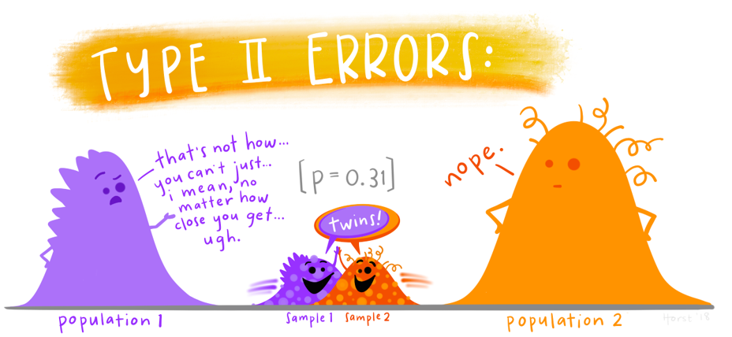

# What Are We Actually Doing When We Test a Hypothesis? {background-color="#D9DBDB"}

## Learning Objectives

By the end of this lecture, you should be able to:

:::{.incremental}
1. Explain what a p-value does and does not tell you

2. Define Type I and Type II errors and their consequences

3. Define statistical power and identify the factors that govern it

4. Explain why underpowered studies are a problem for science

5. Understand why pre-registration and power analysis are required in regulated research

6. Articulate why simulation-based power analysis is preferable to standardised effect sizes
:::

## A Quick Recap on P-values

```{r}
countdown::countdown(
  minutes = 1L,
  color_border = "#00AEEF",
  color_text = "#00AEEF",
  color_running_text = "white",
  color_running_background = "#00AEEF",
  color_finished_text = "#00AEEF",
  color_finished_background = "white",
  top = 0,
  margin = ".5em",
  font_size = "2em"
)
```

You have been using p-values throughout this course. But what do they actually mean?

:::{.fragment}
**What a p-value is:**

> The probability of observing a result at least as extreme as the one you got, *if the null hypothesis were true*

:::

:::{.fragment}
**What a p-value is not:**

- The probability that the null hypothesis is true
- The probability that your result occurred by chance
- A measure of how large or important an effect is
- Proof of anything

:::

:::{.fragment}
**The threshold p < 0.05 means:**

If there were truly no effect, results like yours would occur fewer than 5% of the time by chance alone

:::

## The Decision Table

Every time you run a statistical test, you are making a binary decision — reject or do not reject the null hypothesis. There are four possible outcomes.

|  | **H₀ is true** | **H₀ is false** |
|---|---|---|
| **Reject H₀** | ?  | Correct ✅ |
| **Do not reject H₀** | Correct ✅ |  ? |


## Type 1/2 error

:::{.column}

```{r, echo = FALSE}
knitr::include_graphics("images/type_1_errors.png")
```

:::

:::{.column}


```{r, echo = FALSE, out.width = "250%"}

```
:::

## The Decision Table

Every time you run a statistical test, you are making a binary decision — reject or do not reject the null hypothesis. There are four possible outcomes.

|  | **H₀ is true** | **H₀ is false** |
|---|---|---|
| **Reject H₀** | ?  | Correct ✅ |
| **Do not reject H₀** | Correct ✅ |  ? |

:::{.fragment}
- **Type I error rate** = α (conventionally 0.05)
- **Type II error rate** = β
- **Power** = 1 − β = probability of detecting a real effect

:::

:::{.callout-note}
Setting α = 0.05 means you accept a 5% chance of a false positive *every time you run a test*
:::

## What Do These Errors Actually Mean?

:::: {.columns}
::: {.column}
**Type I error — false positive**

You conclude an effect exists when it does not

:::{.incremental}
- A drug appears to work but does not
- A conservation intervention appears effective but is not
- A gene appears associated with a trait but is not
:::

**Consequence**: wasted resources, misleading literature, potentially harmful decisions
:::


::: {.column}
**Type II error — false negative**

You conclude no effect when one actually exists

:::{.incremental}
- A drug that works appears ineffective
- A real environmental threat goes undetected
- A genuine biological relationship is dismissed
:::

**Consequence**: missed discoveries, ineffective policy, failure to act when action was needed
:::
::::

:::{.fragment}
**Neither error is automatically worse — context determines which matters more**
:::


# The Replication Crisis {background-color="#D9DBDB"}

## Something Went Wrong in Science

In 2015, the Open Science Collaboration attempted to replicate 100 published psychology studies

:::{.fragment}
- 97% of original studies reported significant results (p < 0.05)
- Only **36%** of replications were significant
- Effect sizes in replications were on average **half** those originally reported
:::

:::{.fragment}
This was not unique to psychology. Similar findings emerged in:

- Cancer biology (Begley & Ellis, 2012 — only 6 of 53 landmark studies replicated)
- Neuroscience (Button et al., 2013)
- Ecology and conservation biology (Fraser et al., 2018)
:::

:::{.fragment}
**One major contributing factor: chronically underpowered studies**
:::

:::{.footnote}
(https://www.science.org/doi/10.1126/science.aac4716)
:::


## Why Underpowered Studies Are Dangerous

An underpowered study does not merely fail to detect an effect — it produces unreliable results even when it succeeds

:::{.fragment}
**The winner's curse**

When a study is underpowered, it can only detect an effect when the observed estimate happens — by chance — to be larger than the true effect

A just-significant result from an underpowered study is almost certainly an *overestimate*
:::


:::{.fragment}
**Gelman & Carlin (2014)** named two consequences:

- **Type M error**: the magnitude of the reported effect is wrong
- **Type S error**: the sign (direction) of the effect may be wrong

:::

:::{.footnote}

(https://philip-leftwich-hypothesis-testing-simulation.share.connect.posit.cloud/)

:::


# ✋ Pause and Think {background-color="#D9DBDB"}

## Think-Pair-Share (3 minutes)

```{r}
countdown::countdown(
  minutes = 3L,
  color_border = "#00AEEF",
  color_text = "#00AEEF",
  color_running_text = "white",
  color_running_background = "#00AEEF",
  color_finished_text = "#00AEEF",
  color_finished_background = "white",
  top = 0,
  margin = ".5em",
  font_size = "2em"
)
```

A published study reports that a new habitat management intervention significantly increases bird species richness (p = 0.03, n = 12 sites). The effect size reported is **large**.

**Discuss with the person next to you:**

1. What would you want to know about this study before using its effect size in your own power analysis?

2. If the study was underpowered, in which direction is the reported effect size likely to be biased, and what are the consequences for a power analysis that uses it?

*Be prepared to share one point with the room*.


# What is Statistical Power? {background-color="#D9DBDB"}

## Defining Power

**Power is the probability that your test correctly rejects the null hypothesis when the null hypothesis is false**

$$\text{Power} = 1 - \beta$$

:::{.fragment}
Conventionally, power of **0.80** is the minimum acceptable threshold

This means a 20% chance of missing a real effect — one in five studies of adequate design will still return a false negative

:::

:::{.fragment}
**Power is not a fixed property of a test**

It depends on four things — and you control most of them
:::

## The Four Determinants of Power

:::: {.columns}
::: {.column}

**1. Effect size**

Larger effects are easier to detect

A 10cm difference in plant height is easier to detect than a 1mm difference

**2. Sample size**

More observations → more information → easier to distinguish signal from noise

This is the lever you pull most often
:::

::: {.column}

**3. Variance**

More variable data → harder to see the signal

Reducing measurement error, controlling experimental conditions, or using paired designs all reduce variance

**4. Alpha**

A stricter threshold (e.g. 0.01) reduces Type I errors but increases Type II errors — power falls

Relaxing alpha increases power but at the cost of more false positives

:::
::::

## Visualising Power

```{r, echo=FALSE, warning=FALSE, message=FALSE, cache=TRUE}
library(tidyverse)

# Two overlapping normal distributions
x <- seq(-4, 8, length.out = 1000)

null_dist  <- dnorm(x, mean = 0, sd = 1)
alt_dist   <- dnorm(x, mean = 2, sd = 1)

critical_value <- qnorm(0.95, mean = 0, sd = 1)

df <- tibble(x, null_dist, alt_dist)

ggplot(df) +
  geom_line(aes(x = x, y = null_dist), colour = "#E63946", linewidth = 1) +
  geom_line(aes(x = x, y = alt_dist), colour = "#457B9D", linewidth = 1) +
  geom_area(data = filter(df, x >= critical_value),
            aes(x = x, y = alt_dist),
            fill = "#457B9D", alpha = 0.4) +
  geom_area(data = filter(df, x >= critical_value),
            aes(x = x, y = null_dist),
            fill = "#E63946", alpha = 0.4) +
  geom_vline(xintercept = critical_value, linetype = "dashed") +
  annotate("text", x = critical_value + 0.15, y = 0.35,
           label = "Critical\nvalue", hjust = 0, size = 3.5) +
  annotate("text", x = 3.2, y = 0.15,
           label = "Power\n(1 - β)", colour = "#457B9D",
           fontface = "bold", size = 4) +
  annotate("text", x = 2.2, y = 0.03,
           label = "α", colour = "#E63946",
           fontface = "bold", size = 4) +
  annotate("text", x = -1.5, y = 0.35,
           label = "Null\ndistribution", colour = "#E63946", size = 3.5) +
  annotate("text", x = 3.8, y = 0.35,
           label = "Alternative\ndistribution", colour = "#457B9D", size = 3.5) +
  labs(x = "Test statistic", y = "Density",
       title = "Power is the area of the alternative distribution beyond the critical value") +
  theme_minimal()
```

## What Happens When We Increase Sample Size?

```{r, echo=FALSE, warning=FALSE, message=FALSE, cache=TRUE, out.width = "120%"}
library(tidyverse)
library(patchwork)

plot_power <- function(n, title) {
  se <- 1 / sqrt(n)
  x  <- seq(-1, 4, length.out = 1000)

  null_dist <- dnorm(x, mean = 0, sd = se)
  alt_dist  <- dnorm(x, mean = 1, sd = se)
  cv        <- qnorm(0.95, mean = 0, sd = se)

  df <- tibble(x, null_dist, alt_dist)

  power_val <- round(1 - pnorm(cv, mean = 1, sd = se), 2)

  ggplot(df) +
    geom_line(aes(x = x, y = null_dist), colour = "#E63946", linewidth = 0.8) +
    geom_line(aes(x = x, y = alt_dist),  colour = "#457B9D", linewidth = 0.8) +
    geom_area(data = filter(df, x >= cv),
              aes(x = x, y = alt_dist),
              fill = "#457B9D", alpha = 0.4) +
    geom_vline(xintercept = cv, linetype = "dashed") +
    annotate("text", x = 3, y = max(alt_dist) * 0.7,
             label = paste0("Power = ", power_val),
             colour = "#457B9D", fontface = "bold", size = 3.5) +
    labs(title = title, x = NULL, y = NULL) +
    theme_minimal() +
    theme(plot.title = element_text(size = 11))
}

p1 <- plot_power(5,  "n = 5")
p2 <- plot_power(20, "n = 20")
p3 <- plot_power(50, "n = 50")

p1 + p2 + p3
```

As sample size increases the distributions narrow and separate — power increases


# How Do We Calculate Power? {background-color="#D9DBDB"}

## The Traditional Approach: Standardised Effect Sizes

Cohen (1988) proposed a formula-based approach using standardised effect sizes

:::: {.columns}
::: {.column}
**Cohen's d** for a two-sample t-test:

$$d = \frac{\mu_1 - \mu_2}{\sigma}$$

**Benchmarks**:

- Small: d = 0.2
- Medium: d = 0.5
- Large: d = 0.8

:::
::: {.column}
:::{.fragment}

*Sample size*

$$n = \frac{2\left(t_{1-\alpha/2,\nu} + t_{1-\beta,\nu}\right)^2}{d^2}$$

:::
:::
::::

:::{.fragment}
> "Small, medium, and large are not helpful labels. They tell you nothing about whether an effect matters" 
:::

## A Better Question

Instead of asking *"what standardised effect size am I likely to find?"*

Ask:

> **"What is the smallest effect that would be biologically, clinically, or practically meaningful in my system — and can my study detect it?"**

:::{.fragment}
This reframing has three consequences:

1. Effect size specification becomes a scientific judgement, not a lookup table

2. Power analysis connects directly to your research question and your DAG

3. The answer is system-specific and therefore defensible

:::

## Simulation-Based Power Analysis

Rather than solving a formula, we simulate the experiment many times and count how often we detect the effect

:::{.incremental}
**The logic:**

1. Specify what you think the data-generating process looks like
2. Simulate a dataset from that process
3. Fit your model and record whether p < 0.05
4. Repeat 1000 times
5. Power = proportion of significant results

:::

:::{.fragment}
**Why this is better:**

- Works for any model: OLS, Poisson, binomial, mixed models
- Forces you to specify the data-generating process explicitly
- Makes assumptions visible and testable
- Produces a power *curve* rather than a single number
- Directly connected to the model you will actually fit

:::


# ✋ Pause and Think {background-color="#D9DBDB"}

## Show of Hands

A researcher is planning a study on the effect of light pollution on moth abundance at 20 sites. Moth counts are non-negative integers.

:::{.incremental}

- **Question 1:** Show of hands — how many of you think a formula-based power analysis using Cohen's benchmarks is appropriate here?

- **Question 2:** What model family would you use to simulate this data? Discuss with the person next to you for 60 seconds.

:::

:::{.fragment}
**Answer:** Moth counts are non-negative integers — a Poisson GLM is appropriate. A formula-based approach using Cohen's d assumes a Gaussian response and cannot account for the distributional properties of count data. Simulation handles this naturally.
:::


# Pre-registration and the Ethics of Power {background-color="#D9DBDB"}

## Why Power Analysis Is Not Optional

Underpowered research is not just a statistical inconvenience — it raises ethical and practical concerns

:::: {.columns}
::: {.column}
**In animal research:**

The Animals (Scientific Procedures) Act 1986 and the 3Rs framework (Replace, Reduce, Refine) require researchers to use the minimum number of animals necessary to achieve a scientifically valid result

Using too few animals is as problematic as using too many — an underpowered study produces unreliable results and the animals are used without meaningful scientific return

**Power analysis is a legal and ethical requirement**
:::

::: {.column}
**In clinical trials:**

Regulatory bodies including the MHRA and FDA require prospective power analyses as part of trial registration

An underpowered trial may expose participants to an experimental treatment without sufficient chance of detecting whether it works

**Power analysis is a regulatory requirement**
:::
::::

## Pre-registration

**Pre-registration** means publicly committing to your hypotheses, sample size, and analysis plan *before* collecting data

:::{.incremental}
**Why it matters for power:**

- Forces you to specify an effect size and justify it before you see the data
- Prevents post-hoc sample size adjustment ("we ran more animals until p < 0.05")
- Prevents p-hacking — analysing data multiple ways and reporting only what worked
- Creates a verifiable record of what was planned versus what was found

:::

:::{.incremental}
**Where pre-registration is expected:**

- Registered Reports — journals that peer-review the methods before data collection
- Clinical trials registries (ISRCTN, ClinicalTrials.gov)
- OSF (Open Science Framework) — widely used in ecology and biology
- Animal research licence applications in the UK

:::


# Putting It Together {background-color="#D9DBDB"}

## What a Good Power Analysis Looks Like

A defensible power analysis states:

:::{.incremental}
1. **The model** that will be fitted — not "a t-test" but the specific GLM or mixed model

2. **The effect size** and its source — a published estimate, pilot data, or a minimum meaningful difference, with explicit acknowledgement of uncertainty

3. **The variance estimate** and its source — for Gaussian models; not required for Poisson or binomial

4. **The number of simulations** run — typically 1000 or more

5. **The sample size** at which the target power threshold was reached

6. **A sensitivity analysis** — how does the conclusion change if the effect size or variance assumption is wrong?

:::

## The Power Curve

Rather than reporting a single sample size, a power curve shows how power changes across a range of sample sizes

```{r, echo=FALSE, warning=FALSE, message=FALSE, cache=TRUE}
library(tidyverse)
library(broom)

set.seed(42)

effect       <- 0.5
sigma        <- 1.0
n_sims       <- 1000
sample_sizes <- seq(10, 100, by = 5)

power_curve <- map_dfr(sample_sizes, function(n) {

  p_values <- replicate(n_sims, {
    group    <- rep(c("control", "treatment"), each = n)
    response <- c(rnorm(n, 0, sigma), rnorm(n, effect, sigma))
    sim_data <- tibble(group, response)
    model    <- lm(response ~ group, data = sim_data)
    tidy(model) |> filter(term == "grouptreatment") |> pull(p.value)
  })

  tibble(n = n, power = mean(p_values < 0.05))

})

ggplot(power_curve, aes(x = n, y = power)) +
  geom_line(linewidth = 1, colour = "#457B9D") +
  geom_point(colour = "#457B9D") +
  geom_hline(yintercept = 0.80, linetype = "dashed", colour = "#E63946", linewidth = 0.8) +
  annotate("text", x = 85, y = 0.82,
           label = "80% threshold", colour = "#E63946", size = 3.5) +
  labs(
    x     = "Sample size per group",
    y     = "Estimated power",
    title = "Power curve: two-group Gaussian comparison (effect = 0.5, sigma = 1.0)"
  ) +
  theme_minimal()
```


## Key Takeaways

**1. P-values tell you about probability under the null — not about truth**

**2. Type I and Type II errors are both real and both have consequences**

**3. Underpowered studies produce unreliable results even when significant**

- The winner's curse inflates reported effect sizes
- These inflated estimates propagate through the literature

**4. Power depends on effect size, sample size, variance, and alpha**

- Sample size is the lever you control most directly

**5. Power analysis is an ethical and sometimes legal obligation**

- Animal research and clinical trials require it by law or regulation
- Pre-registration prevents post-hoc justification

**6. Simulation is preferable to formula-based approaches**

- Works for any model
- Makes assumptions explicit
- Produces a curve rather than a single number

## What Comes Next


**Further reading:**

- Gelman & Carlin (2014) *Perspectives on Psychological Science* — Type M and Type S errors
- Open Science Collaboration (2015) *Science* — estimating reproducibility

## Questions?

**Common questions:**

Q: "Can I do a power analysis after collecting data?"
A: A post-hoc power analysis calculated from your own data is circular and uninformative. Power analysis belongs in the design stage.

Q: "What if I cannot find an effect size estimate?"
A: This is common. The workshop covers your options — including sensitivity analysis across a range of plausible values and when it is honest to acknowledge that a power analysis cannot be meaningfully conducted.

Q: "Does 80% power mean my study will work?"
A: No. 80% power means that if the true effect matches your assumption, your study will detect it 80% of the time. If your effect size assumption is wrong — which it often is — your actual power may be very different.

---

# Backup Slides

## The Maths Behind Power (Backup 1)

For a two-sample t-test, power can be calculated analytically:

$$\text{Power} = 1 - \beta = \Phi\left(\frac{|\mu_1 - \mu_2|}{\sigma\sqrt{2/n}} - z_{\alpha/2}\right)$$

Where:

- $\Phi$ is the standard normal CDF
- $z_{\alpha/2}$ is the critical value (1.96 for α = 0.05)
- $n$ is the sample size per group

**Why this is limited:** It only works for a t-test with a Gaussian response. Simulation generalises this logic to any model.

## Cohen's Power Tables (Backup 2)

Sample sizes required for 80% power at α = 0.05, two-sample t-test:

| Effect size (d) | n per group |
|---|---|
| Small (0.2) | 197 |
| Medium (0.5) | 33 |
| Large (0.8) | 14 |

**The problem with this table:** These benchmarks were derived from Cohen's reading of the social science literature in the 1960s. There is no biological justification for applying them to ecology, physiology, or any other life science domain.

## Multiple Testing and Power (Backup 3)

Running multiple tests inflates the Type I error rate — but it also affects power considerations

If you run 20 tests at α = 0.05, you expect one false positive by chance alone

Corrections such as Bonferroni adjust α downward, which reduces Type I error but also reduces power for each individual test

**Implication for study design:** If your study involves multiple outcomes or multiple comparisons, your power analysis should account for the corrected alpha threshold, not the nominal 0.05
